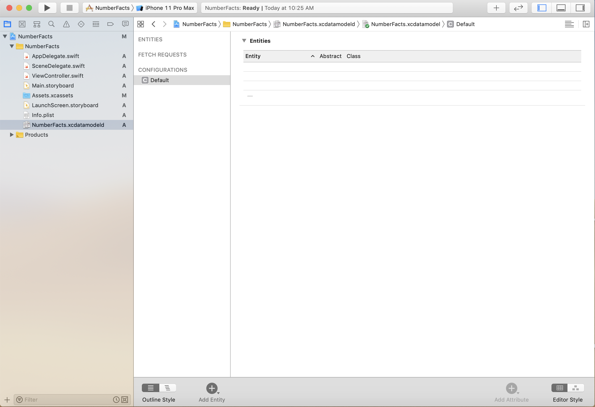
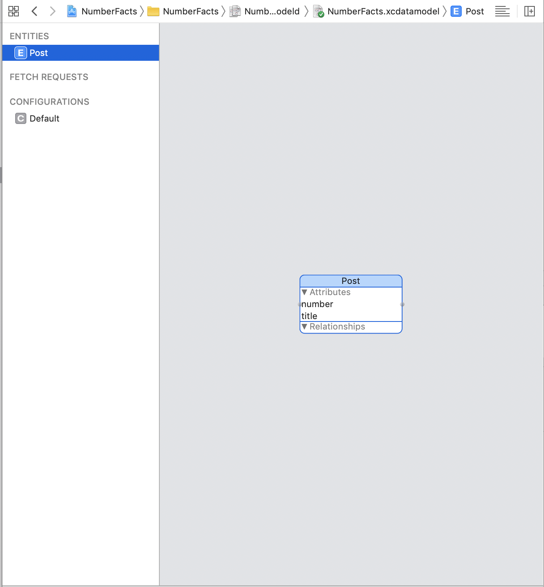
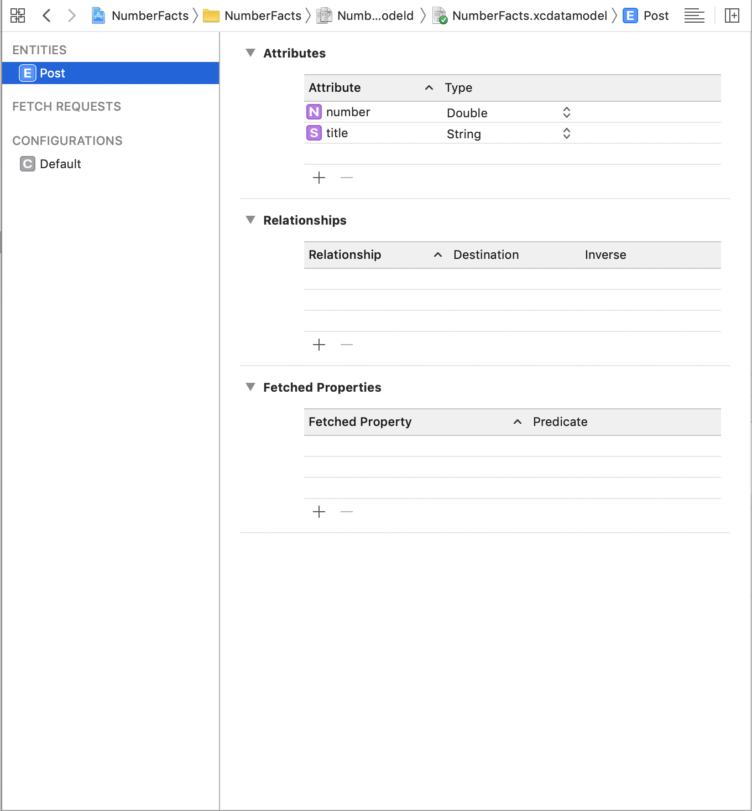
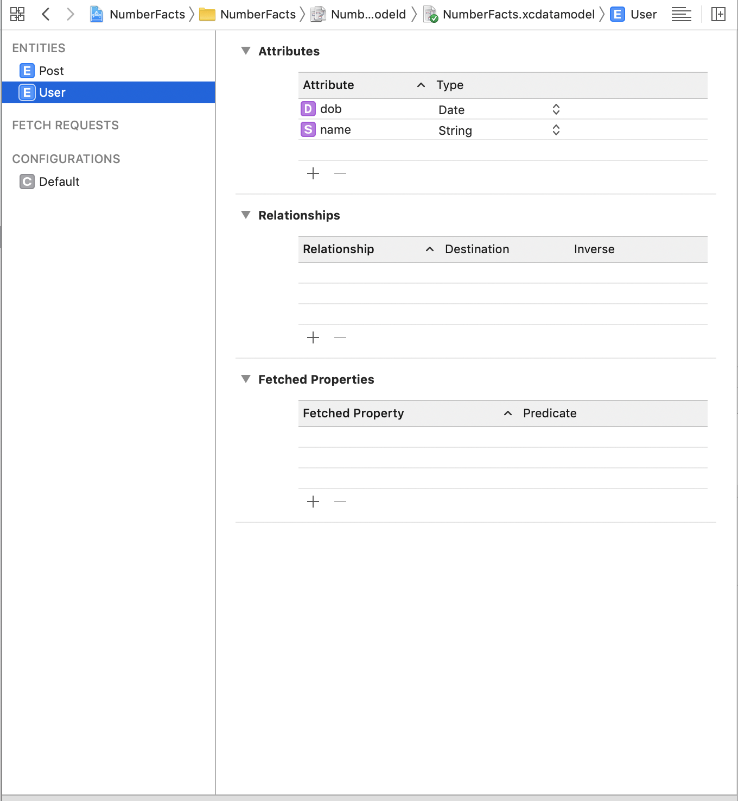
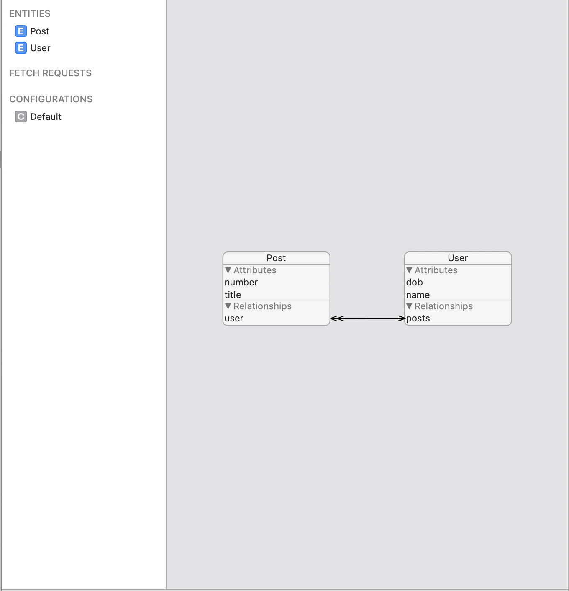
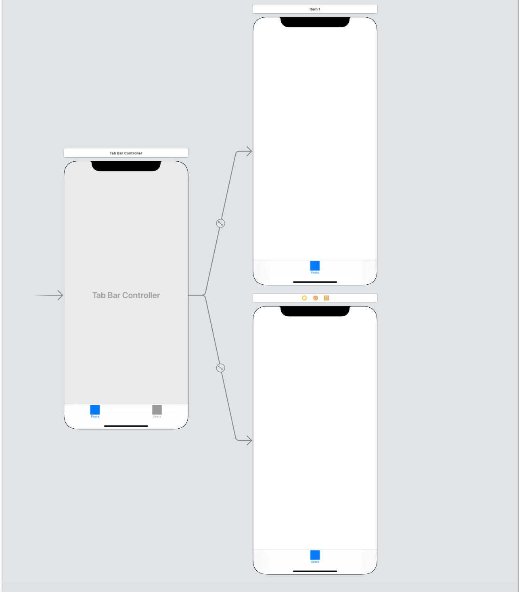
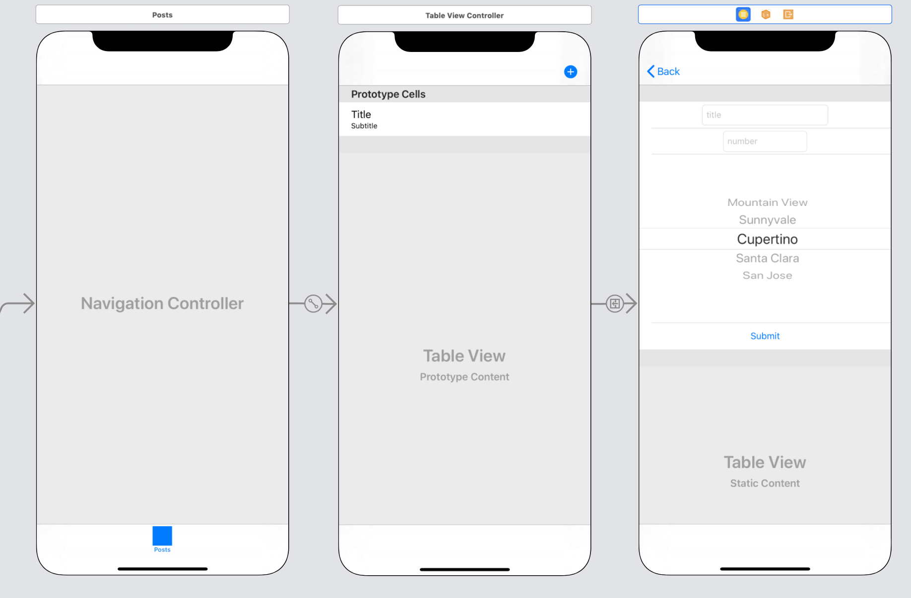
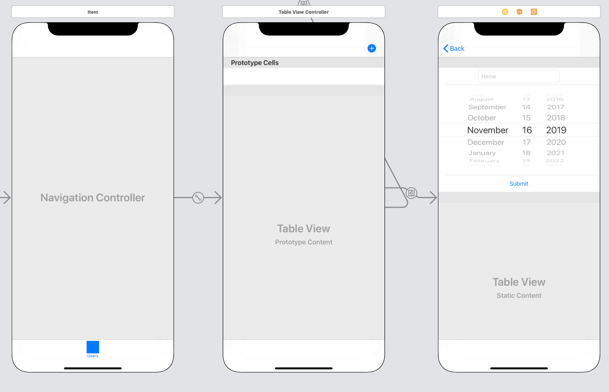
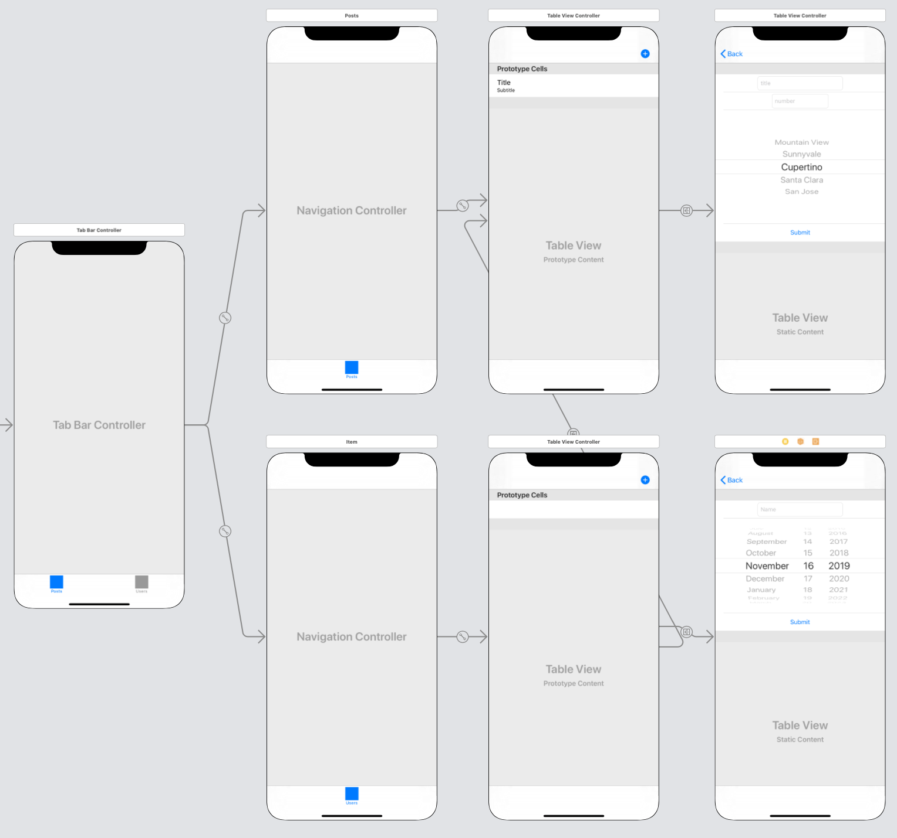

# Core Data Introduction

## Objectives

1. Articulate what Core Data is, and why it is useful
2. Build a Managed Object Context using both to-one and to-many relationships
3. Store and fetch entities

## Readings

1. [cocoacasts - What is Core Data?](https://cocoacasts.com/what-is-core-data)
2. [cocoawithlove - Why is Core Data not a database?](https://www.cocoawithlove.com/2010/02/differences-between-core-data-and.html)
3. [rollout.io - iOS database options](https://rollout.io/blog/ios-databases-sqllite-core-data-realm/)


## Demo Project

- [Repo](https://github.com/joinpursuit/Pursuit-Core-iOS-Core-Data-Introduction)


# 1. Why Core Data?

Core Data is another type of local persistence.  Similar to File Manager, we can use Core Data to store objects directly to the phone.  So what can Core Data do that saving arrays to File Manager can't?

The biggest difference is that Core Data can manage **relationships** between objects.  An example will help illustrate this.

Imagine that you are building an app that has Users and Posts.  Every User is associated with an array of Posts and every Post has a User that posted it.  How would we store this information using File Manager?

We could try something like this:


```swift
var users = [User]()
var posts = [Post]()

let userOne = User(name: "Ann")
let userTwo = User(name: "Bob")

let postOne = Post(text: "Text A", user: userOne)
let postTwo = Post(text: "Text B", user: userOne)
let postThree = Post(text: "Text C", user: userTwo)
let postFour = Post(text: "Text D", user: userTwo)
let postFive = Post(text; "Text E", user: userTwo)

users = [userOne, userTwo]
posts = [postOne, postTwo, postThree, postFour, postFive]

FileManagerHelper.save(users)
FileManagerHelper.manager.save(posts)
```


<details>
<summary>What is a drawback to this approach?</summary>

When we go to save these arrays, we do so by creating a plist file for each of them.  Each of the posts has a User, so we end up storing userTwo in the Users array, and then again in postThree, postFour and postFive.  The same information is replicated in 4 different places!

</details>

Core Data offers a solution to this problem.  Instead of storing redundant copies of information, Core Data knows how to store objects and the *relationships* that they have to each other.

Core Data is thus called an **object graph manager**.  **Objects** are each of the entities that you are storing.  The relationships between them is managed like a **graph** where each entity is a node that has edges connecting it to other entities.  Core Data **manages** this object graph.


# 2. How does Core Data work?

Core Data is technically **not** a database.  A database is a collection of tables that you can access through queries.  While Core Data is often backed by a database, it does not need to be.

The following image outlines how Core Data operates.


**Source**: https://www.objc.io/images/issue-4/stack-simple-9af1e89d.png


The **NSManagedObjectContext** provides an area for your entities to be held.  While typically, you only have one context, you can create as many as you like.

The **NSPersistentStoreCoordinator** is responsible for keeping track of all the NSManagedObjectContexts and for telling the NSPersistentStore to load or save information.

The **NSPersistentStore** manages storing the information from a context given to it by the NSPersistentStoreCoordinator.  The database here could be SQLite or iCloud.

These three aspects combine to create a system that is very powerful and flexible.


# 3. Core Data vs. SQLite

Core Data is not a database.  It is a larger system that can have a database as the means of storing persisting entities.  When deciding on the persistence model of your application, it may make sense to use a wrapper for a SQLite database (e.g [this pod](https://github.com/stephencelis/SQLite.swift)) and not use Core Data.

As a rough guide of the pros and cons, Core Data is fantastic for modeling relationships between objects, and is very fast at fetching results, but in order to operate it loads the entire database into memory.  Traditional databases don't model relationships as clearly and can take longer to fetch results, but don't need to load everything into memory to answer requests.


# 4. Creating a Core Data App.

In this lesson, we will build a simple app that is backed by Core Data.  Our app will allow you to create users and for a user to create a post.

### Configure Xcode

Open a new Xcode project.  This time, we'll need to check the box that says "include Core Data".  This will make some changes to our AppDelegate, and will give us a Data Model to use.


Let's call our app "NumberFacts".  Users will make posts about various facts about numbers.  All of the posts and users will be persisted to your phone.

### AppDelegate Changes

In the AppDelegate, we have a new instance variable and a new instance method.

**persistentContainer**

Remember the picture above with the `NSManagedObjectContext`, the `NSPersistentStoreCoordinator` and the NSPersistentStore?  Here we see none of those and only one class called a `NSPersistentContainer`.  In iOS 10, Apple gave this convenience class which is a wrapper around the entire picture we saw above.  Practically, this means that we can let this wrapper class do the heavy lifting for us.  It builds the Core Data stack by itself, so we don't need to worry about it.  If you do need to deploy for iOS builds before iOS 10, then you'll need to look into building a Core Data stack yourself, but `NSPersistentContainer` will work for most purposes.

**saveContext()**

This method is responsible for saving a `NSManagedObjectContext`.  We will call this method when we want to persist the data in our application.

# 5. Building the model

We want our application to have Users and Posts.  Each Post has one User, and a User may have any number of Posts.  When we use Core Data, instead of building the classes for our model ourselves, we use the xcdatamodeld file provided.  Select the file, and you'll see a new screen.

There are three main kinds of things in Core Data: *Entities*, *Attributes* and *Relationships*.  For all intents and purposes, think of entities as classes, and attributes as properties.  Relationships create additional properties, an instance or array of instances of the entity it is related to.



In our model, we want two attributes, a User and a Post.

## Post

Click on the button at the bottom right to change into the Graph View.  Then select the "Add Entity" button and add a `Post` entity.

Our Post will have two attributes:

- number: Double
- title: String

Create this by clicking the add attribute button.  Then open the Utilities menu to change the names and types of the attributes.



We can also use the Table View to see this object:



## User

Our User will have two attributes:

- name: String
- dob: Date



## Creating the relationship

We now want to add the relationships between them.  Control drag from the User entity to the Post entity.

Name the relationship under the User to "posts" and change the Type from "To One" to "To Many".  Then name the relationship under the Post to "user".



Our model is now built.  We have two classes that functionally act as below:

```swift
class User {
	let name: String
	let dob: Date
	let posts: [Post]
	... (inits below)
}

class Post {
	let number: Double
	let title: String
	let user: User
	... (inits below)
}
```

# 6. Build the UI

To get our demo up and running, we'll use a Storyboard based application.

Create a Tab Bar Controller with two tabs named "Posts" and "Users"



### Posts

Create a table view controller.  Embed it in a Navigation stack and set that navigation stack as one of the view controllers for your Tab Bar Controller.  Give your prototype cell a reuse ID of "postCell" and set the style to subtitle.

Add a bar button item in the "Add" style and create a segue from the button to another TableViewController.  Change the cells from Dynamic to Static.  

Create 4 cells, one to put the title, one to put the number, one to select the user and one with a button to submit.



### Users

Create a table view controller.  Embed it in a Navigation stack and set that navigation stack as one of the view controllers for your Tab Bar Controller. Give your prototype cell a reuse ID of "userCell".

Create a segue from the prototype cell to the PostsTableViewController.  That way, selecting a user will show all their posts.

Add a bar button item in the "Add" style and create a segue from the button to another TableViewController.  Change the cells from Dynamic to Static.  

Create 3 cells, one to put the name, one to put the date (with a date picker) and one with a button to submit.



The whole storyboard should be constructed as seen below:



# 7. Build the CoreDataClient

To create new Posts and Users, we save to the `appDelegate`'s `managedObjectContext`.

To fetch Posts and Users, we use the `fetch` method on `managedObjectContext`, passing in a `User.fetchRequest` or `Post.fetchRequest`

```swift
import UIKit
import CoreData

class CoreDataClient {

    // Static Properties

    static let manager = CoreDataClient()

    // Internal Methods

    func createNewUser(withName name: String, andDOB dob: Date) {
        let newUser = User(context: managedObjectContext)
        newUser.name = name
        newUser.dob = dob
        appDelegate.saveContext()
    }

    func getUsers(onCompletion: @escaping (Result<[User], Error>) -> Void) {
        do {
            guard let users = try managedObjectContext.fetch(User.fetchRequest()) as? [User] else {
                fatalError("Developer Error: User.fetchRequest returned an unexpected type")
            }
            onCompletion(.success(users))
        }
        catch {
            onCompletion(.failure(error))
        }
    }

    func createNewPost(withTitle title: String, number: Double, user: User) {
        let newPost = Post(context: managedObjectContext)
        newPost.title = title
        newPost.number = number
        newPost.user = user
        appDelegate.saveContext()
    }

    func getPosts(onCompletion: @escaping (Result<[Post], Error>) -> Void) {
        do {
            guard let posts = try managedObjectContext.fetch(Post.fetchRequest()) as? [Post] else {
                fatalError("Developer Error: Post.fetchRequest returned an unexpected type")
            }
            onCompletion(.success(posts))
        }
        catch {
            onCompletion(.failure(error))
        }
    }

    // Private Properties and Initializers

    private init() {}

    private var appDelegate: AppDelegate {
        return UIApplication.shared.delegate as! AppDelegate
    }
    private var managedObjectContext: NSManagedObjectContext {
        return appDelegate.persistentContainer.viewContext
    }
}
```

# 8. Build the controllers

With our UI and our Core Data model built, we can now implement the four View Controllers in our app.  Let's start with the Table View Controller to create a new user.

### CreateUserTableViewController

This VC has outlets to the `nameTextField` and the `datePicker`.  It has an IBAction connected to the submit button.  When the button is pressed, it reads the username and the date of birth for the fields, then uses the `CoreDataClient` to save the new User.

```swift
import UIKit

class CreateUserTableViewController: UITableViewController {

    // MARK:- IBOutlets

    @IBOutlet var nameTextField: UITextField!
    @IBOutlet var datePicker: UIDatePicker!

    // MARK:- IBActions

    @IBAction func submitButtonPressed(_ sender: Any) {
        guard nameIsValid(), dobIsValid() else {
            handleInvalidFields()
            return
        }
        saveUser()
        displaySuccessAlert()
    }

    // MARK:- Private Methods

    private func nameIsValid() -> Bool {
        //TODO: Complete Implementation
        return true
    }

    private func dobIsValid() -> Bool {
        //TODO: Complete Implementation
        return true
    }

    private func handleInvalidFields() {
        //TODO: Complete Implementation
    }

    private func saveUser() {
        let name = nameTextField.text!
        let dob = datePicker.date
        CoreDataClient.manager.createNewUser(withName: name, andDOB: dob)
    }

    private func displaySuccessAlert() {
        let successAlert = UIAlertController(title: "Success",
                                             message: "New user added",
                                             preferredStyle: .alert)
        successAlert.addAction(UIAlertAction(title: "OK",
                                             style: .default,
                                             handler: nil))
        present(successAlert,
                animated: true,
                completion: nil)
    }
}
```

### UsersTableViewController

For our UsersTableViewController, we need to load the users from the `CoreDataClient`.  Selecting a `User` should segue to the `PostsTableViewController` and pass the selected user to its `user` property.

```swift
import UIKit

class UsersTableViewController: UITableViewController {

    // MARK:- Internal Properties

    var users = [User]() {
        didSet {
            tableView.reloadData()
        }
    }

    // MARK:- Lifecycle Overrides

    override func viewDidLoad() {
        super.viewDidLoad()
        loadUsers()
    }

    override func viewWillAppear(_ animated: Bool) {
        super.viewWillAppear(animated)
        loadUsers()
    }

    // MARK:- Navigation

    override func prepare(for segue: UIStoryboardSegue, sender: Any?) {
        if let destination = segue.destination as? PostsTableViewController {
            let selectedUser = users[tableView.indexPathForSelectedRow!.row]
            destination.user = selectedUser
        }
    }

    // MARK:- Private Methods

    private func loadUsers() {
        CoreDataClient.manager.getUsers { [weak self] (result) in
            switch result {
            case let .success(fetchedUsers):
                self?.users = fetchedUsers
            case let .failure(error):
                print(error)
            }
        }
    }

    // MARK:- TableViewDataSource Conformance

    override func tableView(_ tableView: UITableView, numberOfRowsInSection section: Int) -> Int {
        return users.count
    }

    override func tableView(_ tableView: UITableView, cellForRowAt indexPath: IndexPath) -> UITableViewCell {
        let cell = tableView.dequeueReusableCell(withIdentifier: "userCell", for: indexPath)
        let user = users[indexPath.row]
        cell.textLabel?.text = user.name
        return cell
    }
}
```

### CreatePostTableViewController

Our `CreatePostTableViewController` combines aspects of the `CreateUserTableViewController` and the `UsersTableViewController`.  We must load the users into the `UIPickerView`, then read from the fields and save a new `Post`.  The `CoreDataClient` will set the `user` attribute of the `Post`, and associate them in the database.

```swift
import UIKit

class CreatePostTableViewController: UITableViewController {

    // MARK:- IBOutlets

    @IBOutlet var titleTextField: UITextField!
    @IBOutlet var numberTextField: UITextField!
    @IBOutlet var usersPickerView: UIPickerView!

    // MARK:- Internal Properties

    var users = [User]() {
        didSet {
            usersPickerView.reloadAllComponents()
        }
    }

    // MARK:- Lifecycle Overrides

    override func viewDidLoad() {
        super.viewDidLoad()
        usersPickerView.delegate = self
        usersPickerView.dataSource = self
        loadUsers()
    }

    // MARK:- IBActions

    @IBAction func submitButtonPressed(_ sender: Any) {
        guard titleIsValid(), postNumIsValid() else {
            handleInvalidFields()
            return
        }

        let postTitle = titleTextField.text!
        let postNum = Double(numberTextField.text!)!
        let postUser = users[usersPickerView.selectedRow(inComponent: 0)]

        CoreDataClient.manager.createNewPost(withTitle: postTitle, number: postNum, user: postUser)
        displaySuccessAlert()
    }

    // MARK:- Private Methods

    private func titleIsValid() -> Bool {
        //TODO: Complete Implementation
        return true
    }

    private func postNumIsValid() -> Bool {
        //TODO: Complete Implementation
        return true
    }

    private func handleInvalidFields() {
        //TODO: Complete Implementation
    }

    private func loadUsers() {
        CoreDataClient.manager.getUsers { [weak self] (result) in
            switch result {
            case let .success(fetchedUsers):
                self?.users = fetchedUsers
            case let .failure(error):
                print(error)
            }
        }
    }

    private func displaySuccessAlert() {
        let successAlert = UIAlertController(title: "Success",
                                             message: "New post added",
                                             preferredStyle: .alert)
        successAlert.addAction(UIAlertAction(title: "OK",
                                             style: .default,
                                             handler: nil))
        present(successAlert,
                animated: true,
                completion: nil)
    }
}

// MARK:- UIPickerView Delegate and DataSource

extension CreatePostTableViewController: UIPickerViewDelegate, UIPickerViewDataSource {
    func numberOfComponents(in pickerView: UIPickerView) -> Int {
        return 1
    }
    func pickerView(_ pickerView: UIPickerView, numberOfRowsInComponent component: Int) -> Int {
        return users.count
    }
    func pickerView(_ pickerView: UIPickerView, titleForRow row: Int, forComponent component: Int) -> String? {
        return users[row].name
    }
}
```


### PostsTableViewController

Our `PostsTableViewController` has an optional `User`.  The `UsersTableViewController` will set this when it segues to this VC.  If this property is non-nil, we load only the posts from the passed in user.  If the property is nil, then we load the posts from all users.

```swift
import UIKit

class PostsTableViewController: UITableViewController {

    // MARK:- Internal Properties

    var posts = [Post]() {
        didSet {
            tableView.reloadData()
        }
    }

    var user: User?

    // MARK:- Lifecycle Overrides

    override func viewDidLoad() {
        super.viewDidLoad()
        loadPosts()
    }

    override func viewWillAppear(_ animated: Bool) {
        super.viewWillAppear(animated)
        loadPosts()
    }

    // MARK:- Private Properties

    private func loadPosts() {
        if let passedInUser = user {
            let userPosts = passedInUser.posts?.allObjects as! [Post]
            posts = userPosts
        } else {
            CoreDataClient.manager.getPosts { [weak self] (result) in
                switch result {
                case let .success(fetchedPosts):
                    self?.posts = fetchedPosts
                case let .failure(error):
                    print(error)
                }
            }
        }
    }

    // MARK:- TableViewDataSource Methods

    override func tableView(_ tableView: UITableView, numberOfRowsInSection section: Int) -> Int {
        return posts.count
    }

    override func tableView(_ tableView: UITableView, cellForRowAt indexPath: IndexPath) -> UITableViewCell {
        let cell = tableView.dequeueReusableCell(withIdentifier: "postCell", for: indexPath)
        let post = posts[indexPath.row]
        cell.textLabel?.text = "\(post.user?.name ?? "Unknown") - \(post.title ?? "No title")"
        cell.detailTextLabel?.text = "\(post.number)"
        return cell
    }
}
```
