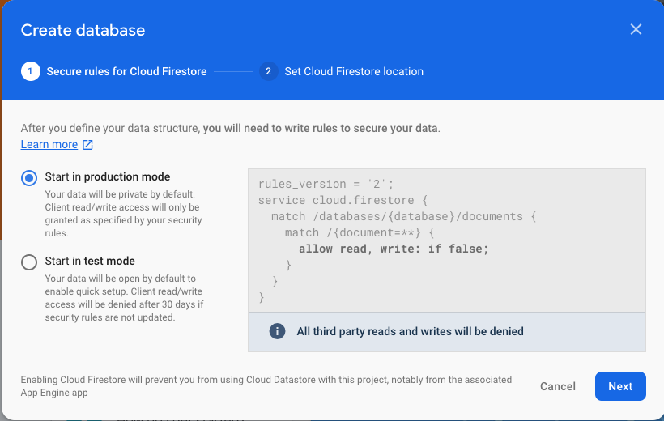
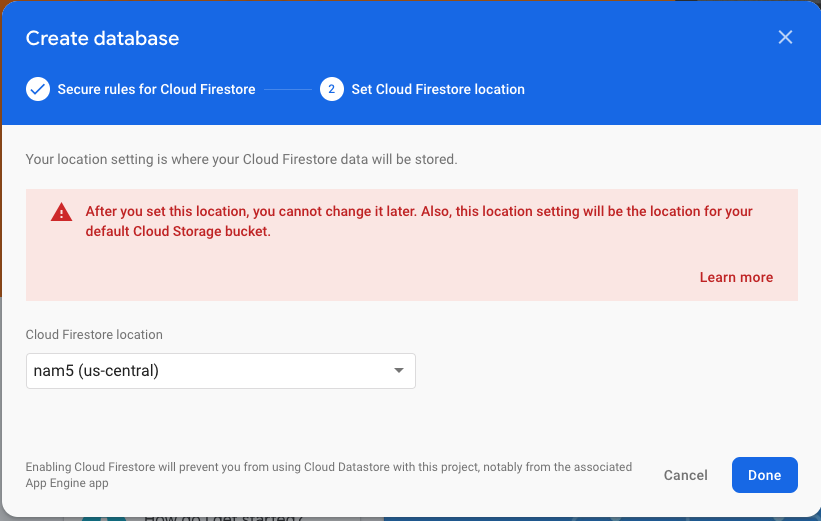
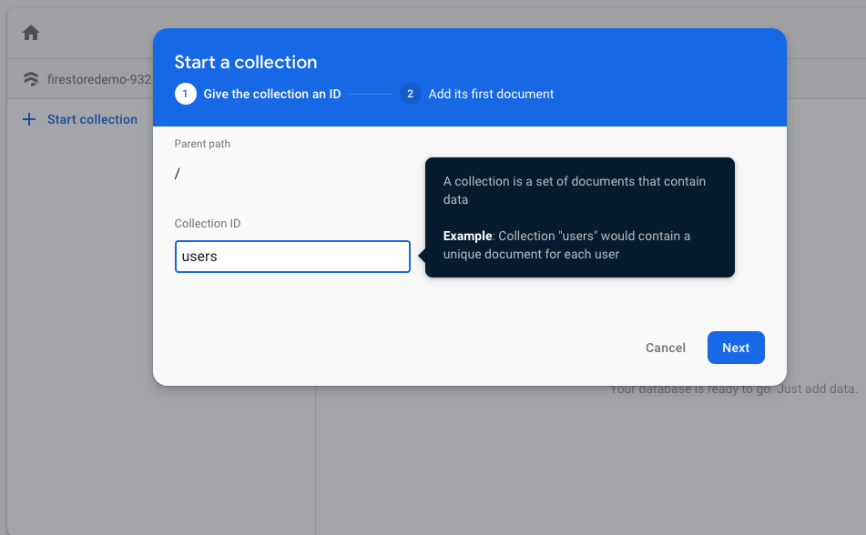
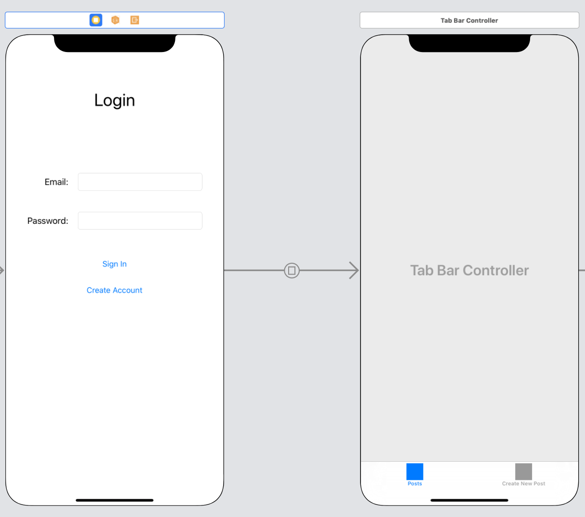
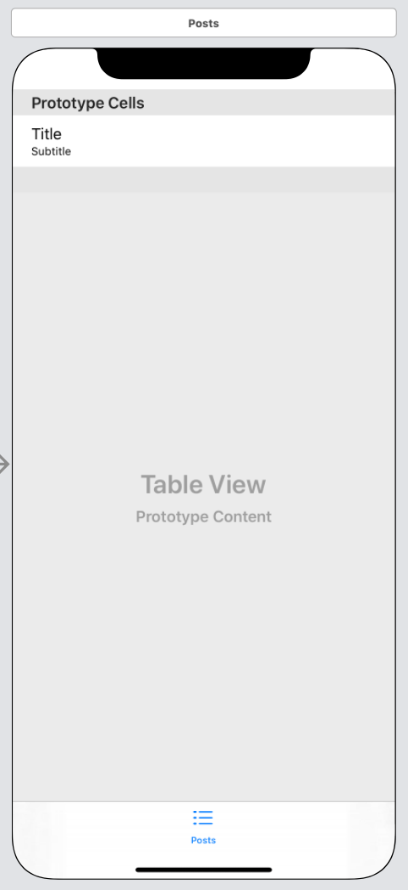
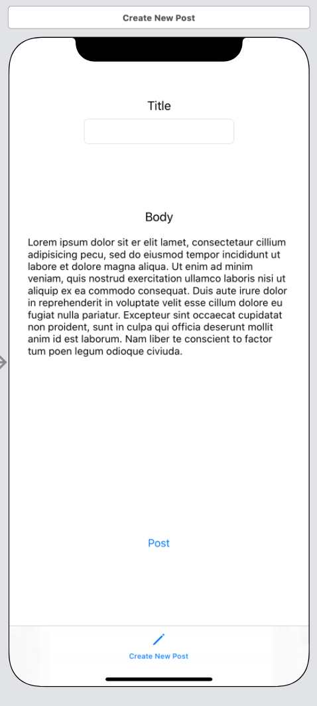

# Firestore

## Objectives

- Understand how document stores persist and reference information
- Build an app that uses Firestore to persist information

## Resources

- [Document Store](https://en.wikipedia.org/wiki/Document-oriented_database)
- link

## Project

- [link](https://github.com/joinpursuit/Pursuit-Core-iOS-Firestore-Demo)

# 1. Introduction to Document Stores

A *Document Store* is a way of organizing information for storage.  It is a kind of *key-value store*.  To use a document store, you create different *collections* for each of your model objects.  For example, a simple social media app might have a `User` collection, a `Post` collection, and a `Comments` collection.  Whenever you want to persist a new `Post` object, create a new document inside the `Post` collection.  The document is essentially a dictionary, and should have keys named after the objects properties, that map to their values.

Each document is identified by a name.  It is important to make sure to give the document a name that won't be used by anything else.  If you use a name that's been used before, you will override the document with the new data.


# 2. Configuring Firestore

>> **Cloud Firestore** is Firebase's new flagship database for mobile app development. It improves on the successes of the
>> Realtime Database with a new, more intuitive data model. Cloud Firestore also features richer, faster queries and scales
>> better than the Realtime Database.

In this lesson, we will build a simple app where users can log in, create posts, and see posts from other users.  We will use Firestore to persist our posts and users to the cloud.

Create a new project, and [connect it up to Firebase](https://github.com/joinpursuit/Pursuit-Core-iOS/blob/master/core-data-firebase-and-solo-portfolio-project/intro-to-firebase-baas/README.md).  Configure auth with email/password enabled.  Then, select "Database" and click on "Create Database"


It will ask you what kind of rules you want to configure.  This will set who is allowed to write to documents in your database.  Choose production mode, but we will change the rules ourselves to be more permissive.



Set the location to whatever it suggests to you



With our database made, let's change the rules about who can write.  Click on "Rules" and replace the rules there with the rules below:

```js
rules_version = '2';
service cloud.firestore {
  match /databases/{database}/documents {
    match /{document=**} {
      allow read, write: if request.auth.uid != null;
    }
  }
}
```

Instead of preventing anyone from writing, this will allow authorized users to write to the database. In a real production environment, this would not be a good rule, because it would allow any user to overwrite all of the persisted data.  These rules could be more complicated to ensure that this isn't allowed, but it will serve for our sample app here.

With our rules configured, we can now build the collections we need in our database

# 3. Building our Firestore Model

We will have two collections

- users
- posts

### users

Whenever a new user creates an account, we want to persist that information ourselves, so we can easily track and find users.  In Firestore, create a new collection called "users"



It will have the following fields:

- name
- email

For a new user, the `documentID` with be the `uid` of the user that Firebase generates.

### posts

Create a new collection called "posts".  It will have the following fields

- body
- title
- userUID

Whenever we create a post, we will associate it with the `uid` from the user.

For a new post, the `documentID` will be a new [UUID](https://developer.apple.com/documentation/foundation/uuid) that we create ourselves.

With our Firestore configured, we can now build our application that uses it to persist information.

# 4. Building the UI

### Login View Controller



### Posts View Controller



### Create New Post View Controller



# 5. Building the models

### PersistedUser.swift

For our `users` collection, we'll need to have a Swift object that models it.  It should have an initializer to translates a FirebaseAuth `User` into our `PersistedUser` model.  We also include a helper `fieldsDict` computed variable that returns the fields from our user as a `[String: Any]`.  This is the formate that Firestore expects in its API.

```swift
import Foundation
import FirebaseAuth

struct PersistedUser {
    let name: String?
    let email: String?
    let uid: String

    init(from user: User) {
        self.name = user.displayName
        self.email = user.email
        self.uid = user.uid
    }

    var fieldsDict: [String: Any] {
        return [
            "name": name ?? "",
            "email": email ?? ""
        ]
    }
}
```

### Post.swift

Our `Post` has a `fieldsDict` like our `PersistedUser`.  Additionally, we add an optional initializer that takes in a `[String: Any]` (that we will get from Firestore) and build a `Post` from it.

```swift
import Foundation

struct Post {
    let title: String
    let body: String
    let uuid: UUID
    let userUID: String

    init(title: String, body: String, userUID: String) {
        self.title = title
        self.body = body
        self.uuid = UUID()
        self.userUID = userUID
    }

    init?(from dict: [String: Any], andUUID uuid: UUID) {
        guard let title = dict["title"] as? String,
            let body = dict["body"] as? String,
            let userUID = dict["userUID"] as? String else {
                return nil
        }
        self.title = title
        self.body = body
        self.userUID = userUID
        self.uuid = uuid
    }

    var uuidStr: String {
        return uuid.uuidString
    }

    var fieldsDict: [String: Any] {
        return [
            "title": title,
            "body": body,
            "userUID": userUID
        ]
    }
}
```

# 6. Firestore Service

With our models built, we can now build our services for the Firebase Auth and Firestore APIs.

### FirebaseAuthService.swift

```swift
import Foundation
import FirebaseAuth

enum GenericError: Error {
    case unknown
}

class FirebaseAuthService {

    // MARK:- Static Properties

    static let manager = FirebaseAuthService()

    // MARK:- Internal Functions

    func loginUser(withEmail email: String, andPassword password: String, onCompletion: @escaping (Result<User, Error>) -> Void) {
        firebaseAuth.signIn(withEmail: email, password: password) { (result, error) in
            if let user = result?.user {
                onCompletion(.success(user))
            } else {
                onCompletion(.failure(error ?? GenericError.unknown))
            }
        }
    }

    func createNewUser(withEmail email: String, andPassword password: String, onCompletion: @escaping (Result<User, Error>) -> Void) {
        firebaseAuth.createUser(withEmail: email, password: password) { (result, error) in
            if let createdUser = result?.user {
                onCompletion(.success(createdUser))
            } else {
                onCompletion(.failure(error ?? GenericError.unknown))
            }
        }
    }

    // MARK:- Internal Properties

    var currentUser: User? {
        return firebaseAuth.currentUser
    }

    // MARK:- Private Properties

    private let firebaseAuth = Auth.auth()

    // MARK:- Private Initializers

    private init() {}
}
```

### FirestoreService.swift

Importing `FirebaseFirestore` gives us access to `Firestore.firestore()` of type `Firestore`.  A `Firestore` has a `collection` property of type `FIRCollectionReference`.  It has two methods which we want to use:

- getDocuments(completion:)
- setData(completion:)

The completion handler in both methods takes in an optional `FIRDocumentSnapshot` object.  This contains a `documents` property which is an array of `FIRQueryDocumentSnapshot`.  A snapshot has a `documentID` property and a `data()` method which return an array of all the fields in Firestore.

The completion handler also takes in an optional Error if anything goes wrong during the data reading or writing.

```swift
import FirebaseFirestore

class FirestoreService {

    // MARK:- Static Properties

    static let manager = FirestoreService()

    // MARK:- Internal Properties

    func getPosts(onCompletion: @escaping (Result<[Post], Error>) -> Void) {
        db.collection("posts").getDocuments() { (querySnapshot, err) in
            if let err = err {
                onCompletion(.failure(err))
            } else {
                let posts = querySnapshot!.documents.compactMap { (snapShot) -> Post? in
                    guard let uuid = UUID(uuidString: snapShot.documentID) else { return nil }
                    return Post(from: snapShot.data(), andUUID: uuid)
                }
                onCompletion(.success(posts))
            }
        }
    }

    func create(_ user: PersistedUser, onCompletion: @escaping (Result<Void, Error>) -> Void) {
        db.collection("users").document(user.uid).setData(user.fieldsDict) { err in
            if let err = err {
                onCompletion(.failure(err))
            } else {
                onCompletion(.success(()))
            }
        }
    }

    func create(_ post: Post, onCompletion: @escaping (Result<Void, Error>) -> Void) {
        db.collection("posts").document(post.uuidStr).setData(post.fieldsDict) { err in
            if let err = err {
                onCompletion(.failure(err))
            } else {
                onCompletion(.success(()))
            }
        }
    }

    // MARK:- Private Properties

    private let db = Firestore.firestore()
}
```


# 7. Building the ViewControllers

With our services and models built, we can build our View Controllers.

### LogInViewController.swift

```swift
import UIKit
import FirebaseAuth

class LogInViewController: UIViewController {

    // MARK: -IBOutlets

    @IBOutlet var emailTextField: UITextField!
    @IBOutlet var passwordTextField: UITextField!

    // MARK: -Private Properties

    private var validUserCredentials: (email: String, password: String)? {
        guard let email = emailTextField.text,
              let password = passwordTextField.text,
              emailFieldIsValid() else {
                return nil
        }

        return (email, password)
    }

    // MARK: -IBActions

    @IBAction func signInUser(_ sender: Any) {
        guard let validCredentials = validUserCredentials else {
            handleInvalidFields()
            return
        }
        FirebaseAuthService.manager.loginUser(withEmail: validCredentials.email,
                                              andPassword: validCredentials.password,
                                              onCompletion: { [weak self] (result) in self?.handleLogInResponse(withResult: result) })
    }

    @IBAction func createNewUserAccount(_ sender: Any) {
        guard let validCredentials = validUserCredentials else { return }
        FirebaseAuthService.manager.createNewUser(withEmail: validCredentials.email,
                                                  andPassword: validCredentials.password,
                                                  onCompletion: { [weak self] (result) in self?.handleCreateUserResponse(withResult: result) })
    }

    // MARK: -Private methods

    private func handleLogInResponse(withResult result: Result<User, Error>) {
        switch result {
        case .success:
            performSegue(withIdentifier: "loginSegue", sender: nil)
        case let .failure(error):
            presentGenericAlert(withTitle: "Login Failure",
                                andMessage: "An error occurred while logging in: \(error)")
        }
    }

    private func handleCreateUserResponse(withResult result: Result<User, Error>) {
        switch result {
        case let .success(user):
            FirestoreService.manager.create(PersistedUser(from: user)) { [weak self] result in
                self?.handleCreateUserInDatabaseResponse(withResult: result)
            }
        case let .failure(error):
            presentGenericAlert(withTitle: "Create user failure",
                                andMessage: "An error occurred while creating an account: \(error)")
        }
    }

    private func handleCreateUserInDatabaseResponse(withResult result: Result<Void, Error>) {
        switch result {
        case .success:
            performSegue(withIdentifier: "loginSegue", sender: nil)
        case let .failure(error):
            print("An error occurred peristing the user to Firestore: \(error)")
        }
    }

    private func handleInvalidFields() {
        // TODO: Complete implementation
    }

    private func emailFieldIsValid() -> Bool {
        // TODO: Complete implementation
        return true
    }

    private func presentGenericAlert(withTitle title: String, andMessage message: String) {
        let alertVC = UIAlertController(title: title, message: message, preferredStyle: .alert)
        alertVC.addAction(UIAlertAction(title: "OK", style: .cancel, handler: nil))
        present(alertVC, animated: true, completion: nil)
    }
}
```

### PostsViewController.swift

```swift
import UIKit

class PostsViewController: UIViewController {

    // MARK: -IBOutlets

    @IBOutlet var postsTableView: UITableView!

    // MARK: -Internal Properties

    var posts = [Post]() {
        didSet {
            postsTableView.reloadData()
        }
    }

    // MARK: -Lifecycle Methods

    override func viewDidLoad() {
        super.viewDidLoad()
        postsTableView.delegate = self
        postsTableView.dataSource = self
        loadPosts()
    }

    override func viewWillAppear(_ animated: Bool) {
        super.viewWillAppear(animated)
        loadPosts()
    }

    // MARK: - Private Methods

    private func loadPosts() {
        FirestoreService.manager.getPosts { [weak self] (result) in
            self?.handleFetchPostsResponse(withResult: result)
        }
    }

    private func handleFetchPostsResponse(withResult result: Result<[Post], Error>) {
        switch result {
        case let .success(posts):
            self.posts = posts
        case let .failure(error):
            print("An error occurred fetching the posts: \(error)")
        }
    }
}

// MARK: -Table View Delegate

extension PostsViewController: UITableViewDelegate {}

// MARK: -Table View Data Source

extension PostsViewController: UITableViewDataSource {
    func tableView(_ tableView: UITableView, cellForRowAt indexPath: IndexPath) -> UITableViewCell {
        let cell = tableView.dequeueReusableCell(withIdentifier: "postCell", for: indexPath)
        let post = posts[indexPath.row]
        cell.textLabel?.text = post.title
        cell.detailTextLabel?.text = post.body
        return cell
    }
    func tableView(_ tableView: UITableView, numberOfRowsInSection section: Int) -> Int {
        return posts.count
    }
}
```

### CreateNewPostViewController.swift

```swift
import UIKit

class CreateNewPostViewController: UIViewController {

    // MARK: -IBOutlets

    @IBOutlet var titleTextField: UITextField!
    @IBOutlet var bodyTextView: UITextView!

    // MARK: -IBActions

    @IBAction func submitPost(_ sender: UIButton) {
        guard let title = titleTextField.text,
            let body = bodyTextView.text,
            let user = FirebaseAuthService.manager.currentUser,
            titleIsValid() && bodyIsValid() else {
            handleInvalidFields()
            return
        }

        let newPost = Post(title: title, body: body, userUID: user.uid)

        FirestoreService.manager.create(newPost) { [weak self] (result) in
            self?.handlePostResponse(withResult: result)
        }
    }

    // MARK: -Private Methods

    private func handlePostResponse(withResult result: Result<Void, Error>) {
        switch result {
        case .success:
            print("Post created")
        case let .failure(error):
            print("An error occurred creating the post: \(error)")
        }
    }

    private func handleInvalidFields() {
        //TODO: Handle invalid fields
    }

    private func titleIsValid() -> Bool {
        //TODO: Validate title
        return true
    }
    private func bodyIsValid() -> Bool {
        //TODO: Validate body
        return true
    }
}
```
