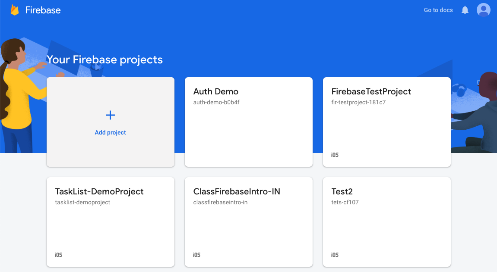
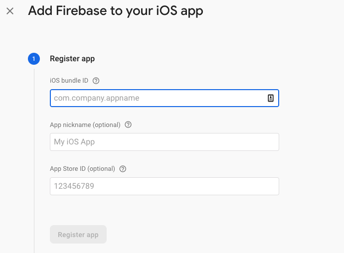
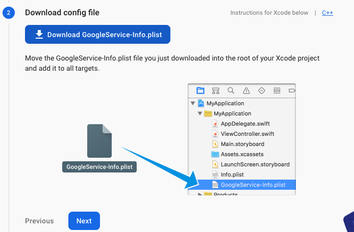
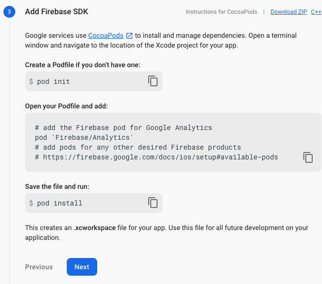
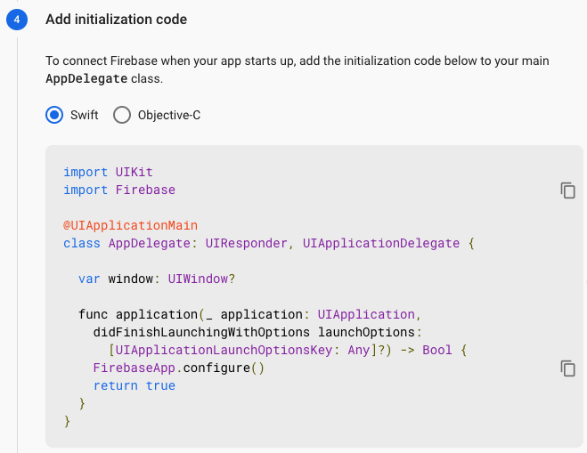
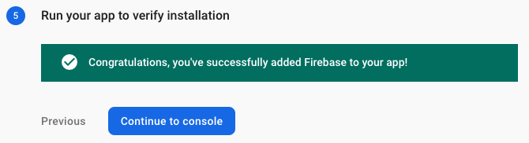
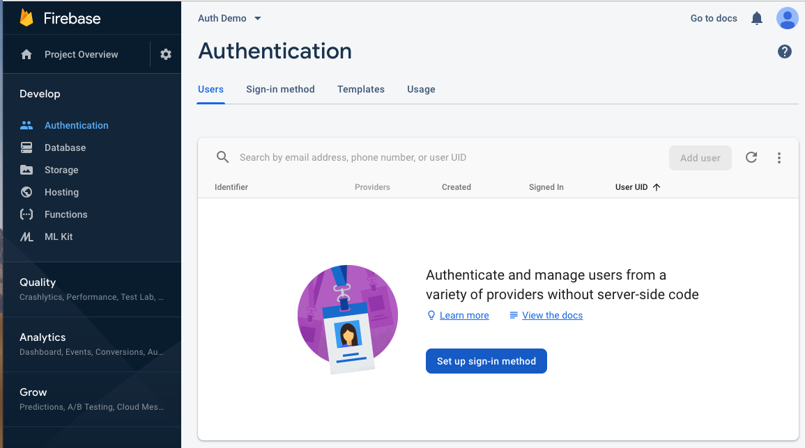
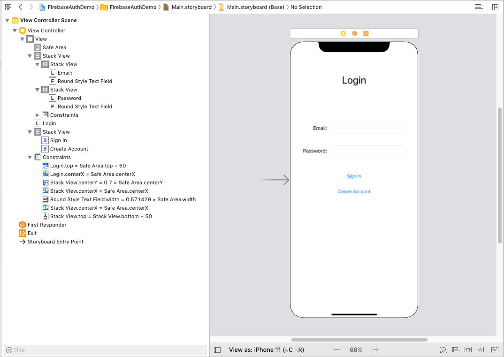

# Firebase Intro

## Objectives

1. Understand what Firebase is and what it is used for
2. Integrate Firebase Auth into a project

## Readings
[Firebase Docs](https://firebase.google.com/docs/ios/setup?authuser=0)  
[Authentication](https://firebase.google.com/docs/auth/?authuser=1)     
[Cloud Firestore](https://firebase.google.com/docs/firestore/?authuser=1)   
[Cloud Storage](https://firebase.google.com/docs/storage/?authuser=1)

## [Demo App](https://github.com/joinpursuit/Pursuit-Core-iOS-Firebase-Auth-Demo)   

# 1. What is Firebase and why would we want to use it?

Firebase is a platform that manages a backend for mobile applications.  There are three main features that Firebase offers that we will take advantage of.

1. Authentication
2. Cloud Firestore database
3. Storage (Images, etc)

Without a backend, there is a limit to what kind of apps we are able to build.  We have been able to build applications that request and process data, and even applications that post some limited amount of information.  Companies like Facebook or Spotify provide APIs for logging into user accounts and editing information using OAuth.  But these services only let you interact with specific products.  If we want to build our own service, we need to have our own backend.

Firebase provides this backend to mobile developers.  There is a [free tier](https://firebase.google.com/pricing/), which we will be using which limits the storage and number of simultaneous users that can be on your app.  Paid tiers raise these limits.

# 2. Competitors to Firebase

Firebase is one of the most popular backend as a service providers, but there are other competitors.  CloudKit is Apple's service that requires an iCloud account which makes it only useful for iOS users.  Amazon Web Services provides an alternative to Firebase that provides the same functionality, but can be trickier to learn. Realm is also a very strong competitor to Firebase.

1. [CloudKit](https://developer.apple.com/icloud/)    
2. [Amazon Web Services](https://aws.amazon.com/)    
3. [Realm](https://realm.io/)   


# 3. Getting Started

The point of Firebase is to create an app that many users will be able to access.  But how do we use it?  We are going to create a very small app today that will run through Authorization and reading and writing data for a simple model.

To begin, create a new Xcode project.

Then, go to [https://firebase.google.com/](https://firebase.google.com/) and login.  You can login with any gmail account.  Once you are logged in, click on the button at the top labeled "Go To Console".  Click on the plus icon to create a new project.



Select your project, and click on the iOS logo to configure Firebase for iOS


Then, follow the steps to connect your project to Firebase:

### Add your BundleID



### Download Google's plist

Make to select `"Copy Items if needed"` when you drag the `.plist` file to Xcode. The GoogleService-Info.plist file contains settings that Firebase uses to set up your app.




### Add the Firebase SDK

Include `Firebase/Auth` in your `Podfile`



### Configure Firebase to start in your app

Close your Xcode project, and open the `.xcworkspace` file.  Then add the following code to your `AppDelegate`:




### Run your app to verify installation




You are now set up to use Firebase!  

# 4. Configuring Auth on Firebase

Our app is now setup to talk to Firebase.  Our first step will be to enable users to create an account and sign in.

### Website configuration

Go to your console online and select "Authentication" in the side bar menu.  Then select **Set up sign-in Method**.  



You can choose from any of the given options.  For this app, select "Email/Password".

You are then presented with a page showing all of the users in your app:


You can add users directly through the website.  Now, let's add the ability to add users and log in users through our app.


# 5. Building the Auth UI

Refactor the default ViewController to "LoginViewController".

In your Storyboard file, add the following:

- A Text Field for entering the email
- A Text Field for entering the password
- A login button
- A create account button

It should look like the image below:



# 6. Building the `FirebaseAuthService`

Firebase gives us some very powerful tools for managing signing in and creating users.  Just like we did with our `NetworkHelper`, we want to package this functionality in its own Singleton class, so that our VC's aren't calling Firebase methods directly.  This also makes it possible later to switch out `Firebase` for a competing service.

We want our class to have the following API:

```swift
import Foundation
import FirebaseAuth

class FirebaseAuthService {

    // MARK: -Static Properties

    static let manager = FirebaseAuthService()

    // MARK: -Internal Functions

    func loginUser(withEmail email: String, andPassword password: String, onCompletion: @escaping (Result<User, Error>) -> Void) {
        // TODO: Add Implementation
    }

    func createNewUser(withEmail email: String, andPassword password: String, onCompletion: @escaping (Result<User, Error>) -> Void) {
      // TODO: Add Implementation
    }

    // MARK: -Internal Properties

    var currentUser: User? {
      // TODO: Add Implementation
    }

    // MARK: -Private Initializers

    private init() {}
}
```

Our `loginUser` and `createNewUser` functions have a signature that takes in an email, password and completionHandler.  We will either get a user or an error back from the Firebase API.  Then, we will call the completion handler, which will handle the response.

FirebaseAuth has an `Auth.auth()` property which has methods for `signIn`, `createUser`, and `currentUser`.  We can complete our `FirebaseAuthService` by using these methods:

```swift
import Foundation
import FirebaseAuth

enum GenericError: Error {
    case unknown
}

class FirebaseAuthService {

    // MARK: -Static Properties

    static let manager = FirebaseAuthService()

    // MARK: -Internal Functions

    func loginUser(withEmail email: String, andPassword password: String, onCompletion: @escaping (Result<User, Error>) -> Void) {
        firebaseAuth.signIn(withEmail: email, password: password) { (result, error) in
            if let user = result?.user {
                onCompletion(.success(user))
            } else {
                onCompletion(.failure(error ?? GenericError.unknown))
            }
        }
    }

    func createNewUser(withEmail email: String, andPassword password: String, onCompletion: @escaping (Result<User, Error>) -> Void) {
        firebaseAuth.createUser(withEmail: email, password: password) { (result, error) in
            if let createdUser = result?.user {
                onCompletion(.success(createdUser))
            } else {
                onCompletion(.failure(error ?? GenericError.unknown))
            }
        }
    }

    // MARK: -Internal Properties

    var currentUser: User? {
        return firebaseAuth.currentUser
    }

    // MARK: -Private Properties

    private let firebaseAuth = Auth.auth()

    // MARK: -Private Initializers

    private init() {}
}
```

# 7. Building the LoginViewController

Below, we complete our LoginVC by calling the appropriate methods in the `FirebaseAuthService` when buttons are clicked:

```swift
import UIKit
import FirebaseAuth

class LogInViewController: UIViewController {

    // MARK: -IBOutlets

    @IBOutlet var emailTextField: UITextField!
    @IBOutlet var passwordTextField: UITextField!

    // MARK: -Private Properties

    private var validUserCredentials: (email: String, password: String)? {
        guard let email = emailTextField.text,
              let password = passwordTextField.text,
              emailFieldIsValid() else {
                return nil
        }

        return (email, password)
    }

    // MARK: -IBActions

    @IBAction func signInUser(_ sender: Any) {
        guard let validCredentials = validUserCredentials else {
            handleInvalidFields()
            return
        }
        FirebaseAuthService.manager.loginUser(withEmail: validCredentials.email,
                                              andPassword: validCredentials.password,
                                              onCompletion: { [weak self] (result) in self?.handleLogInResponse(withResult: result) })
    }

    @IBAction func createNewUserAccount(_ sender: Any) {
        guard let validCredentials = validUserCredentials else { return }
        FirebaseAuthService.manager.createNewUser(withEmail: validCredentials.email,
                                                  andPassword: validCredentials.password,
                                                  onCompletion: { [weak self] (result) in self?.handleCreateUserResponse(withResult: result) })
    }

    // MARK: -Private methods

    private func handleLogInResponse(withResult result: Result<User, Error>) {
        let alertTitle: String
        let alertMessage: String
        switch result {
        case let .success(user):
            alertTitle = "Login Success"
            alertMessage = "Logged in user with email \(user.email ?? "no email") and id \(user.uid)"
        case let .failure(error):
            alertTitle = "Login Failure"
            alertMessage = "An error occurred while logging in: \(error)"
        }
        presentGenericAlert(withTitle: alertTitle, andMessage: alertMessage)

    }

    private func handleCreateUserResponse(withResult result: Result<User, Error>) {
        let alertTitle: String
        let alertMessage: String
        switch result {
        case let .success(user):
            alertTitle = "Success - New Account Created"
            alertMessage = "Created user with email \(user.email ?? "no email") and id \(user.uid)"
        case let .failure(error):
            alertTitle = "Create user failure"
            alertMessage = "An error occurred while creating an account: \(error)"
        }
        presentGenericAlert(withTitle: alertTitle, andMessage: alertMessage)
    }

    private func handleInvalidFields() {
        // TODO: Complete implementation
    }

    private func emailFieldIsValid() -> Bool {
        // TODO: Complete implementation
        return true
    }

    private func presentGenericAlert(withTitle title: String, andMessage message: String) {
        let alertVC = UIAlertController(title: title, message: message, preferredStyle: .alert)
        alertVC.addAction(UIAlertAction(title: "OK", style: .cancel, handler: nil))
        present(alertVC, animated: true, completion: nil)
    }
}
```
