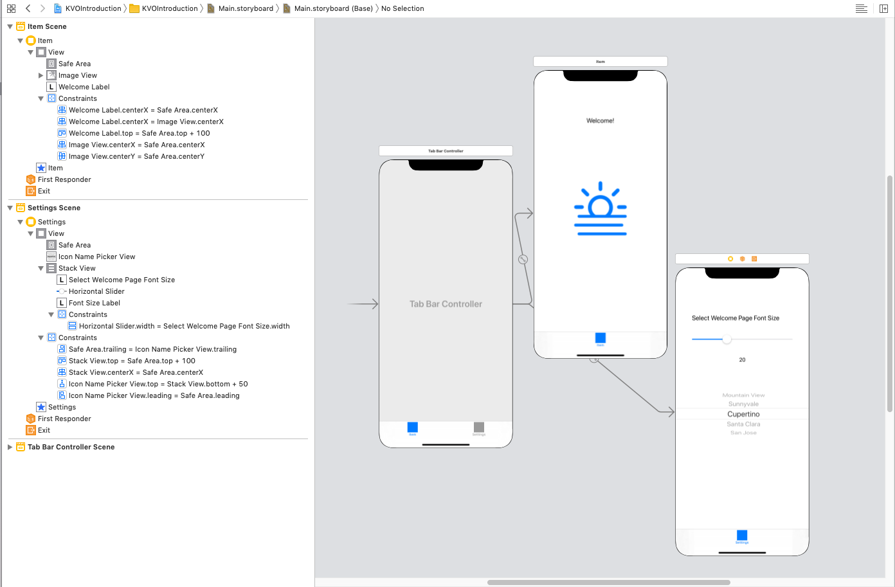

## Key-Value Observing

## Objectives

* What is the Observer pattern
* What is Key-Value Observing (KVO)
* Build an app that implements KVO  

## Resources

|Resources|Summary|
|:-----|:-----|
|[Key- Value Observing in Swift](https://developer.apple.com/documentation/swift/cocoa_design_patterns/using_key-value_observing_in_swift) | Apple Docs for Swift KVO |
|[Intro to Key-Value Observing](https://developer.apple.com/library/content/documentation/Cocoa/Conceptual/KeyValueObserving/KeyValueObserving.html)|Introduction to Key-Value Observing Programming Guide|
|[Using Swift with Cocoa and Objective-C](https://developer.apple.com/library/content/documentation/Swift/Conceptual/BuildingCocoaApps/AdoptingCocoaDesignPatterns.html)|Using Swift with Cocoa and Objective-C|
|[NSKeyValueObserving](https://developer.apple.com/documentation/foundation/notifications/nskeyvalueobserving)|An informal protocol that objects adopt to be notified of changes to the specified properties of other objects|
|[Hacking with Swift](https://www.hackingwithswift.com/example-code/language/what-is-key-value-observing)|What is key-value observing?|

## Demo Project

- [link](https://github.com/joinpursuit/Pursuit-Core-iOS-KVO-Introduction)

# 1. The Observer Pattern

A common problem that we want to solve when programming is how to be informed when something interesting happens.  For example, we may want to know:

- When do we get valid data back from online?
- Did a user tap on a Table View cell?
- When does the keyboard appear?
- Did an underlying array of objects change, and do we need to reload the cells in a Table View?

In order to answer these questions, we've used the following strategies so far:

### callbacks

```swift
NetworkClient.manager.getData(onCompletion: { _ in print("We got data!") })
```

### delegation

```swift
class MyVC: UIViewController, UITableViewDelegate {

  lazy var tableView = {
    return UITableView()
  }()

  override func viewDidLoad() {
    super.viewDidLoad()
    tableView.delegate = self    
  }

  func tableView(tableView: UITableView, didSelectRowAtIndexPath indexPath: NSIndexPath){
      print("You selected the cell at \(indexPath.row)")
  }
  ...
}
```

```swift
NotificationCenter.default.addObserver(self,
					selector: #selector(handleKeyboardAppearing(sender:)),
					name: UIResponder.keyboardWillShowNotification,
					object: nil)

@objc func handleKeyboardAppearing(sender: Notification) {
    guard let infoDict = sender.userInfo else { return }
    guard let rectValue = infoDict["UIKeyboardFrameEndUserInfoKey"] as? CGRect else { return }
    print("The keyboard is \(rectValue.height) by \(rectValue.width)")
}
```

### Property Observers

```swift
var myThings: [Thing] {
  didSet {
    print("Now I have these things: \(myThings)")
  }
}
```

Callbacks, delegation and property observers work well for mapping on a 1:1 basis.  We can map a single network call to a callback, map a delegate to one View Controller, and map a didSet to one specific object.  However, what if we wanted multiple different objects to all react to a particular event?  For this we need to use the **observer pattern**

In the observer pattern, a **subject** broadcasts new information.  At any point, an object can **observer** that subject and get access to its updates:


Source: https://medium.com/elp-2018/observe-the-observer-design-pattern-3b9a84fd559c

`NSNotificationCenter` is one example of an observer pattern.  It works well for built in system events (e.g. screen rotations and keyboard events), but it is harder to handle our own custom events.  Key-Value Observing is one solution to this problem.


# 2. Key-Value Observing in Swift

In Objective-C, you can think of objects as having keys that are strings (the property names) and value (the value for that property name).  Whenever the value for a key changes, it broadcasts the new value to any observers who might be listening.  We can create observers to receive updates about these changes, and execute code accordingly.

To do so, we'll need to create a class that's able to have its property observed:

```swift
@objc class Dog: NSObject {
    var name: String
    @objc dynamic var age: Int
    init(name: String, age: Int) {
        self.name = name
        self.age = age
    }
}
```

It must:

- Be an `@objc` class that inherits from `NSObject`
- Have any properties that you want to observe be `@objc` and `dynamic`
- Have any properties that you want to observe be able to be read by the Objective-C runtime.

Now that we have our `Dog` class, we can build a `DogWalker` class that takes in a `Dog`, and prints a message when it has a birthday:

```swift
class DogWalker {
    let dog: Dog
    var birthdayObservation: NSKeyValueObservation?

    init(dog: Dog) {
        self.dog = dog
        configureBirthdayObservation()
    }

    func walk() {
        print("Now walking \(dog.name)")
    }

    private func configureBirthdayObservation() {
        birthdayObservation = dog.observe(\.age, options: [.old, .new], changeHandler: { (dog, change) in
            print("Hey \(dog.name), happy birthday from the dog walker!")
        })
    }
}
```

Note the odd syntax after the `observe` call.  The "\." syntax is called a [Key Path](https://docs.swift.org/swift-book/ReferenceManual/Expressions.html).  It lets us access properties of the dog that we are observing.

We can create another class with a separate observation:

```swift
class DogGroomer {
    let dog: Dog
    var birthdayObservation: NSKeyValueObservation?

    init(dog: Dog) {
        self.dog = dog
        configureBirthdayObservation()
    }

    func groom() {
        print("Now grooming \(dog.name)")
    }

    private func configureBirthdayObservation() {
        birthdayObservation = dog.observe(\.age, options: [.old, .new], changeHandler: { (dog, change) in
            print("Hey \(dog.name), happy birthday from the dog groomer!")
        })
    }
}
```

Then, we can create a dog, its walker and groomer, then have the dog have a birthday:

```swift
let snoopy = Dog(name: "Snoopy", age: 5)
let walker = DogWalker(dog: snoopy)
let groomer = DogGroomer(dog: snoopy)

snoopy.age += 1


// Prints the following
// Hey Snoopy, happy birthday from the dog groomer!
// Hey Snoopy, happy birthday from the dog walker!
```

We have successfully configured multiple observers to watch changes to the same property in a given subject.

# 4. Building an app using KVO

We can use this same strategy to build an application using KVO.  Here, we'll build an app that has a welcome screen, and a settings screen.  Changing content on the settings screen should update the settings screen itself, in addition to the welcome screen.

## Storyboard

Create a new project and put together the following UI in Storyboard:



## Settings.swift

Next, let's build our `Settings` model.  In order to get KVO working for it, we'll make it a singleton.  This is because KVO can't observe static properties in Swift.

`Settings.swift`
```swift
import UIKit

@objc class Settings: NSObject {
    static let shared = Settings()
    override private init() {
        self.fontSize = 15
        self.iconName = "sun.haze"
    }
    @objc dynamic var fontSize: Int
    @objc dynamic var iconName: String
}
```

## SettingsViewController.swift

Next, drag in outlets to your fontSize label and picker view, and an action to your slider.  Configure your Settings View Controller to update the Settings singleton when a new row or slider value is selected.  Then configure an an observer to update the font size label when the Settings singleton has its fontSize value updated.  Finally, configure the picker view to choose between several different icon string names.

```swift
import UIKit

class SettingsViewController: UIViewController {

    // MARK:- IBOutlets

    @IBOutlet var iconNamePickerView: UIPickerView!
    @IBOutlet var fontSizeLabel: UILabel!

    // MARK:- Internal Variables

    var iconNames = [String]()
    var fontSizeObservation: NSKeyValueObservation?

    // MARK:- Lifecycle Overrides

    override func viewDidLoad() {
        super.viewDidLoad()
        loadIconNames()
        configurePickerView()
        configureObservers()
    }

    // MARK:- IBActions

    @IBAction func fontSizeChanged(_ slider: UISlider) {
        let newSize = Int(slider.value)
        Settings.shared.fontSize = newSize
    }

    // MARK:- Private Methods

    private func loadIconNames() {
        iconNames = ["sun.haze", "moon", "globe", "icloud"]
    }

    private func configurePickerView() {
        iconNamePickerView.delegate = self
        iconNamePickerView.dataSource = self
    }

    private func configureObservers() {
        observeFontSize()
    }

    private func observeFontSize() {
        fontSizeObservation = Settings.shared.observe(\.fontSize, options: [.old, .new]) { [weak self] object, change in
            guard let newSize = change.newValue else { return }
            self?.fontSizeLabel.text = "\(newSize)"
        }
    }
}

// MARK:- UIPickerViewDelegate

extension SettingsViewController: UIPickerViewDelegate {
    func pickerView(_ pickerView: UIPickerView, titleForRow row: Int, forComponent component: Int) -> String? {
        return iconNames[row]
    }
    func pickerView(_ pickerView: UIPickerView, didSelectRow row: Int, inComponent component: Int) {
        let iconName = iconNames[row]
        Settings.shared.iconName = iconName
    }
}

// MARK:- UIPickerViewDataSource

extension SettingsViewController: UIPickerViewDataSource {
    func numberOfComponents(in pickerView: UIPickerView) -> Int {
        return 1
    }

    func pickerView(_ pickerView: UIPickerView, numberOfRowsInComponent component: Int) -> Int {
        return iconNames.count
    }
}
```

## WelcomeViewController.swift

In your `WelcomeViewController.swift`, create outlets to your imageView and welcomeLabel.  Configure observers such that updates to the Settings singleton will update the outlets as necessary:

```swift
import UIKit

class WelcomeViewController: UIViewController {

    // MARK:- IBOutlets

    @IBOutlet var imageView: UIImageView!
    @IBOutlet var welcomeLabel: UILabel!

    // MARK:- Internal Variables

    var fontSizeObservation: NSKeyValueObservation?
    var iconNameObservation: NSKeyValueObservation?

    var settings = Settings.shared

    // MARK:- Lifecycle Overrides

    override func viewDidLoad() {
        super.viewDidLoad()
        configureObservers()
    }

    // MARK:- Private Methods

    private func configureObservers() {
        observeFontSize()
        observeIconName()
    }

    private func observeFontSize() {
        fontSizeObservation = settings.observe(\.fontSize, options: [.old, .new]) { [weak self] object, change in
            guard let newSize = change.newValue else { return }
            self?.welcomeLabel.font = self?.welcomeLabel.font.withSize(CGFloat(newSize))
        }
    }
    private func observeIconName() {
        iconNameObservation = settings.observe(\.iconName, options: [.old, .new]) { [weak self] object, change in
            guard let newName = change.newValue,
                let newImage = UIImage(systemName: newName) else {
                    return
            }
            self?.imageView.image = newImage
        }
    }
}
```

Build and run your app, and you have built something that uses KVO to pass data.  The advantage of this model is that it is simple to add more View Controllers that also observe the Settings VC and update themselves.
