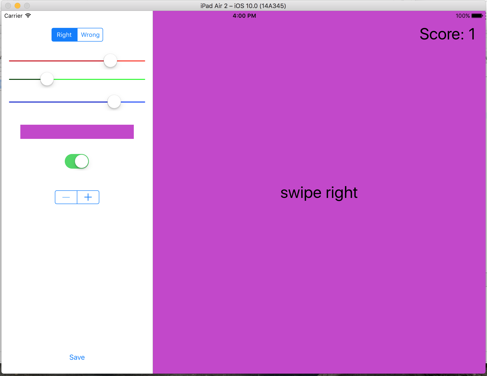

## Unit 2, Week 3 Homework

```
 __   __  ___   _______  _______  __    _  _______  ______    _______  ___     
|  | |  ||   | |       ||       ||  |  | ||       ||    _ |  |       ||   |    
|  | |  ||   | |       ||   _   ||   |_| ||_     _||   | ||  |   _   ||   |    
|  |_|  ||   | |       ||  | |  ||       |  |   |  |   |_||_ |  | |  ||   |    
|       ||   | |      _||  |_|  ||  _    |  |   |  |    __  ||  |_|  ||   |___ 
|       ||   | |     |_ |       || | |   |  |   |  |   |  | ||       ||       |
|_______||___| |_______||_______||_|  |__|  |___|  |___|  |_||_______||_______|
 _______  ______    _______  _______  ___   _                                  
|       ||    _ |  |       ||   _   ||   | | |                                 
|    ___||   | ||  |    ___||  |_|  ||   |_| |                                 
|   |___ |   |_||_ |   |___ |       ||      _|                                 
|    ___||    __  ||    ___||       ||     |_                                  
|   |    |   |  | ||   |___ |   _   ||    _  |                                 
|___|    |___|  |_||_______||__| |__||___| |_|  
                                                             
```

## The ```git``` side of things

1. Fork https://github.com/C4Q/AC3.2-GesturesAndControls if you haven't already
2. Clone your **own** fork to a local directory.
3. Add an upstream in your local directory thusly:

	```
	git remote add upstream https://github.com/C4Q/AC3.2-Tableviews_Part_1
	```
4. Run this to get a working homework branch

	```
	git fetch upstream homework:homework
	git checkout homework
	```
At this point you should have the state of the project as we left off in class: a single
slider in the master (```SettingsViewController```) will update the color of background of the detail (```GesturesViewController```) for correct
gestures. 

5. Work on the assignment and when
you're done when you're done commit inside XCode or on the command line and then run
	```
	git push origin homework
	```
That will  push your changes up to that branch on your fork.

1. Make a pull request from **your** fork. You should see the ```homework``` branch
on both sides of the pull request.


### Using Controls

#### Assignment

1. Using the single ```UISlider``` we're using as a model, add two more ```UISlider```s to control red, green
and blue values individually. Instead of passing a number to the detail, send at ```UIColor``` object that you create
based on these three values.
2. In real time, preview the color being manipulated in a ```UIView``` in the master. You'll do this by
continuously updating the value of the background color of the preview ```UIView``` on change value events from all sliders.
2. Add a ```UISwitch``` that will determine whether or not to reset the score to zero on wrong guesses. If on, it will
do what it's doing now: reset. When off it will just keep counting up.
3. Add a ```UIStepper``` to set the number of consecutive tries before winning. After winning, reset the score to zero.
4. Add a ```UISegmentedControl``` to configure which of the right/wrong colors you're setting. This will require
another property to hold the color for wrong answers.
At this point your application will look something like this:


5. Add titles and feedback in the form of ```UILabels``` to help the user know what's what. E.g. mark what the switch
does; show the value of the stepper.

#### Reading

* [UITextField](https://developer.apple.com/reference/uikit/uitextfield)
* [UITextFieldDelegate](https://developer.apple.com/reference/uikit/uitextfielddelegate)
* [Strings](http://useyourloaf.com/blog/swift-string-cheat-sheet/). We'll be manipulating
Strings and it's **always** good to improve our String library abilities.

#### Other Reading

**Zen and the Art of Motorcycle Maintenance**, by Robert M. Persig

* [Stuckness](http://www.chiro.org/LINKS/FULL/ARCHIVE/Zen/chapter24.htm)
* [Gumption](http://www.chiro.org/LINKS/FULL/ARCHIVE/Zen/chapter26.htm)
