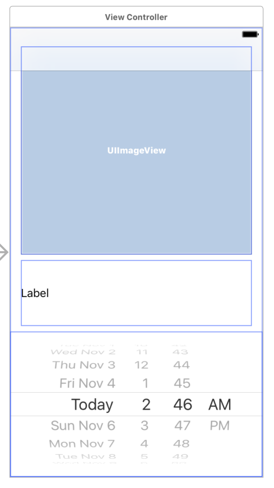

# Unit 3 Week 3 Homework

# NASA APOD

## Objective

Build an app that displays NASA's Picture of the Day for any day using the Date Picker.

## Wireframe

## Steps

1. Register for an API key at NASA, https://api.nasa.gov/index.html#apply-for-an-api-key.

2. Read the API as described on https://api.nasa.gov/api.html#apod.

3. When the user changes the date on the [date picker](https://developer.apple.com/reference/uikit/uidatepicker),
   load a new APOD (picture and description).
   Be careful to check the media type. If it's video, you can either skip or provide button to open the URL in 
   Safari. 

