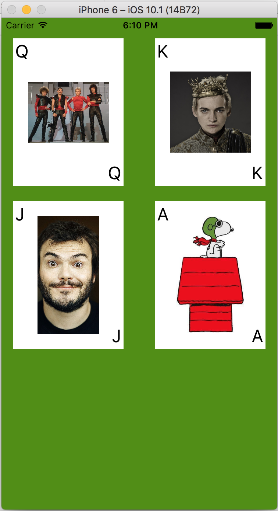

# Unit 5 Week 1 Homework

## Custom Views Backed by Nibs

### Objectives

* Create a custom reusable playing card view
* Generate the custom view by creating a backing nib file that loads into it 
* Reference that UIView subclass in the storyboard


###  Steps

1. Fork and clone https://github.com/C4Q/AC3.2-SimpleCardViews. Create a new project inside it
	and name it **SimpleCardViews**. (It would be very helpful for us looking at your projects
	if you follow this naming.)


1. The end goal looks something like this. You can find your own images.



1. Create a new Single View Application and for once leave it that way. Work directly in the 
generated ```ViewController``` class.


1. Refer to the Custom Views part of the [nibs lesson](https://github.com/C4Q/AC3.2/tree/master/lessons/unit5/nibs)
for guidance, and specifically for the initializers to put in your custom view. We used the first code block
in class to make an initializer for the PeriodicTableItemView, our UIView subclass.

	```swift
	override init(frame: CGRect) {
	    super.init(frame: frame)
	}

	required init?(coder aDecoder: NSCoder) {
	    super.init(coder: aDecoder)
	    
	    if let view = Bundle.main.loadNibNamed("PeriodicTableItemView", owner: self, options: nil)?.first as? UIView {
	        self.addSubview(view)
	        view.frame = self.bounds
	    }
	} 
	```

	You can use this, changing the nib name appropriately. The ```init(coder:)``` method is called when
	our view is found in a storyboard or nib file. 

1. The steps for making the custom view are:
	1. Create a new Cocoa Touch file, subclassing UIView.
	1. Create a new File, this time choosing the User Interface > View option. This creates a nib/xib file.
	Name it the same as its swift file, e.g. CardView.swift and CardView.xib (for the ```CardView:UIView``` class) 
	This isn't required but it makes sense and we can take advantage of this later.
	1. In the xib file click on ```File's Owner``` and set its class in the Identity Inspector to the
	class you just made, CardView in the example above.
	1. Open up the Assistant Editor and create outlets from the views to the code just as we do 
	with view controllers in Storyboards.
	1. Add the initializers in the code block above, using the correct nib name.

1. To use your custom view in another nib or in a Storyboard find the ```View``` object and place it 
where you want it. Then in the Identity Inspector change its class to your custom class.

1. In your view controller you can populate the outlets as you are used to. You may find you want to set
a property in the view from which the view can populate itself, much like when we pass a property to a
detail view controller.

Tip

* To get the images you can add them as assets to your project or grab them via API. I did the former.
