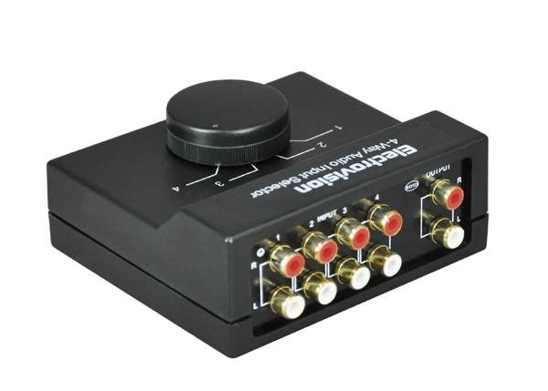

# Standards
Master conditionals in all their forms and their relationship to boolean logic

# Objectives
Students will be able to:
* Understand and use if / then / else constructs
* Apply boolean logic to conditionals
* Understand and use switch
* Develop ability to choose among variations of conditionals

# Resources
Swift Programming: The Big Nerd Ranch Guide, Chapter 3, Conditionals

Swift Programming: The Big Nerd Ranch Guide, Chapter 5, Switch (pp. 35-39)

Apple's [Swift Language Reference, Control Flow](https://developer.apple.com/library/ios/documentation/Swift/Conceptual/Swift_Programming_Language/ControlFlow.html#//apple_ref/doc/uid/TP40014097-CH9-ID120) Seek to **Conditional Statements**

# Assessment Materials
## Midday Check-in and solutions

## Warm up

```swift
// 1. 
let primate = "Ape"
let equid = "Zebra"

// what does this evaluate to?
primate > equid

// 2a-b.
let cold = 32
let ideal = 75
let hot = 90
let currentTemp = 65

// 2a.
// what does this evaluate to?
currentTemp < hot && currentTemp > cold

// 2b.
// write an expression that evaluates to true 
// if currentTemp is within 5 degrees of ideal
```

# Lecture
## Intro
Conditionals are what makes a program dynamic. Without them programs would have no way to do anything differently. We use the expression "branch" to refer to the possible paths our program can take. 
The anaology is a visual representation of how paths through the code can be visualized as the branches of a tree. It's a good analogy because it expresses both the connection to a larger trunk as well as the diminishing size of path. This size represents the likliness that the branch will be reached. 

Note: there are a few places where we use the analogy of trees and branching in Computer Science. It is an example of the divide and conquer paradigm.

### ```if```

```swift
var temperatureInFahrenheit = 30
if temperatureInFahrenheit <= 32 {
    print("It's very cold. Consider wearing a scarf.")
}
```

### ```else```

```swift
temperatureInFahrenheit = 40
if temperatureInFahrenheit <= 32 {
    print("It's very cold. Consider wearing a scarf.")
} else {
    print("It's not that cold. Wear a t-shirt.")
}
// Prints "It's not that cold. Wear a t-shirt."
```

### ```else if```

```swift
temperatureInFahrenheit = 90
if temperatureInFahrenheit <= 32 {
    print("It's very cold. Consider wearing a scarf.")
} else if temperatureInFahrenheit >= 86 {
    print("It's really warm. Don't forget to wear sunscreen.")
} else {
    print("It's not that cold. Wear a t-shirt.")
}
// Prints "It's really warm. Don't forget to wear sunscreen."
```

**Exercise**

Using the constants from the warm up write conditionals that 
output helpful messages about the temperature. See if you can work in 
some string interpolation.

```swift
let cold = 32
let ideal = 75
let hot = 90
let currentTemp = 65

// 1.
// print a meaningful message for this condition
currentTemp < hot && currentTemp > cold

// 2.
// and for this one
currentTemp > hot || currentTemp < cold

// 3.
// print a meaningful message for this condition
// if currentTemp is within 5 degrees of ideal
```

## ```switch```

```swift
switch aValue {
case onePossibleAndExpectedValueToCompareTo:
	// do something for the case of onePossibleAndExpectedValueToCompareTo
case anotherPossibleAndExpectedValueToCompareTo:
	// do something for the case of anotherPossibleAndExpectedValueToCompareTo
default:
	// do something for the case when there are no matches
}
```

The ```switch``` statement is a conditional that is most useful when the set of possible values we're comparing to is known. Swift's ```switch``` statement is more powerful than its predecessors so it can be used more widely. In many cases ```switch``` is more readable than the alternative. That alternative
is almost always a series of ```if-then-else``` blocks.



A 4-way switch ([1])

An image like this helps to link the word "switch" to the ```switch``` statment. We normally think of 
a switch as being on or off and so the keyword is not intuitive. But if we think of the input selector
on an old style stereo amplifier (I couldn't find a better image.) I think it helps to have a visual of this kind of branching.

The **type** of the cases and the operand on the ```switch``` line must agree. This makes sense and is consistent with our experience with Swift and its strong typing. As long as we can compare that type with itself then we can use it in a ```switch```.

### ```break```

```swift
switch temperature {
case 32:
    print("\(temperature) is cold")
case 99:
    print("\(temperature) is hot")
}
```

Generates the error: "Switch must be exhaustive, try adding a default clause." This is one important point about ```switch```: you must cover all bases. And adding the default clause introduces a second point. If we don't want to do anything in our default case we use the keyword ```break```. Swift requires an executable statement in each case. Generally, we may want to break in other matches but default is the most intuitive and therefore the most common. 


```swift
switch temperature {
case 32:
    print("\(temperature) is cold")
case 99:
    print("\(temperature) is hot")
default:
	break
}
```

### ```fallthrough```

```fallthrough``` is used to have consecutive cases match. It's not as common.

```swift
let integerToDescribe = 5
var description = "The number \(integerToDescribe) is"
switch integerToDescribe {
case 2, 3, 5, 7, 11, 13, 17, 19:
    description += " a prime number, and also"
    fallthrough
default:
    description += " an integer."
}
print(description)
```

### Ranges

```switch``` also matches values in ranges. This introduces the ```Range``` type. Let's look at a range by itself before we see it in the context of ```switch```. The ```Range``` is always defined by two numbers: the upper bound and the lower bound. There are two forms, one that *doesn't* include the higher bound and one that does. The non-inclusive is the more common form.

**Question:** Why do you think it might be the more common form?

```swift
let r = 0..<5
print(String(r.dynamicType))

let cardValues = 1...13
print(String(cardValues.dynamicType))
```

Note how the Playground converts the inclusive version of the Range into the non-inclusive.

```swift
let approximateCount = 62
let countedThings = "moons orbiting Saturn"
var naturalCount: String
switch approximateCount {
case 0:
    naturalCount = "no"
case 1..<5:
    naturalCount = "a few"
case 5..<12:
    naturalCount = "several"
case 12..<100:
    naturalCount = "dozens of"
case 100..<1000:
    naturalCount = "hundreds of"
default:
    naturalCount = "many"
}
print("There are \(naturalCount) \(countedThings).")
// Prints "There are dozens of moons orbiting Saturn."
```

### Tuples
The ```switch``` statement also allows for matching on tuples. This is another new data type. A tuple is a grouping of a set of related variables into one.

```swift
// independent constants
let name = "Agnes"
let age = 24
let zipcode = 11106

// one tuple agnesInfo now contains a list of values
let agnesInfo = (name, age, zipcode)
let hollyInfo = ("Holly", 33, "10301") // can be built from literals; note the type of zip
```

If you enter the above block in a playground you'll see agnesInfo broken into numbered components, 0, 1 and 2. We haven't discussed Swift arrays here but you're familiar with them from the Workshop at least and so will recognize the numbers as zero-based array indexes. *variableName*.*index* is the syntax to access the tuple items from the variable. For example:

```swift
agnesInfo.2 // gets Agnes's zipcode
```

[Tuples][2] get their name from the sequence of multiples we're familiar with, starting with single, double, triple, quadruple, quintuple, etc. From this mathematicians coined the term n-tuple, and it's shortened to tuple. Because many common examples of tuples happen to have two elements, and how the term sounds like "duplicate", and "two", it's easy to think tuples denotes two parts. But this is not the case. There can be many items in a tuple.

#### Exercise

* Declare some tuples and inspect their component values.

#### ```switch``` + a tuple

So let's look at ```switch``` with a tuple.

```swift
let agnesInfo = ("Agnes", 24, 11106)
let hollyInfo = ("Holly", 33, 10301)
let kaiInfo = ("Kai", 18, 11106)
let personInfo = kaiInfo

switch personInfo {
case (_, 0..<30, 10300...10399):
    print("\(personInfo.0) is young and lives on Staten Island")
case (_, 0..<30, 11100...11199):
    print("\(personInfo.0) is young and lives in LIC")
case (_, 0..<30, _):
    print("\(personInfo.0) is young and we don't know where they live")
case (_, _, 10000...14999):
    print("(\(personInfo.0) lives in New York State")
default:
    print("We can't say anything interesting about \(personInfo.0)")
}
```

#### Exercise

* Add some more people to the example above and try to hit every case.
* Add some new cases.

```swift
let paulInfo = ("Paul", 48, 97321)
let mariaInfo = ("Maria", 18, 10305)
case (_, 30..<60, 97300..97399):
    print("\(personInfo.0) is mature and lives in Salem, OR")
```

# Review and Wrapup

* Describe the use of ```if```.
* Compare and contrast the use of if/then/else and switch.
* What are Ranges?
* What are Tuples?


## References
http://images.esellerpro.com/2594/I/112/9/lrgscale4%20Way%20Stereo%20Input%20Selector2.jpg
[1]: http://images.esellerpro.com/2594/I/112/9/lrgscale4%20Way%20Stereo%20Input%20Selector2.jpg

https://en.wikipedia.org/wiki/Tuple
[2]: https://en.wikipedia.org/wiki/Tuple

