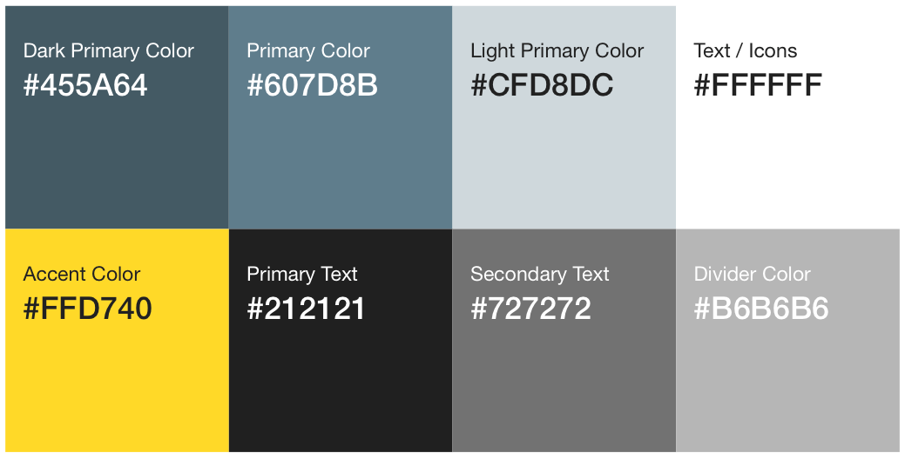

# That Photo Category App

## Introduction

\[TBD\] is a social image sharing and upvoting app. Each new image is uploaded to one of a 
set of categories and is subsequently ranked by up- and down- votes within it. 
By funneling images into discrete categories more opportunites for each image to feature
in a top-list.

## Screens

### Launch Screen


### Login


### Categories

#### Main Screen


#### Category


#### Single Image


### Uploads

#### Main


#### Upload (progress)


#### Upload (complete)


## Flows

### Login


### Main


### Upload


## Implementation Requirements

### Color Palette



### Assets

All assets for the app icons can be [found here](images/Assets).


### Backend Services

The backend of the app is implmented in Firebase. 

* Registration and login uses Firebase's _Authentication_
* Structured data such as the pre-set list of categories, up- and down- votes use Firebase's _Database_
* Images are uploaded to Firebase's _Storage_

### Categories

For this MVP version of the app categories are defined and entered by an administrator 
within a node in the Firebase database and read into the app for use in any category 
related feature.

Users select among a pre-defined set of categories to  upload each image into. 
(Later versions of the app might allow the users to define the categories but this 
is not a current requirement.)

### Authentication

Registration and Login are reached from the same screen. Login is required in order to enter
any part of the app and so this screen is presented when the user is not logged in.

### Profile

The profile page has a profile picture. This is chosen by tapping on the picture or a place-holder. 
The user is prompted to choose and upload a photo from the library. The user's up- and 	down- vote history
and a strip of your uploaded images, fetched from Firebase appear below the profile image.
 
### Uploads

##### Browsing

The Uploads tab is a custom photo browser built with the Photos framework. The data is
simply a reverse chronological list of all image assets in the user's library. Browsing is performed
by swiping either the main, large, image or the horizontally scrolling strip at bottom,
similar in operation to the built-in Photos app. Swiping above and scrolling below are kept in sync
with one another.

##### Uploading

When the user decides to upload an image, he/she chooses a category and gives it a title and
taps the upload button in the navigation bar. Progress and success (and failure) are reported.

### Animations

The first priority is to match the designs as closely as possible. Additionally, the app uses 
animations to enhance user experience and add polish.  We consulted with a UI/UX firm and 
they recommend (and so we require):

* at least one ```UIDynamicAnimator```
* at least one ```UIPropertyAnimator```
* at least one "complex" animation
* animations are smooth and bug free. 

We leave it up to the developer to decide where best to place animations but in order to minimize
external dependencies we require all animations be done in original code. CocoaPods cannot be used 
directly for animations, meaning using SnapKit is fine but using Facebook's Pop isn't.


