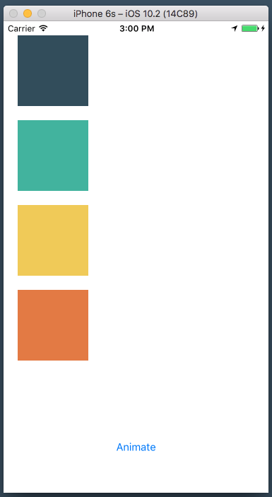
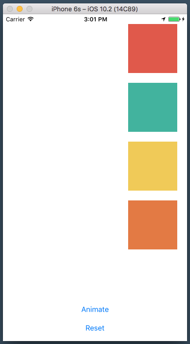
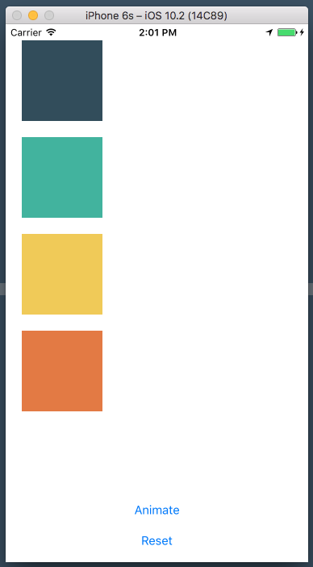
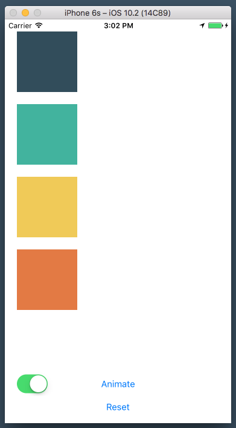
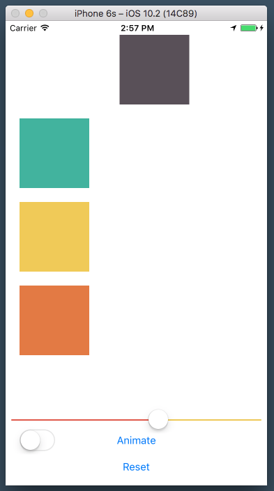

# AC3.2-AnimationBasics
---

### Readings
1. [UIViewPropertyAnimator - Apple Docs](https://developer.apple.com/reference/uikit/uiviewpropertyanimator)
1. [Animating Constraints Using iOS 10’s New UIViewPropertyAnimator - Medium](https://medium.com/@sdrzn/animating-constraints-using-ios-10s-new-uiviewpropertyanimator-944bbb42347b#.q407dwl8l)
2. [iOS10 - UIViewPropertyAnimator - Swiftification](http://www.swiftification.org/2016/08/04/ios10-uiviewpropertyanimator-tutorial/)
3. [Quick Guide Animations With UIViewPropertyAnimator - Think and Build It](http://www.thinkandbuild.it/quick-guide-animations-with-uiviewpropertyanimator/)
4. [iOS 10 Day-by-Day: Day 4 UIViewPropertyAnimator](https://www.shinobicontrols.com/blog/ios-10-day-by-day-day-4-uiviewpropertyanimator)
5. [Using UIViewPropertyAnimator - Technotopia](http://www.techotopia.com/index.php/IOS_10_Animation_using_UIViewPropertyAnimator)

### Tools

1. [Cubic Bezier](http://cubic-bezier.com/#.17,.67,.83,.67)

### Sample Projects

1. [Save The Dot!](https://github.com/JakeLin/SaveTheDot)

---

### Animations the Old Way

Previously, like laying out views in general, basic movement animations were done using primarily `frame`s (see [What Can Be Animated? - Apple Docs](https://developer.apple.com/library/content/documentation/WindowsViews/Conceptual/ViewPG_iPhoneOS/AnimatingViews/AnimatingViews.html#//apple_ref/doc/uid/TP40009503-CH6-SW2) for list of animatable properies). The code is somewhat straightforward to read, but difficult to extend and create complex animations.


#### Animating a View Left-to-Right: `UIView.animate`

```swift
  // This code moves a view's origin.x by 300pt
  let newFrame = view.frame.offsetBy(dx: 300.0, dy: 0.0)
  UIView.animate(withDuration: 1.0) { 
    view.frame = newFrame
  }
```

`UIView.animate(withDuration:)` was used as a simple way to execute view animations inside of its closure. iOS would look at the starting state of the view, along with the changes specified in the animation block and then automatically generate all of the "tweening" (in-between states) needed for the animation to occur smoothly. The class functions on `UIView` are very convenient and allow for some decent customization for basic animations to a view's animatable properties. Along with the duration of the animation it is also possible to adjust delays, animation curves, and other options. It is still possible (and pretty common) to do these sorts of animations with `UIView`'s class functions, but in iOS10 Apple has taken things one step further with [`UIViewPropertyAnimator`](https://developer.apple.com/reference/uikit/uiviewpropertyanimator)

> "A UIViewPropertyAnimator object lets you animate changes to views and dynamically modify your animations before they finish. With a property animator, you can run your animations from start to finish normally or you can turn them into interactive animations and control the timing yourself." 


---

### A Simple Example of `UIViewPropertyAnimator`

`UIViewPropertyAnimator` works similar to its `animate(withDuration:)`: you put in the changes to animate within a block, you adjust durations, delay and (animation) curves, and have optional completion handlers.


#### Animating a View Left-to-Right: `UIViewPropertyAnimator`

```swift

  let newFrame = view.frame.offsetBy(dx: 300.0, dy: 0.0)
  UIViewPropertyAnimator(duration: 1.0, curve: .linear) { 
      view.frame = newFrame
  }.startAnimation()
```

Not too much different right? Before we go onto doing some of the more interesting things `UIViewPropertyAnimator` can do, let's first talk about animation curves, and explain what that `.linear` means. 


#### Animation Curves: [`UIViewAnimationCurve`](https://developer.apple.com/reference/uikit/uiviewanimationcurve)

 - `.easeInOut` - An ease-in ease-out curve causes the animation to begin slowly, accelerate through the middle of its duration, and then slow again before completing.
 - `.easeIn` - An ease-in curve causes the animation to begin slowly, and then speed up as it progresses.
 - `.easeOut` - An ease-out curve causes the animation to begin quickly, and then slow down as it completes.
 - `.linear` - A linear animation curve causes an animation to occur evenly over its duration.
 
Just writing them down isn't really going to help us visualize the actual movement. Let's code a view for each of these curves. 

> Class Coding: I will demo creating a single view and animating it. Follow along and complete 3 additional views, each with a differing animation curve. Oh, and did I mention? We're using Snapkit to save us some time 💪. Let's also control when the animations start by adding in a button to signal it's start.

```swift
  // instatiation
  internal lazy var darkBlueView: UIView = {
    let view: UIView = UIView()
    view.backgroundColor = UIColor(colorLiteralRed: 51.0/255.0, green: 77.0/255.0, blue: 92.0/255.0, alpha: 1.0)
    return view
  }()
  
  // constraints
  darkBlueView.snp.makeConstraints { (view) in
    view.leading.equalToSuperview().offset(20.0)
    view.top.equalToSuperview().offset(20.0)
    view.size.equalTo(CGSize(width: 100.0, height: 100.0))
  }
  
  // example function
  internal func animateDarkBlueViewWithSnapkit() {
    
    // we use remakeConstraints for.. well, remaking a view's constraints in Snapkit
    self.darkBlueView.snp.remakeConstraints({ (view) in
      view.trailing.equalToSuperview().inset(20.0)
      view.top.equalToSuperview().offset(20.0)
      view.size.equalTo(CGSize(width: 100.0, height: 100.0))
    })
    
    // this one will be .linear, add 3 more views for .easeInOut, .easeIn, .easeOut
    let propertyAnimation = UIViewPropertyAnimator(duration: 1.0, curve: .linear) {
        self.view.layoutIfNeeded()
    }
    
    propertyAnimation.startAnimation()
    
  }
```

> Why is it necessary to use `self.view.layoutIfNeeded()` inside of the animation block, instead of just remaking the constraints? Adjusting the constraints is just part of the process; `layoutIfNeeded()` signals to the autolayout engine that it must immediately re-evaluate a view's constraints. Calling for that signal inside of an animation block results in getting an animation out of the redrawing/arranging that needs to happen.



---
### Adding Animations

`UIViewPropertyAnimator` is also intended to allow for dynamically adding animations. Let's first look how to add an animation to an existing animator object. 

```swift
    self.darkBlueView.snp.remakeConstraints { (view) in
      view.trailing.equalToSuperview().inset(20.0)
      view.top.equalToSuperview().offset(20.0)
      view.size.equalTo(CGSize(width: 100.0, height: 100.0))
    }
    
    let propertyAnimation = UIViewPropertyAnimator(duration: 1.0, curve: .linear) {
      self.view.layoutIfNeeded()
    }
    
    propertyAnimation.startAnimation()
    
    propertyAnimation.addAnimations {
      self.darkBlueView.backgroundColor = Colors.red
    }
```

Pretty simple! The animations added will be performed in the same duration and animation curve. But it is also possible to specify a delay:

```swift
    propertyAnimation.addAnimations({ 
      self.darkBlueView.backgroundColor = Colors.red
    }, delayFactor: 0.5)
```

Note, however, that this delay is a value between `0.0` and `1.0` and doesn't correspond to seconds...

> The value you specify must be between 0.0 and 1.0. This value is multiplied by the animator’s remaining duration to determine the actual delay in seconds. For example, specifying the value 0.5 when the duration is 2.0 results in a one second delay for the start of the animations.



> Class coding: Go ahead and add a few more animations of your own. Try playing around with `alpha` or `backgroundColor`, or introduce a new transform like `scale` or `rotation`.

---
### Cleaning Up

Before we move on, let's clean up our code just a bit to make this a bit easier for us. First let's make our animators accessible to the entire view controller:

```swift
class ViewController: UIViewController {
  static let animationDuration: TimeInterval = 1.0
  
  let darkBlueAnimator = UIViewPropertyAnimator(duration: animationDuration, curve: .linear, animations: nil)
  let tealAnimator = UIViewPropertyAnimator(duration: animationDuration, curve: .easeInOut, animations: nil)
  let yellowAnimator = UIViewPropertyAnimator(duration: animationDuration, curve: .easeIn, animations: nil)
  let orangeAnimator = UIViewPropertyAnimator(duration: animationDuration, curve: .easeOut, animations: nil)
  
  // ... other code ... //
  
}
```

Add the following code to the first line in `configureConstraints()` (you'll realize what its for in a moment)

```swift
    darkBlueView.snp.removeConstraints()
    tealView.snp.removeConstraints()
    yellowView.snp.removeConstraints()
    orangeView.snp.removeConstraints()
```

Create a new function, `reset`

```swift
  internal func reset() {
    configureConstraints()
    self.view.layoutIfNeeded()
  }
```

Add in a button below `animateButton` tasked with calling the `reset` function.

```swift
  internal lazy var resetAnimationsButton: UIButton = {
    let button = UIButton(type: .roundedRect)
    button.setTitle("Reset", for: .normal)
    return button
  }()
```

> Class coding: Now complete to complete our changes, add the new button to the view hierarchy, set its constraints, and add a new action-target. Lastly, update the `animateXXXXViewWithSnapkit` functions to make use of their corresponding instance animator objects. When you're ready, or if you get stuck, compare your code with mine: [Basic Animations Clean Up](https://gist.github.com/spacedrabbit/e2688e21b7e1515689fe22f4a05e2e4f)



When you finish, go ahead and run your project and play around with the animations. You may notice something odd if you try to reset the animations before they complete... why is that?

### Adding Completions and Reversing Animations

To fix the above (at least for one of the animators), add in this additional line to the very beginning of your `reset()` function: `darkBlueAnimator.stopAnimation(true)`. This happens because the action to "reset" the animation happens in the middle of the current animation, resulting in a *dynamically* changing animation to satisfy the new constraints. Pretty awesome. More on that later.

Let's try to reverse our animations, rather than reseting them. Add a new function, `reverse(sender: UISwitch)`

```swift
  internal func reverse(sender: UISwitch) {
    darkBlueAnimator.isReversed = sender.isOn
    tealAnimator.isReversed = sender.isOn
    orangeAnimator.isReversed = sender.isOn
    yellowAnimator.isReversed = sender.isOn
  }
```

Additionally, add a `UISwitch` to the project and add its `target` as this new `reverse` function. 

Now, tap on "Animate" and flip the switch during its animation! 



#### Completion Handlers
A completion handler for a `UIViewPropertyAnimator` lets you know at what state the animation was in when the animation finished. That state corresponds to an enum, `UIViewAnimatingPosition`: 

1. `.end`: The end point of the animation. Use this constant when you want the final values for any animatable properties—that is, you want to refer to the values you specified in your animation blocks.
2. `.start`: The beginning of the animation. Use this constant when you want the starting values for any animatable properties—that is, the values of the properties before you applied any animations.
3. `.current`: The current position. Use this constant when you want the most recent value set by an animator object.

Add this code snippet to your `darkBlueAnimator` instance inside of `animateDarkViewWithSnapKit()` and observe the changes: 

```swift
    darkBlueAnimator.addCompletion { (position: UIViewAnimatingPosition) in
      switch position {
      case .start: print("At the start of the animation")
      case .end: print("At the end of the animation")
      case .current: print("Somewhere in the middle")
      }
    }
```

---

### Current state values / "Scrubbing"

It is possible to adjust the current progress % of the animation by adjusting its `.fractionComplete` property. To demonstrate this, add in a `UISlider` to our project and place it just above the `animateButton`. Create a new function, `updateAnimationInProgress(sender:)` and add it as the target `selector` of the slider:

```swift
  internal func updateAnimationProgress(sender: UISlider) {
    
    if darkBlueAnimator.isRunning {
      darkBlueAnimator.pauseAnimation()
    } else {
      animateDarkBlueViewWithSnapkit()
      darkBlueAnimator.pauseAnimation()
    }
    
    darkBlueAnimator.fractionComplete = CGFloat(sender.value)
  }
```

You'll notice that for this to work, the animation has to be in progress. This is because we first need to pause the animation in order to update its `fractionComplete`. Now, try moving the slider before or during animations.



> For all of the code up to this point, check out [this gist](https://gist.github.com/spacedrabbit/bf66a0e222eea54bffd1cd3521d86c70)

--- 

### Class Demos

#### Springs! 
Let's take a look at some of the springing animation we can add.

#### Custom Bezier Curves!
You can define your own timing functions.

#### Dynamically Updating Animation!
Let's see how we can dynamically change an animation but working with `UITouch` events.

1. Stage 1: Moving a view to where you touch ([Full Code](https://gist.github.com/spacedrabbit/f795f5980c4f223a5230e96b8eb1c821))
2. Stage 2: Adding a scale animation to simulate z-position ([Full Code](https://gist.github.com/spacedrabbit/c0c0282c4879d72c804a0a1aa0e69d49))
3. Stage 3: Changing code to work with touch-dragging ([Full Code](https://gist.github.com/spacedrabbit/d1d0dfe4af93e6124bfad29c19f5979e))
4. Stage 4: Only tapping in the bounds of the view will drag ([Full Code](https://gist.github.com/spacedrabbit/60821d6d19b216f87e7143a54153b35e))

---

### Exercise

1. Your first exercise is to reproduce this simple "dice" animation: https://ios.uplabs.com/posts/simple-dice-app#_=_

2. Next, attempt to recreate this login/registration screen animation: https://material.uplabs.com/posts/login-mockup

