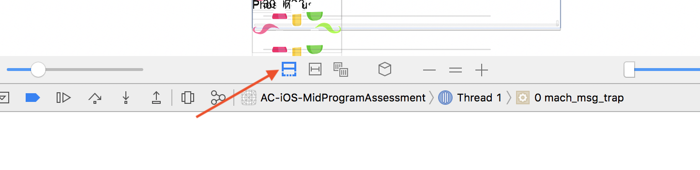

# Debugging Workshop

Techniques

1. Use print statements to view your data
2. Use break points to stop execution without rebuilding
3. Take small components into a Playground
4. Use online resources to find similar problems and solutions
5. Use the Debug View Hierachy

# 1. Use Print Statements to View Information

Example: Print the data you get back from a network call.

# 2. Use break points to stop execution without rebuilding

Example: Figure out why data isn't being passed via a segue.

Fullscreen Link: [Giphy](https://giphy.com/gifs/xULW8ieQVRWnA4lT1e/fullscreen)

#### Set up:

1. Punch in your breakpoint on the line you suspect your code to have an issue with. 
2. Run your app in simulator until it gets to that point where it stops and the **variable view** (left side) and **console debugger** (right side) activate.
3. You can observe your values in the **variable view** and type out code in the console, which is like Playground. Click next to `(lldb)` and type in `po` (for "print out") and then your code. ex. `po print(destination.element)`
4. Click the debugger's run button to continue along your code.

**Pro-Tip:** Be wary of using too many breakpoints. It isn't fun to hit continue over and over.

`LLDB` is a software debugger. It stands for "Low Level Debugger", probably.

#### Clean up options:

* Click on the blue ribbon in the debug bar to deactivate or activate all the breakpoints. You'll see the breakpoints greyed out when they're deactivated, in case you want to refer back to it later.
* Click on the individual breakpoint and either drag it to the right or release it to get rid of it.

# 3. Take small components into a Playground

Example: Parse JSON in your model in a Playground

# 4. Use online resources to find similar problems and solutions

Example: How to move info.plist file

[How to move info.plist](https://stackoverflow.com/questions/4159090/how-to-tell-xcode-where-my-info-plist-and-pch-files-are/4159153)
### Google Error 
##### Sometimes you just have to Google it ¯\\\_(ツ)_/¯
- It is very likely that you are not the first person to run into some type of bug 
- This is when google, stackOverflow, etc. come in handy 

Fullscreen Link: [Giphy](https://giphy.com/gifs/xUNd9C8re61oyDoxLG/fullscreen)

# 5. Use the Debug View Hierachy
1. Make sure app is running on the viewController you want to debug
2. In the console click the **Debug View Hierarchy** 
Example: 
3. Click Show Clipped Content
Example: 
4. You can rotate your view controller and see if your views are laid out correctly.
5. The **Debug View Hierarchy** is used to see if views are created but not shown on screen. 

Fullscreen Link: [Giphy](https://giphy.com/gifs/3ohc1aZ6mrBJISSZWg/fullscreen)
