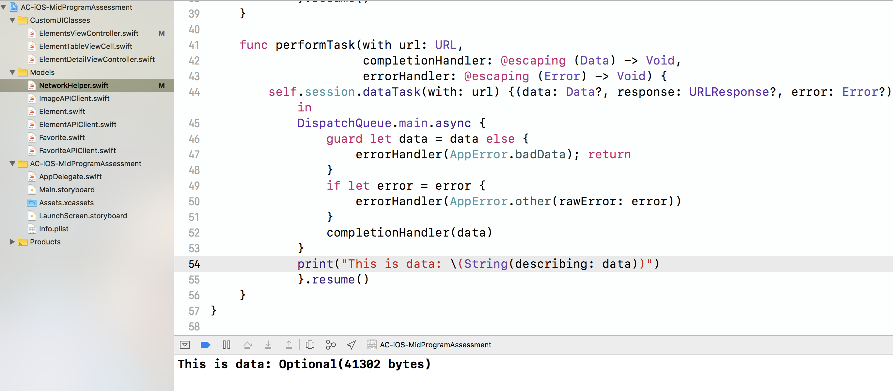

# Debugging Workshop

Techniques

1. Use print statements to view your data
2. Use break points to stop execution without rebuilding
3. Take small components into a Playground
4. Use online resources to find similar problems and solutions

# 1. Use Print Statements to View Information

The highlighted line of code is where you can put a print statement and test to see if you are getting data from the internet.

# 2. Use break points to stop execution without rebuilding

Example: Figure out why data isn't being passed via a segue.

# 3. Take small components into a Playground

Example: Parse JSON in your model in a Playground

# 4. Use online resources to find similar problems and solutions

Example: How to move info.plist file

# 5. Use the Debug View Hierachy
1. Make sure app is running on the viewController you want to debug
2. In the console click the **Debug View Hierarchy** 
Example: 
3. Click Show Clipped Content
Example: 
4. You can rotate your view controller and see if your views are laid out correctly.
5. The **Debug View Hierarchy** is used to see if views are created but not shown on screen. 
