# Programmatic-Autolayout
Alternative to defining constraints in Storyboard

---
### Reading (Some of these you would have read already for prior lessons):
1. [Understanding AutoLayout] (https://developer.apple.com/library/content/documentation/UserExperience/Conceptual/AutolayoutPG/index.html#//apple_ref/doc/uid/TP40010853)
2. [Anatomy of a Constraint](https://developer.apple.com/library/content/documentation/UserExperience/Conceptual/AutolayoutPG/AnatomyofaConstraint.html#//apple_ref/doc/uid/TP40010853-CH9-SW1)
3. [Simple Constraints](https://developer.apple.com/library/content/documentation/UserExperience/Conceptual/AutolayoutPG/WorkingwithSimpleConstraints.html#//apple_ref/doc/uid/TP40010853-CH12-SW1)
4. [Programmatically Creating Constraints](https://developer.apple.com/library/content/documentation/UserExperience/Conceptual/AutolayoutPG/ProgrammaticallyCreatingConstraints.html#//apple_ref/doc/uid/TP40010853-CH16-SW1)
4. [Visual Format Language - Details](https://developer.apple.com/library/content/documentation/UserExperience/Conceptual/AutolayoutPG/ProgrammaticallyCreatingConstraints.html#//apple_ref/doc/uid/TP40010853-CH16-SW9)
5. [Visual Format Language - Syntax](https://developer.apple.com/library/content/documentation/UserExperience/Conceptual/AutolayoutPG/VisualFormatLanguage.html#//apple_ref/doc/uid/TP40010853-CH27-SW1)

#### Optional
1. [Changing Constraints](https://developer.apple.com/library/content/documentation/UserExperience/Conceptual/AutolayoutPG/ModifyingConstraints.html#//apple_ref/doc/uid/TP40010853-CH29-SW1)
2. [Debugging Tips & Tricks](https://developer.apple.com/library/content/documentation/UserExperience/Conceptual/AutolayoutPG/DebuggingTricksandTips.html#//apple_ref/doc/uid/TP40010853-CH21-SW1)

---
### Vocabulary

1. **Autolayout**: the engine that dynamically calculates the size and position of all the views in your view hierarchy, based on constraints placed on those view. [Apple](https://developer.apple.com/library/content/documentation/UserExperience/Conceptual/AutolayoutPG/index.html#//apple_ref/doc/uid/TP40010853-CH7-SW1)
2. **Visual Format Language**: *"lets you use ASCII-art like strings to define your constraints. This provides a visually descriptive representation of the constraints."* [Apple](https://developer.apple.com/library/content/documentation/UserExperience/Conceptual/AutolayoutPG/ProgrammaticallyCreatingConstraints.html#//apple_ref/doc/uid/TP40010853-CH16-SW9)

---
### 0. Objectives:

1. Be as, and more, proficient using programmatic autolayout than using Storyboard.
1. Understand the anatomy of a constraint
2. Revisit some simple Interface builder autolayout examples in storyboard
3. Translate storyboard constraints using three methods:
	1. `NSLayoutConstraint`
	2. `Visual Format Language` (VFL)
	3. `NSLayoutAnchor`
4. Look at some common constraint and UI errors

---
### 1. Why Programmatic?
There's a lot of ways to answer this question:

- You'll 100% encounter it in your development careers
- It's better than storyboard constraints (personal opinion)
- Less git conflicts on your storyboard
- Its more powerful and flexible than using storyboards alone
- etc...

But practically, we've been talking this entire time about understanding a problem and deconstructing it into its atomic components. Laying out your views is using that same skillset, and doing it programmatically lets you better understand how your storyboard's components are constructed. Over time and with practice, you'll be able to "read" a mockup of an app as you would with code.

---
### 2. Frames & Autolayout
It used to be the case that you had to calculate exactly the position of your views using the iPhones coordinate system. Some developers prefer this, but overall you end up writing a lot of difficult-to-understand code as a result. There was one instance where I was asked to make some changes to the layout of something a co-developer had written. Here's an small example of some of their "simpler" code:

```swift
  public override func layoutSubviews() {
    super.layoutSubviews()

    var x, y, w, h: CGFloat
    x = 0.0; y = 0.0; w = 20.0; h = 20.0
    self.imageView.frame = CGRectMake(x, y, w, h)

    x = self.imageView.frame.maxX + 5.0; y = 0.0
    w = self.bounds.width - x; h = 20.0
    self.noteLabel.frame = CGRectMake(x, y, w, h)

    x = 0.0; y = self.bounds.maxY - self.imageView.frame.maxY;
    w = 110.0; h = self.bounds.maxY - y
    self.button.frame = CGRectMake(x, y, w, h)
  }
```

Can you tell what it does by just skimming the code? You'd have to be a pretty good liar to convince me that you could. But I can tell you that it is intended to dynamically size some UI elements (`imageView, noteLable, button`) based on the size of their super view.

Regardless of readability, let's go back to my situation: I'm asked to make a design change to this view never having seen the code before. Not only do I need to piece out what this code does, I'll likely try to draw it out for myself on paper/whiteboard so I don't forget it all, along with adding comments to the code, then I'll have to decided how to make the changes I need without breaking the existing, delicate, layout code.

> **Developer's Note**: What did I end up doing? I told my PM that it would take too much time for me to go through the code to make a design change and it would be better to have the original developer do it. He agreed after I showed him the code and explained the issue. Fortunately it was a low-priority change, but we may have been in a bad situation if it was a critical fix.

Autolayout does away with having to calculate frames by being expressive in its relation to other views.

---
### 3. Anatomy of a Constraint


A constraint is, in essences, a linear equation with the format:

`item1.attribute = multiplier x item2.attribute + constant`

For example, if we were trying to arrange two buttons such that they are right next to each other, with `8pt` between them, we could write:

`button2.leading = 1.0 x button1.trailing + 8.0`

And since constraints are equations, not assignments, we can reverse them so long as we invert the multiplier and constant:

`button1.trailing = 1.0 x button2.leading - 8.0`

But where did we get `.leading` and .`trailing` from? There's a [list](https://developer.apple.com/reference/uikit/nslayoutattribute) we can check. What crucial to understand here though, is that a constraint can be described from either UI element that is involved. Meaning, the constraint we just wrote out about can be described by either using `button1` or `button2`. It's this kind of of reflexive relationship that allows autolayout to work well.

---
### 4. Constraint Concepts

#### Minimum Satisfiable Constraints
You need to ensure that you define a location and a size for your views, otherwise they are considered to be "ambiguous" and you will get warnings. You'll need to define an element's `width, height, x-axis, y-axis` either explicitly, or implicitly through the relationships of the views around it. Note that elements with intrinsic sizes, like `UIButton`, needs just their origin's x- and y-axis point set at a minimum.

#### Constraint Priorities
Every constraint has a priority that determines how important they are relative to all other constraints.

It is sometimes not possible for Autolayout to satisfy all of the constraints you've coded in. At that point, Autolayout goes through the constraints and chooses one to break in order to satisfy *most* of the constraints. But you can also set up a value hierarchy of which constraints are required or optional by giving them a value between 1 - 1000, 1 being the lowest and 1000 meaning the constraint is required.

If an optional constraint cannot be satisfied, it will just skip it and continue on to the rest. Generally, you can use the system defined priority values of `250` (low) `500` (medium) `750` (high) and `1000` (required).

> **Developer's Note**: What is of particular interest is that when the autolayout engine has to break a constraint, it still takes into account that broken constraint in determining a correct layout. So this malformed constraint still has some weight in deciding what the overall layout looks like. This is why you'll see your UI look correct when running in the sim, despite getting broken constraint warnings in console! But be aware, a broken constraint must be fixed since you can't guarantee that the autolayout engine will always get it right.

#### Content Hugging & Compression Resistance

We first took a look at CH&CR in the [second table views lesson](https://github.com/C4Q/AC3.2-Tableviews_Part_2#content-huggingcompression-resistance-chcr), but in short:

	- **Content Hugging**: how much you want to resist expanding (defaults to low/`250` because its better for content to expand than shrink if necessary)
	- **Compression Resistance**: how much you want to resist growing (defaults to `750`)

---
### 5. Defining Constraints Programmatically

There are three ways to coding layout contraints. See [this link](https://developer.apple.com/library/content/documentation/UserExperience/Conceptual/AutolayoutPG/ProgrammaticallyCreatingConstraints.html#//apple_ref/doc/uid/TP40010853-CH16-SW5) for detailed explanations of each.

#### Layout Anchors (`NSLayoutAnchor`)

> *"Layout anchors let you create constraints in an easy-to-read, compact format. - Apple*

#### `NSLayoutConstraint`
Incredibly long and tedious to write. Very difficult to read and interpret as well.

#### Visual Format Language
Lets you express constraints using a string representation.

1. Auto Layout prints constraints to the console using the visual format language; for this reason, the debugging messages look very similar to the code used to create the constraints.
2. The visual format language lets you create multiple constraints at once, using a very compact expression.
3. The visual format language lets you create only valid constraints.
4. The notation emphasizes good visualization over completeness. Therefore some constraints (for example, aspect ratios) cannot be created using the visual format language.
5. The compiler does not validate the strings in any way. You can discover mistakes through runtime testing only.

---
### 6. The Basics

We're going to be looking at a number of examples on programmatic constraints. To get yourself ready for this lesson: simply

1. Add four `UIView` to storyboard
2. Give them each a different background color
3. Create an outlet for each view, naming the `UIView` after the color chosen for the background.

For the following examples, i created a `blueView, greenView, pinkView` and `redView`
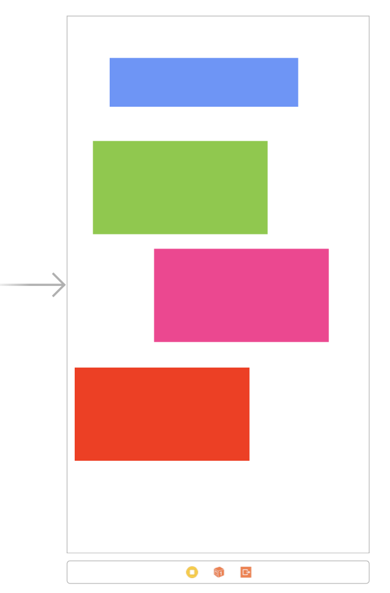

We're going to keep all of the views we're not currently working with, hidden. So in the `viewDidLoad` method of your `ViewController` class, add:

```swift
  override func viewDidLoad() {
    super.viewDidLoad()

    // set all the hidden until we need to see one
    blueView.isHidden = true
    pinkView.isHidden = true
    redView.isHidden = true
    greenView.isHidden = true

    // These identifiers will help debug constraints breaking
	blueView.accessibilityIdentifier = "BLUE"
	pinkView.accessibilityIdentifier = "PINK"
	redView.accessibilityIdentifier = "RED"
	greenView.accessibilityIdentifier = "GREEN"

    self.centerViewWithNSLayoutConstraint() // we will create this in a moment
  }
```

#### Centering a single `UIView` using `NSLayoutConstraint`

Goal: Center the `blueView` on screen and give it a `width` and `height` of `200`

Add in the new function that we just called from `viewDidLoad`

```swift
  func centerViewWithNSLayoutConstraint() {
    blueView.isHidden = false

  }
```

The cornerstone to using `NSLayoutConstraint` is the `init(item:attribute:relatedBy:toItem:attribute:multiplier:constant:)` function, which needs to be written for each and every constraint you set. In this first example, we need to give a view a defined, `width`, `height`, `x-axis` and `y-axis` constraint -- so we'll need to create four of them.

Let's start out with the view's `x` and `y` position:

```swift
  let blueCenterXConstraint =
      NSLayoutConstraint(item: blueView,  // 1.
        attribute: .centerX,              // 2.
        relatedBy: .equal,                // 3.
        toItem: self.view,                // 4.
        attribute: .centerX,              // 5.
        multiplier: 1.0,                  // 6.
        constant: 0.0)                    // 7.

  let blueCenterYConstraint =
      NSLayoutConstraint(item: blueView,
        attribute: .centerY,
        relatedBy: .equal,
        toItem: self.view,
        attribute: .centerY,
        multiplier: 1.0,
        constant: 0.0)
```

Here's a breakdown of what's happening:

1. The `item` parameter is the UI element that you're adding a constraint to
2. The first `attribute` describes what point of the `item` you're interested in adding a constraint to. If you reviewed the list linked earlier, you'd see that `centerX` refers to the center point on the view in the x-axis.
3. `relatedBy:` determines the relationship in terms of a comparison operator, it can be `equal`, `greaterThanOrEqualTo`, `lessThanOrEqualTo`.
4. The `toItem` is the other view that you're setting the constraint relative to; in our case it will be set relative to the parent view, `self.view`
5. The second `attribute` refers to the `toItem`'s attribute you're constraining relative to. We want to center `blueView` in its parent view, but we could as easily constrain the `blueView`'s `centerX` to `self.view`'s `.leading`, which would place the center-x on the `blueView` on the left edge of the screen.
6. `multiplier` allows you to set a proportional constraint by setting a multiplier. For example, you could give `blueView` a width `.equal` to that of `self.view`, but set it's `multiplier` to `0.5` and it would give `blueView` a width 1/2 the size of `self.view`.
7. `constant` allows you to give a specific value to offset/inset your constraint. For example, you could align `blueView` to `self.view` on their `.leading` edges, but add an 8pt margin by giving it a value of `constant: 8.0`.

The overall effect of the above two lines is that the `blueView`'s center point will be equal to `self.view`, effectively centering it on screen.

With the `x` and `y` coordinate set, we now need to specify a `width` and `height`, as they are `(0,0)` by default on a `UIView`.

```swift
  let blueWidthConstraint =
      NSLayoutConstraint(item: blueView,
        attribute: .width,
        relatedBy: .equal,
        toItem: nil,                  // 1.
        attribute: .notAnAttribute,   // 2.
        multiplier: 1.0,
        constant: 200.0)              // 3.

  let blueHeightConstraint =
      NSLayoutConstraint(item: blueView,
        attribute: .height,
        relatedBy: .equal,
        toItem: nil,
        attribute: .notAnAttribute,
        multiplier: 1.0,
        constant: 200.0)
```

You should be able to read the above using the breakdown from the prior example, but there is an important difference here:

1. We're setting a width for `blueView`, but we're not setting it relative to any other UI element. So this time around the `toItem` is `nil` to indicate that.
2. When we don't have another UI element to set some attribute relatively, we need to specify the second `attribute` (the one meant for `toItem`) is `.notAnAttribute` because... well, we're not setting the constraint relative to another view's attribute.
3. The `constant` value is where we specifically determine the value for the `width`.

The last thing we need to do is actually *add* these constraints to the views that needs them. We can do that using the `addConstraints` mehtod:

```swift
  self.blueView.addConstraints([blueCenterXConstraint, blueCenterYConstraint,   blueWidthConstraint, blueHeightConstraint])
```

Your function at this point should look like this:

```swift
  internal func centerViewWithNSLayoutConstraint() {
    blueView.isHidden = false

    // center x
    let blueCenterXConstraint = NSLayoutConstraint(item: blueView, attribute: .centerX, relatedBy: .equal, toItem: self.view, attribute: .centerX, multiplier: 1.0, constant: 0.0)

    // center y
    let blueCenterYConstraint = NSLayoutConstraint(item: blueView, attribute: .centerY, relatedBy: .equal, toItem: self.view, attribute: .centerY, multiplier: 1.0, constant: 0.0)

    // width
    let blueWidthConstraint = NSLayoutConstraint(item: blueView, attribute: .width, relatedBy: .equal, toItem: nil, attribute: .notAnAttribute, multiplier: 1.0, constant: 200.0)

    // height
    let blueHeightConstraint = NSLayoutConstraint(item: blueView, attribute: .height, relatedBy: .equal, toItem: nil, attribute: .notAnAttribute, multiplier: 1.0, constant: 200.0)

    // add constraints
    self.blueView.addConstraints([blueCenterXConstraint, blueCenterYConstraint, blueWidthConstraint, blueHeightConstraint])
  }
```

Run the project at this point and let's see what we get...

#### CRASH!

```
// In console, you'll see these messages among the output

The view hierarchy is not prepared for the constraint: ...

View hierarchy unprepared for constraint.
  Constraint: <NSLayoutConstraint:0x600000088430 BLUE.centerX == UIView:0x7fe7ecd08e60.centerX

...That view's superview: NO SUPERVIEW...
```

The error messages a little misleading as to why we get a problem, but I'll let you in on the secret: with `NSLayoutContraint` you have to make sure the right views own the right constraints.

---
#### Constraint Ownership

Our `blueView` should have knowledge of its `width` and `height` since we set them as a constant and not relative to any other view. However, the `centerX` and `centerY` constraints can only be fulfilled by `blueView`s super view, because only the super view has knowledge of it's on space.

Think of it this way:

Suppose I ask you to make a picture frame for me. I tell you I'd like it to be 5"x7" and centered on my bedroom wall. You should have no problem making the frame 5"x7" on your own, (assuming you know how to measure 📐 and cut wood 🌲). Though to understand *where* the "center" of my wall is, you'd have to measure the wall. The only way you'd know the center point of the frame, would be to know where the center is on the wall it was being put in. So in some ways, the wall determines what "center" really means for the picture frame.

This is what it is like in our app. For autolayout to know where `center` is for `blueView`, it has to ask `self.view` -- it's the "wall" we're putting the "frame" on. What we need to do now is add the constraints to their proper owning views:

```swift
    // self.view, the parent, is told to center the blueView in its bounds
    self.view.addConstraints([blueCenterYConstraint, blueCenterXConstraint])
    // blueView is told to be 200x200
    self.blueView.addConstraints([blueWidthConstraint, blueHeightConstraint])
```

Re-run the project once more ...

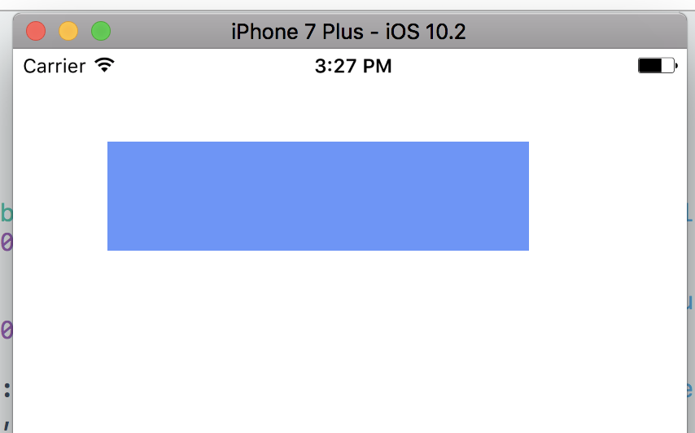

We've prevented a crash and we can see the view on screen, but it doesnt have the right size or position, and we're getting an error in console:

```
Unable to simultaneously satisfy constraints.
  Probably at least one of the constraints in the following list is one you don't want.
  Try this:
    (1) look at each constraint and try to figure out which you don't expect;
    (2) find the code that added the unwanted constraint or constraints and fix it.
  (Note: If you're seeing NSAutoresizingMaskLayoutConstraints that you don't understand, refer to the documentation for the UIView property translatesAutoresizingMaskIntoConstraints)
(
    "<NSAutoresizingMaskLayoutConstraint:0x600000089060 h=--& v=--& BLUE.width == 259   (active, names: BLUE:0x7f8f0a40a220 )>",
    "<NSLayoutConstraint:0x600000087d00 BLUE.width == 200   (active, names: BLUE:0x7f8f0a40a220 )>"
)
```

You're going to run into this fairly often, but remember this one portion:

```
"<NSAutoresizingMaskLayoutConstraint:0x600000089060 h=--& v=--&
```

Any time you see `NSAutoresizingMaskLayoutConstraint`, it means you forgot to set `translatesAutoresizingMaskIntoConstraints` property on a view to `false`. Add `blueView.translatesAutoresizingMaskIntoConstraints = false` to the line just below where you set `isHidden` to `false`. You code should look like:

```swift
  internal func centerViewWithNSLayoutConstraint() {
    blueView.isHidden = false
    blueView.translatesAutoresizingMaskIntoConstraints = false

    let blueWidthConstraint = NSLayoutConstraint(item: blueView, attribute: .width, relatedBy: .equal, toItem: nil, attribute: .notAnAttribute, multiplier: 1.0, constant: 200.0)

    let blueHeightConstraint = NSLayoutConstraint(item: blueView, attribute: .height, relatedBy: .equal, toItem: nil, attribute: .notAnAttribute, multiplier: 1.0, constant: 200.0)

    let blueCenterXConstraint = NSLayoutConstraint(item: blueView, attribute: .centerX, relatedBy: .equal, toItem: self.view, attribute: .centerX, multiplier: 1.0, constant: 0.0)

    let blueCenterYConstraint =
      NSLayoutConstraint(item: blueView, attribute: .centerY, relatedBy: .equal, toItem: self.view, attribute: .centerY, multiplier: 1.0, constant: 0.0)

    self.view.addConstraints([blueCenterYConstraint, blueCenterXConstraint])
    self.blueView.addConstraints([blueWidthConstraint, blueHeightConstraint])
  }
```

What are autoresizing masks? Check out [this answer on Reddit](https://www.reddit.com/r/iOSProgramming/comments/3f88uh/autoresizing_masks_what_are_they/ctm80vj/) for a great explanation. It suffices to know that resizing masks pre-date Autolayout and should be avoided. What this means in practical terms is that you're going to always have to set `translatesAutoresizingMaskIntoConstraints` to `false` for *every* view you're laying out.

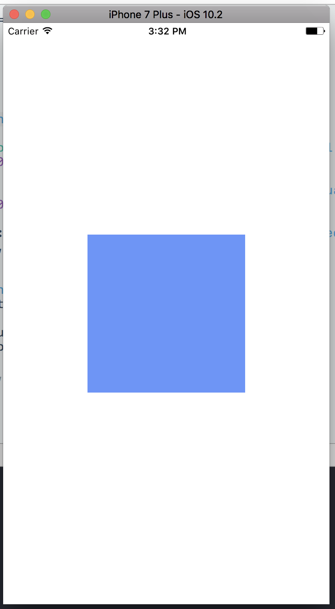

---

#### Practice Exercises

Using `NSLayoutConstraint` and the remaining three views:

1. Pin the `redView`'s bottom-left corner, to the bottom-left corner of the screen. Give it a `width` and `height` of `200.0`
2. Pin the `top` of `pinkView` to the bottom of `blueView`, and make it centered vertically. Give it a `height` and `width` that is half of `blueView`'s. *Note: this does not mean to give it a `constant` value of 100! You should do it some other way...*
3. Pin the `greenView`'s top-left corner to the top-left corner of the screen, but give it a `16pt` margin. The `width` should be equal to `redView`'s width and the `height` should be equal to `pinkView`'s height. *Note: AGAIN, this does not mean to give it a defined `constant` value You should be doing these **relative** size changes some other way...*

The final product should look like:

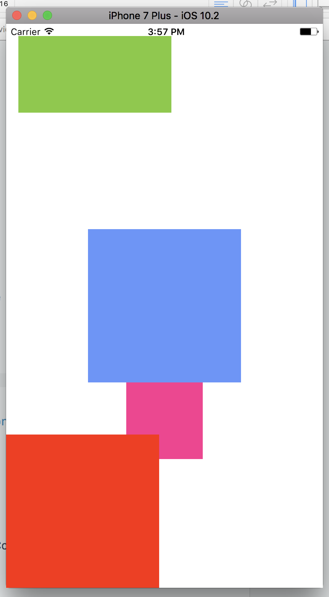

---
### 7. Visual Format Language (VFL)

VFL came out as a way to try to cut down on the amount of code that was necessary to write with `NSLayoutContraint`. Unfortunately, it looses some of the flexibility possible with `NSLayoutContraint` in the process. For example, you cannot center a view using only VFL!

> Developer's Note: For how to do it though, check out [this StackOverflow answer](https://stackoverflow.com/a/13148012). I also provide an example in the [`/Exercises.md`](https://github.com/C4Q/AC3.2-Programmatic-Autolayout/blob/master/Exercises/Exercises.md#2-centering-something-with-vfl) file

Though VFL does make writing certain constraints quite brief. Let's take a look at how we'd pin `blueView` to the top-left corner of the screen and make it `200ptx200pt`:

```swift
  func topLeftCornerWithVFL() {
    blueView.translatesAutoresizingMaskIntoConstraints = false
    blueView.isHidden = false

    // V = vertical axis
    // H = horizontal axis
    // : = starting the constraints
    // | = refers to the superview
    // (value) tells you the "constant" of the constraint
    // [] surrounds individual views
    let verticalConstraint: String = "V:|[blueView(200.0)]"    // 1.
    let horizontalConstraint: String = "H:|[blueView(200.0)]"  // 2.
    let viewDictionary = [ "superView" : self.view, "blueView" : blueView ] // 3.

    let constraintsVertical = NSLayoutConstraint.constraints(withVisualFormat: verticalConstraint,
        options: [],
        metrics: nil,
        views: viewDictionary) // 4.

    let constraintsHorizontal = NSLayoutConstraint.constraints(withVisualFormat: horizontalConstraint,
        options: [],
        metrics: nil,
        views: viewDictionary)

    // 5.
    NSLayoutConstraint.activate(constraintsVertical)
    NSLayoutConstraint.activate(constraintsHorizontal)
  }
```

The breakdown:

1. In this line, we create two constraints with a simple string:
  - We set the `.top` of `blueView` equal to the top of `self.view`: `V:|[blueView]`. This line says "take the vertical edge of blueView, and place it right next to its super view's vertical edge"
  - We set the `.height` of `blueView` equal to 200.0: `[blueView(200.0)]`
2. Here, we set two more constraints:
  - We set the `.leading` of `blueView` equal to the `.leading` of `self.view`
  - We set the `.width` of `blueView` equal to 200.0
3. VFL needs a way to parse the string you pass it, and it does this using a `Dictionary` that you define. For our example, we created a key of `blueView` with a value of `self.blueView`. So when autolayout parses the VFL string, it will look for occurances of "blueView" and understand it is suppose to reference `self.blueView` in making these constraints.
4. This is where we pass in the `Dictionary` of our mapped keys/views for use in autolayout.
5. Lastly, we need to `activate` these constraints before they are actually applied.

So, what would pinning the blue view to the bottom left corner look like? We really only need to change one character, the pipe (`|`), and move it to the end of the `verticalConstraint` string.

```swift
  let verticalConstraint: String = "V:[blueView(200.0)]|"
  let horizontalConstraint: String = "H:|[blueView(200.0)]"
```

<br>
<details><summary>Dicuss: How does this work?</summary>
<br><br>

Since the <code>|</code> character indicates the edge of a super view in that axis, by placing the <code>|</code> on the direct right of the <code>blueView</code> on the vertical plane, we're pinning it to the bottom of its superview, <code>self.view</code>.
<br><br>
On the horizontal plane, keeping the <code>|</code> character at the front results in pinning the view to the left edge of its superview.
<br><br>
So taken together, we've pinned the bottom edge and left edge of the view, while preserving its size.

<br><br>
</details>
<br>

---
#### Practice Exercises

1. Pin each view to a corner of the screen. Give them all a width and height of 100pt
2. Take three views and line them up horizontally against the top of the screen:
	- Give them a width of 100 and a height of 50
	- Take the leftmost view and pin it `8pt` from the `leading` edge
	- Pin the other two views `8pt` from each other, starting from the leftmost one
	- Pin them `8pt` from the top

You result should look like:


---
### 8. Layout Anchors

The most recent development in the world of autolayout has been the rise of `NSLayoutAnchor`. It's somewhere between `NSLayoutConstraint` and VSL in terms of coding needed and in self-documenting nature. But it has the advantage of being driven by autocomplete, so you will (generally) write code much faster in this method.

What does it look like to center `blueView` and give it a width and height of 200?

```swift
  func centerViewWithLayoutAnchors() {
    blueView.isHidden = false
    blueView.translatesAutoresizingMaskIntoConstraints = false

    blueView.centerXAnchor.constraint(equalTo: self.view.centerXAnchor).isActive = true
    blueView.centerYAnchor.constraint(equalTo: self.view.centerYAnchor).isActive = true
    blueView.widthAnchor.constraint(equalToConstant: 200.0).isActive = true
    blueView.heightAnchor.constraint(equalToConstant: 200.0).isActive = true
  }
```

Having first taken a look at `NSLayoutConstraint` and then VFL, the syntax and intent of `NSLayoutAnchor` should be fairly clear. The constraint follows a predictable pattern:

```
<view>.<attribute>.<constraint type>.isActive = true
```

> **Developer's Note:** It is also possible to assign the constraint to a variable if you needed to deactive it at some point. You'll find that this is helpful when we talk about modifying constraints when rotating the device.

Extending the example above a little further, what if we wanted to do something like this:

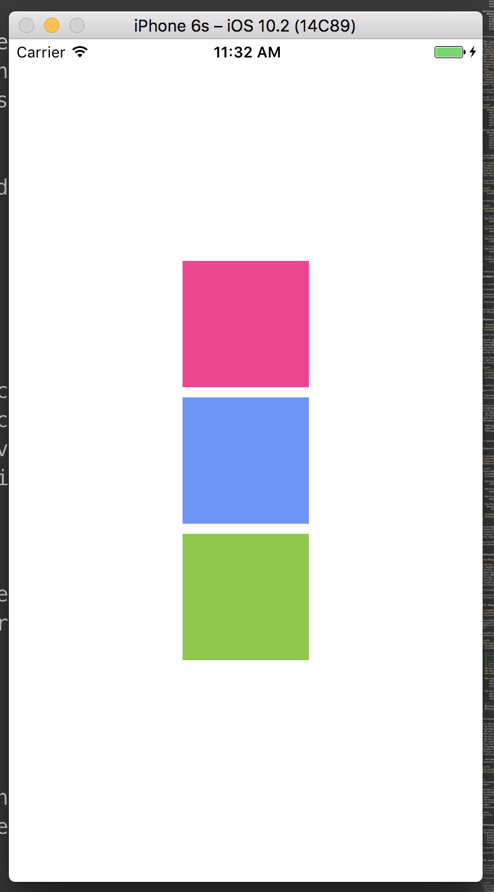

We can build off the previous example by keeping the code in place for the `blueView`, but we just need to adjust its width and height to be `100pt` each. What about the other two views?

<br>
<details><summary>Discussion: What are some inferences we can make about the constraints based on the screenshot provided?</summary>
<br><br>

We could say:

<ol>
	<li>All views are the same width and height</li>
	<li>They could all be aligned by their <code>centerX</code></li>
	<li>The blue view could be aligned to the super view's center, and the other two views could be aligned to the blue view via either their leading or trailing edges</li>
	<li>The pink and green view have a small margin between themselves and the blue view</li>
	<li>It's more likely that the green and pink views are aligned relative to the blue view, rather than the super view</li>
	<li>The pink view could be aligned to the blue view, and the green view could be aligned to the pink view</li>
	<li>...plus a good number of other possibilities</li>
</ol>

<br><br>
</details>
<br>

Remember that a core skill of a developer is to be able to look at a problem and deconstruct it into its smaller, codeable components. There are many "right" answers for how to constrain the views in the screenshot, but I'm going to show you one that I think makes the most sense in this scenario.

```swift
	internal func threeVerticallyAlignedViews() {
		blueView.isHidden = false
		pinkView.isHidden = false
		greenView.isHidden = false
	    blueView.translatesAutoresizingMaskIntoConstraints = false
	    pinkView.translatesAutoresizingMaskIntoConstraints = false
	    greenView.translatesAutoresizingMaskIntoConstraints = false

	    // center X & Y, 100pt sides
	    blueView.centerXAnchor.constraint(equalTo: view.centerXAnchor).isActive = true
	    blueView.centerYAnchor.constraint(equalTo: view.centerYAnchor).isActive = true
	    blueView.widthAnchor.constraint(equalToConstant: 100.0).isActive = true
	    blueView.heightAnchor.constraint(equalToConstant: 100.0).isActive = true

	    // center X, 100pt sides, lined up by trailing/leading. -8pt from blue view
	    pinkView.bottomAnchor.constraint(equalTo: blueView.topAnchor, constant: -8.0).isActive = true
	    pinkView.widthAnchor.constraint(equalTo: blueView.widthAnchor).isActive = true
	    pinkView.heightAnchor.constraint(equalTo: pinkView.widthAnchor).isActive = true
	    pinkView.leadingAnchor.constraint(equalTo: blueView.leadingAnchor).isActive = true
	    pinkView.trailingAnchor.constraint(equalTo: blueView.trailingAnchor).isActive = true

	    //center X, 100pt sides, 8pt from blue view
	    greenView.topAnchor.constraint(equalTo: blueView.bottomAnchor, constant: 8.0).isActive = true
	    greenView.centerXAnchor.constraint(equalTo: blueView.centerXAnchor).isActive = true
	    greenView.widthAnchor.constraint(equalTo: blueView.widthAnchor).isActive = true
	    greenView.heightAnchor.constraint(equalTo: pinkView.widthAnchor).isActive = true
	}
```

Take a moment to let the constraints sink in and think about how you'd write them using the other two methods.

> **Developer's Note**: You may have noticed since the start of this lesson, we've been writing constraint-related code immediately in their own functions. You're going to find that separating out autolayout code into their own separate function(s) will greatly help the organization and readbility of your code.

#### Practice Exercises

1. If you're looking for extra practice, go ahead and attempt to recreate the practice exercises for `NSLayoutContraint` and VFL using `NSLayoutAnchor`.
2. For this exercise, we're going to slightly modify the last example to make it look like:
	- 
	- `greenView` should have `8pt` margins from the `blueView` and `self.view`
	- `greenView` should stretch from the trailing edge of the `blueView` (+ the 8pt margin) to the trailing edge of `self.view` (- the 8pt margin)
	- `greenView` should be the same `height` as `blueView` as well as `top` and `bottom` margins
	- The label is for the advanced portion, so it can be ignored for this part.

#### Advanced:

1. See if you can also add the label pictured.
	- It should be instantiated programmatically, meaning it can't be added from Interface Builder
	- The label's leading edge should be aligned with the green view's leading
	- The label should have the same centerY as the green view

---
### 8. Exercises

> Note: You are welcome to implement each of these examples using either `NSLayoutConstraint`, VFL or `NSLayoutAnchor`. For extra practice, implement each example three times each using a different method. My recommendation is to do them all using `NSLayoutAnchor` at the bare minimum.

#### Problem 1

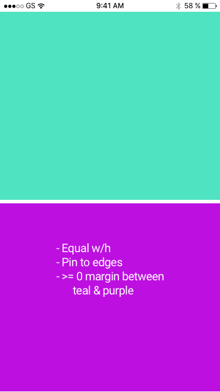

#### Problem 2

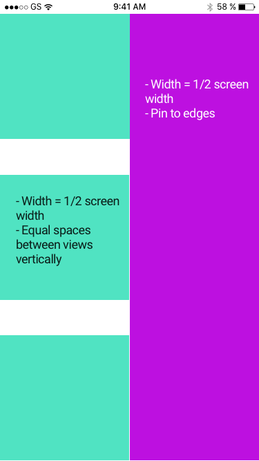

#### Problem 3

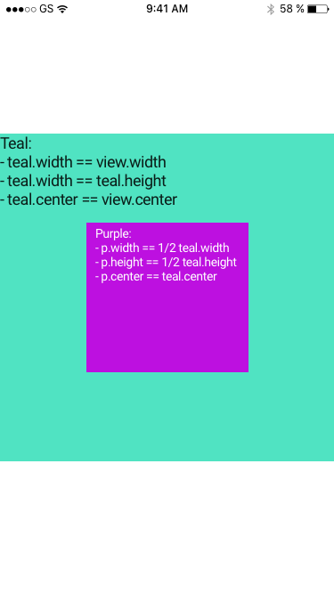

#### Problem 4

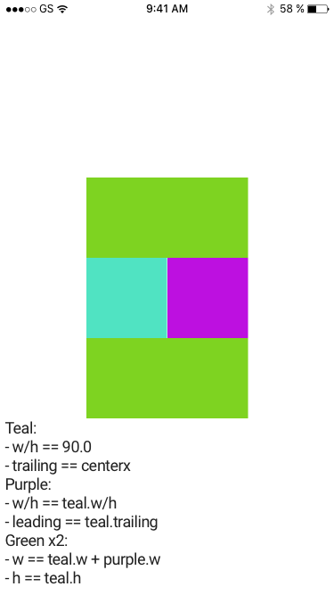

#### Problem 5

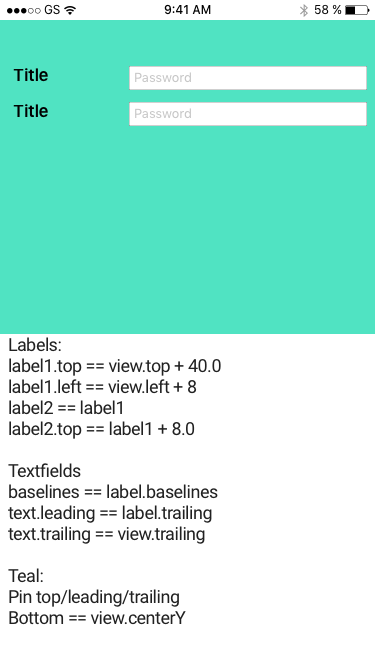

---

#### Advanced: Golden Ratio w/ Fib Sequence
See [The Designer's guide to the golden ratio](http://www.creativebloq.com/design/designers-guide-golden-ratio-12121546)

The Fibonacci sequence gets pretty close to the Golden Ration (1:1.618...). For this example, I'd like for you to step through the first few numbers in the sequence in order to draw out a `UIView` representation of the sequence for `[1, 1, 2, 3, 5, 8, 13]`

**Double bonus** if you can do this task without hard-coding each view's values. You may solve this anyway you see fit, recursively inclusive.

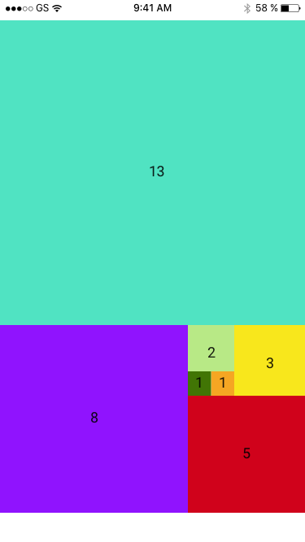
