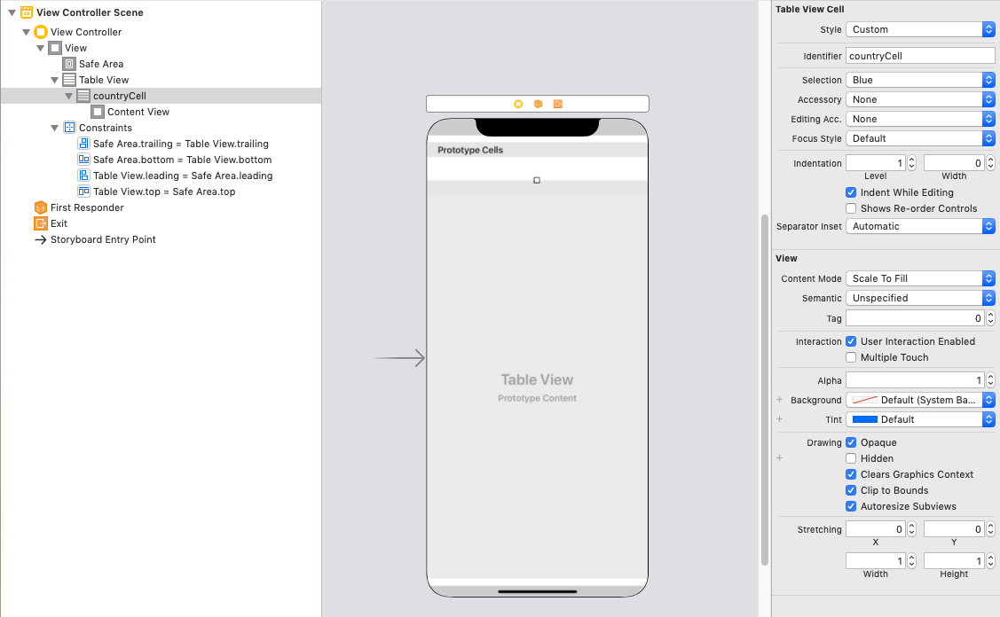
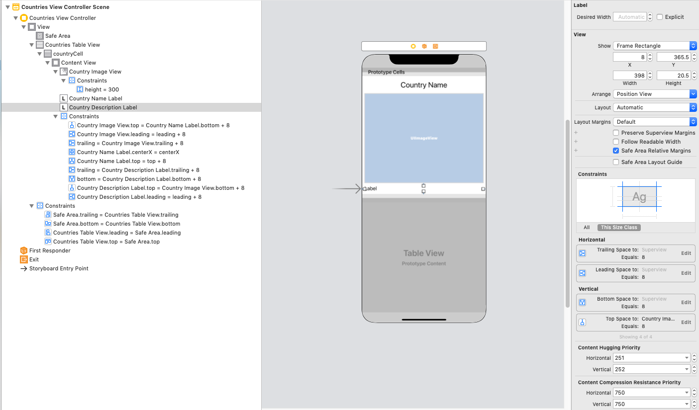
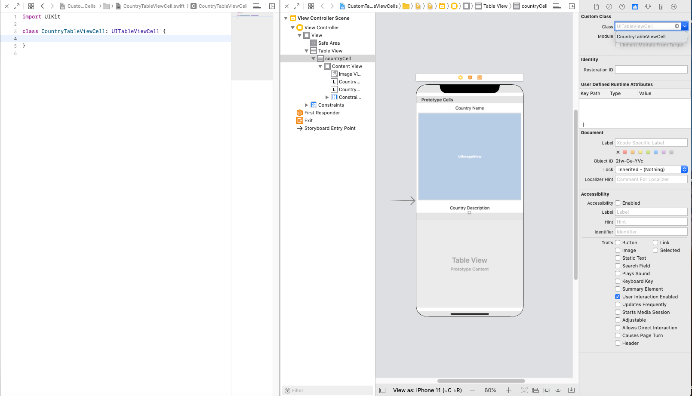

# Custom Table View Cells

## Readings

- [Apple docs](https://developer.apple.com/library/archive/referencelibrary/GettingStarted/DevelopiOSAppsSwift/CreateATableView.html#//apple_ref/doc/uid/TP40015214-CH8-SW2)
- [Ralf Ebert](https://www.ralfebert.de/ios-examples/uikit/uitableviewcontroller/custom-cells/)
- [Stack Overflow](https://stackoverflow.com/questions/24170922/creating-custom-tableview-cells-in-swift)

## Objectives

1. Create a `UITableViewCell` subclass
1. Create custom cell UI in Storyboard
1. Dequeue cells as instances of a `UITableViewCell` subclass

## Sample App

- [Link](https://github.com/joinpursuit/Pursuit-Core-iOS-Custom-Table-View-Cell)

# 1. Custom Table View Cells Introduction

In previous lessons, we've reviewed how to present a list of information to a user using a Table View.  So far, we've relied on the default styling of a Table View Cell, with the image to the left and two `UITextLabels`.  But what if we wanted to change the UI?  In order to build our own custom cells, we'll need to create a subclass of a `UITableViewCell` that has our desired layout.

In this lesson, we'll build an application that shows a list of countries, where we use Auto Layout to position the UI elements in the cell.

Get started by making a new application.  Add to it the following Swift class:

<details>
<summary>Country.swift</summary>

```swift
import Foundation

struct Country {
    let name: String
    let description: String
    let continent: String

    var imageName: String {
        return name
            .components(separatedBy: " ")
            .joined()
            .dropLast()
            .description
            .lowercased()
    }

    static let countries = [
        Country(name: "Saint Lucia 🇱🇨",
                description: "Tropical 🏝 paradise. Known as Helen of the West. Only drive-in volcano. National dish is green banana and salt fish. ",
                continent: "North America"),
        Country(name: "Colombia 🇨🇴",
                description: "Historically troubled with natural beauty. Known for coffee (you’re welcome), ",
                continent: "South America"),
        Country(name: "Jamaica 🇯🇲",
                description: "West Indian/Caribbean utopia. Origin of Reggae/Dancehall.  Birthplace of Bob Marley & Vybz Kartel. Know for cuisine choices such as ackee & salt fish, jerk everything, and mango’s",
                continent: "North America"),
        Country(name: "Bangladesh 🇧🇩",
                description: "it’s hot.  Evidently the national dish is Hilsa Curry (hilsa is a fish).  But she likes tilapia. Muslin originally came from Bangladesh too. ",
                continent: "Asia"),
        Country(name: "America 🇺🇸",
                description: "Known as Land of the free! The American dream. Our national dish are hamburgers ( originally made from a Hamburg steak) ",
                continent: "North America"),
        Country(name: "India 🇮🇳",
                description: "Tropical country, very culturally diverse and curry is very popular there",
                continent: "Asia"),
        Country(name: "Ukraine 🇺🇦",
                description: "Country in Eastern Europe with wonderful climate (full four seasons). Known for its tasty food (national dish is Borsch with pampushki (garlic bread)) and cozy stylish cafes.",
                continent: "Europe"),
        Country(name: "Dominican Republic 🇩🇴",
                description: "Invented Mangu. Hot.",
                continent: "North America"),
        Country(name: "Nepal 🇳🇵",
                description: "Landlocked country, Hinduism and Buddhism are the two main religion. Cows are sacred and cant be kill. Known for Mt. Everest.",
                continent: "Asia"),
        Country(name: "Ecuador 🇪🇨",
                description: "City in Southern Ecuador. Known for hand crafted Panama hats (and other things I can't remember...)",
                continent: "South America"),
        Country(name: "Nigeria 🇳🇬",
                description: "The home of Afro-beat. A true motherland.  The National dish is Jollof Rice which is known for being very spicy and can be filled with meat , chicken , or shrimp (just to name a few).",
                continent: "Africa"),
        Country(name: "Dominica 🇩🇲",
                description: "Dominica is a small island in the West Indies with a population of just under 75,000 people. One of its national dances is the the Bele, a dance that displays its national wear.",
                continent: "North America"),
        Country(name: "Mexico 🇲🇽",
                description: "One of North America's biggest countries, known for its great tasting spices and food and hard working people",
                continent: "North America"),
        Country(name: "Russia 🇷🇺",
                description: "Largest country in the world. It shares borders with 14 countries and has 9 time zones. Russia won World War 2. National dish is Vodka.",
                continent: "Europe"),
    ]
}
```
</details>


For the images, drag them into your assets folder from the link [here].

# 2. Configuring our Table View:

Drag in a Table View into your View Controller, and pin it to the edges.  Then, give it one prototype cell:



Return to your `ViewController.swift` class

Rename your View Controller to "CountriesViewController", by right clicking on "View Controller" and selecting `refactor -> rename`.

Create an outlet from your Table View in Storyboard to your View Controller.  Then build your View Controller to load the `Country` object array into a variable:

```swift
import UIKit

class CountriesViewController: UIViewController {

    // MARK:- IBOutlets

    @IBOutlet var countriesTableView: UITableView!

    // MARK:- Internal Variables

    var countries = [Country]() {
        didSet {
            countriesTableView.reloadData()
        }
    }

    // MARK:- Lifecycle Methods

    override func viewDidLoad() {
        super.viewDidLoad()
        loadData()
    }

    private func loadData() {
        countries = Country.countries
    }
}
```

Now we can configure the data source and delegate of the Table View to display information about the countries:

```swift
import UIKit

class CountriesViewController: UIViewController {

    // MARK:- IBOutlets

    @IBOutlet var countriesTableView: UITableView!

    // MARK:- Internal Variables

    var countries = [Country]() {
        didSet {
            countriesTableView.reloadData()
        }
    }

    // MARK:- Lifecycle Methods

    override func viewDidLoad() {
        super.viewDidLoad()
        configureTableView()
        loadData()
    }

    // MARK:- Private Methods

    private func configureTableView() {
        countriesTableView.dataSource = self
        countriesTableView.delegate = self
    }

    private func loadData() {
        countries = Country.countries
    }
}

// MARK:- UITableViewDelegate Conformance

extension CountriesViewController: UITableViewDelegate {}

// MARK:- UITableViewDataSource Conformance

extension CountriesViewController: UITableViewDataSource {
    func tableView(_ tableView: UITableView, numberOfRowsInSection section: Int) -> Int {
        return countries.count
    }

    func tableView(_ tableView: UITableView, cellForRowAt indexPath: IndexPath) -> UITableViewCell {
        let cell = tableView.dequeueReusableCell(withIdentifier: "countryCell", for: indexPath)
        let country = countries[indexPath.row]
        cell.textLabel?.text = country.name
        return cell
    }
}
```

Now that we are presenting information from our model, let's change the UI to make our cells display information differently.


# 3. Customizing `UITableviewCell` in Storyboard

In your Storyboard file, build your custom cell UI as depicted below:



Note that the "Vertical Content Hugging Priority" has been set to 252 for the country description label.  If this is not set, you may encounter the following error:


#### Content Hugging/Compression Resistance ([CHCR](https://developer.apple.com/library/content/documentation/UserExperience/Conceptual/AutolayoutPG/WorkingwithConstraintsinInterfaceBuidler.html#//apple_ref/doc/uid/TP40010853-CH10-SW2))
These aren't the easiest concepts to understand, and I think in large part is due to their naming. But thanks to one very perfectly succinct [StackOverflow answer](http://stackoverflow.com/a/16281229/3833368), it's a bit easier:

- **Content Hugging**: How much content does not want to grow
- **Compression Resistance**: How much content does not want to shrink

Meaning:
- The higher the **Content Hugging** value, the more it will try to keep its size you set in IB. Think of it as how tightly the edges of a view are hugging what's inside the view (like how the edges of a `UILabel` are hugging the text inside of it).
- The higher the **Compression Resistance** value, the more it will try to expand the bounds you set in IB.

*Note:* These values are set *relative* to the views that surround it. Meaning, these properties will only matter in cases where constraints do not define an exact width/height for a view, and rather, expect a view to expand/contract based on the sizes of the views around it.


# 4. Linking Storyboard Elements to a custom `UITableViewCell`

With our UI built, we want to be able to set the values of the labels and images through code.  We'll need a place to hold outlets to these UI elements, just like our `CountriesViewController` class holds an outlet to our Table View.

To do this, we'll create a new Swift class.  Like `CountriesViewController` subclasses from `UIViewController`, our custom cell will subclass from `UITableViewCell`.  Click on `File -> New -> File` and select "Cocoa Touch Class".  Select `UITableViewCell` and name your subclass "CountryTableViewCell".  

Return to your Storyboard file, and change the class name of your custom cell to be `CountryTableViewCell`



We now have a file where we can create outlets from our custom cell in Storyboard.

```swift
import UIKit

class CountryTableViewCell: UITableViewCell {

    // MARK:- IBOutlets

    @IBOutlet var countryNameLabel: UILabel!
    @IBOutlet var countryImageView: UIImageView!
    @IBOutlet var countryDescriptionLabel: UILabel!

}
```

We also want our cell to be able to set its own properties when given a `Country`.  Adding this code here helps to separate the different parts of our application.

```swift
import UIKit

class CountryTableViewCell: UITableViewCell {

    // MARK:- IBOutlets

    @IBOutlet var countryNameLabel: UILabel!
    @IBOutlet var countryImageView: UIImageView!
    @IBOutlet var countryDescriptionLabel: UILabel!

    // MARK:- Internal Methods

    func setup(with country: Country) {
        countryNameLabel.text = country.name
        countryImageView.image = UIImage(named: country.imageName)
        countryDescriptionLabel.text = country.description
    }
}
```

# 5. Dequeuing Custom Cells

Now our UI is built in Storyboard, and connected to a file that can display a Country.  Our last step is to have our `CountriesViewController` dequeue our custom cell instead of the default `UITableViewCell`.

### CountriesViewController.swift

```swift
extension CountriesViewController: UITableViewDataSource {
    func tableView(_ tableView: UITableView, numberOfRowsInSection section: Int) -> Int {
        return countries.count
    }

    func tableView(_ tableView: UITableView, cellForRowAt indexPath: IndexPath) -> UITableViewCell {
        guard let cell = tableView.dequeueReusableCell(withIdentifier: "countryCell", for: indexPath) as? CountryTableViewCell else {
            fatalError("Developer Error: Unexpected class for cell with reuseID countryCell")
        }
        let country = countries[indexPath.row]
        cell.setup(with: country)
        return cell
    }
}
```

We **downcast** the `UITableViewCell` to a `CountryTableViewCell` so that we can access its `countryNameLabel`, `countryImageView` and `countryDescriptionLabel` properties.

Now, our counties load using the UI that we've specified.
