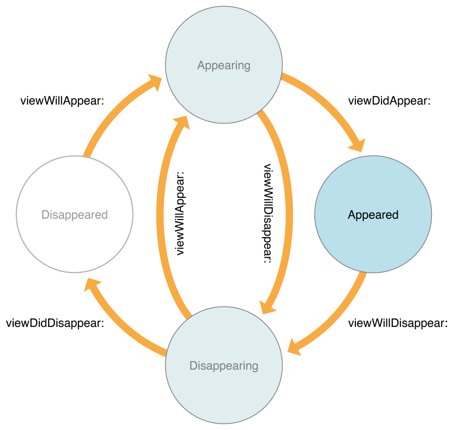

# Controls and View Controller Lifecyle

### Readings/References

1. [Apple Documentation - UIControl](https://developer.apple.com/documentation/uikit/uicontrol)
1. [Apple Documentation - View Controller Lifecycle](https://developer.apple.com/library/archive/referencelibrary/GettingStarted/DevelopiOSAppsSwift/WorkWithViewControllers.html)
1. [Apple Documentation - UIColor](https://developer.apple.com/documentation/uikit/uicolor)
1. [codementor - lifeCycle](https://www.codementor.io/hemantkumar434/view-controller-lifecycle-ios-applications-7oyju9lp6)

### References

1. [`UISwitch`](https://developer.apple.com/documentation/uikit/uiswitch)
1. [`UISegmentedControl`](https://developer.apple.com/documentation/uikit/uisegmentedcontrol)
1. [`UIStepper`](https://developer.apple.com/documentation/uikit/uistepper)
1. [`UISlider`](https://developer.apple.com/documentation/uikit/uislider)

---
### 0. Objectives

1. Understand the View Controller Lifecycle
1. Override UIViewController Lifecycle methods appropriately
1. Create and manipulate a UISwitch
1. Create and manipulate a UIStepper
1. Create and manipulate a UISegmentedControl
1. Create and manipulate a UISlider


### 1. View Controller Lifecycle

In some ways, a View Controller can be compared to something that is alive.  It comes into being, changes and then stops existing.

The poetic minds of programmers have called this process the *Lifecycle*
that describes how a piece of software is born 👶 and dies ☠️.

In Swift, the View Controller is the central way by which we control views. Ultimately, it is the View Controller that controls its main view (`self.view`, also sometimes called its **content view**) which is loaded, appears, and disappears.  As such, the term for tracking views throughout an app is called the **View Controller Lifecycle**.

While the term might be new, the concept is one that we've been using since the first day of iOS.

When we want to load data into a view right when our app starts, what method do we use?

<details>
<summary>Answer</summary>

```swift
viewDidLoad()
```
</details>

However, this is not the only method that we have available to us.  The diagram below from Apple demonstrates how a View Controller transitions between non-existence and being active:



[image source](https://developer.apple.com/library/content/referencelibrary/GettingStarted/DevelopiOSAppsSwift/Art/WWVC_vclife_2x.png)

The four circles represent the various states that your View Controller's view can be in.

The following methods are the View Controller Lifecycle methods that you have the ability to override: ([source - Apple Docs](https://developer.apple.com/library/content/referencelibrary/GettingStarted/DevelopiOSAppsSwift/Art/WWVC_vclife_2x.png))

- **viewDidLoad()**

Called when the view controller’s content view (the top of its view hierarchy) is created and loaded from a storyboard. The view controller’s outlets are guaranteed to have valid values by the time this method is called. Use this method to perform any additional setup required by your view controller.

Typically, iOS calls `viewDidLoad()` only once, when its content view is first created; however, the content view is not necessarily created when the controller is first instantiated. Instead, it is lazily created the first time the system or any code accesses the controller’s view property.

- **viewWillAppear()**

Called just before the view controller’s content view is added to the app’s view hierarchy. Use this method to trigger any operations that need to occur before the content view is presented onscreen. Despite the name, just because the system calls this method, it does not guarantee that the content view will become visible. The view may be obscured by other views or hidden. This method simply indicates that the content view is about to be added to the app’s view hierarchy.

- **viewDidAppear()**

Called just after the view controller’s content view has been added to the app’s view hierarchy. Use this method to trigger any operations that need to occur as soon as the view is presented onscreen, such as fetching data or showing an animation. Despite the name, just because the system calls this method, it does not guarantee that the content view is visible. The view may be obscured by other views or hidden. This method simply indicates that the content view has been added to the app’s view hierarchy.

- **viewWillDisappear()**

Called just before the view controller’s content view is removed from the app’s view hierarchy. Use this method to perform cleanup tasks like committing changes or resigning the first responder status. Despite the name, the system does not call this method just because the content view will be hidden or obscured. This method is only called when the content view is about to be removed from the app’s view hierarchy.

**viewDidDisappear()**

Called just after the view controller’s content view has been removed from the app’s view hierarchy. Use this method to perform additional teardown activities. Despite the name, the system does not call this method just because the content view has become hidden or obscured. This method is only called when the content view has been removed from the app’s view hierarchy.


### 2. Overriding Lifecycle Methods

The section above explains why these methods exist and what they are responsible for.  But how can we step in and run our own code here?  When are these lifecycle methods called?  In order to understand how to implement code in these methods, let's create a project that overrides all these methods to gain an understanding of when they are called.

Create a new Project named "LifecycleMethodsAndControls"

In your ViewController class, add the following implementation:

```swift
class ViewController: UIViewController {

    override func viewDidLoad() {
        super.viewDidLoad()
        print("viewDidLoad")
    }

    override func viewWillLayoutSubviews() {
        super.viewWillLayoutSubviews()
        print("viewWillLayoutSubviews")
    }

    override func viewWillAppear(_ animated: Bool) {
        super.viewWillAppear(animated)
        print("viewWillAppear", "isAnimated: \(animated)")
    }

    override func viewDidAppear(_ animated: Bool) {
        super.viewDidAppear(animated)
        print("viewDidAppear", "isAnimated: \(animated)")
    }

    override func viewWillDisappear(_ animated: Bool) {
        super.viewWillDisappear(animated)
        print("viewWillDisappear", "isAnimated: \(animated)")

    }

    override func viewDidDisappear(_ animated: Bool) {
        super.viewDidDisappear(animated)
        print("viewDidDisappear", "isAnimated: \(animated)")
    }
}
```
This includes a simple printout that informs you when each step is being called.

Create a label in the middle with the text "View Controller One"

Build and run your app.  You should see the following messages appear in the console:

```
viewDidLoad
viewWillAppear isAnimated: false
viewWillLayoutSubviews
viewWillLayoutSubviews
viewDidAppear isAnimated: false
```

Notice that `viewWillLayoutSubviews` may be called multiple times.  Don't expect code in there to only run a single time.  We see that all the Lifecycle methods involves bringing a screen to view are present.  In order to get the remaining Lifecycles, we'll need a way to make our View Controller leave the screen.  This is a good opportunity for a (brief) introduction to Segues.

Embed your View Controller in a Navigation Controller by selecting your View Controller and selecting `Editor -> Embed In -> Navigation Controller`

- Add a button to your View Controller.  
- Create a new View Controller by dragging one out from the Object Library.  
- Create a Segue from the button to the new View Controller by control dragging.

Build and rerun your app.  When you segue to the new controller, you should observe the remaining lifecycle methods being called:

```
viewWillDisappear isAnimated: true
viewDidDisappear isAnimated: true
```

Select the back button and you will see the following readout in your console:

```
viewWillAppear isAnimated: true
viewDidAppear isAnimated: true
```

**Question**: Why are those the only lifecycle methods to be called?

<details>
<summary>Solution</summary>

The view is already loaded, and we have already laid out its subviews.  They are all there in memory stored on your phone.  They are just hidden, waiting to be displayed when the user navigates back to them.
</details>

The majority of the time, overriding `viewDidLoad()` will be sufficient.  When you do need to run code at other times, override the above lifecycle methods to add your own implementation.  

Always remember to call `super.init()` as your first line.  This is good practice because you don't know what kind of setup the parent class is doing, so you want to make sure that you are still allowing it to run whatever code it was running before.

### 3. Controls - UISwitch

We are able to use the Target-Action pattern with all Swift controls. In this way, we will be able to observe when their properties change.

`UISwitch` is a simple control with one relevant property:

- isOn: `Bool`

Switches are great for enabling options or any other setting that only requires a `Bool`. Think of it like a light switch, which only has "on/off" settings.

Let's create a wrapper around our Controls to see each of them isolated in action.

- Create a Tab Bar Controller and make it the initial View Controller.
- Drag in a new View Controller.  
- Drag a Switch and a label inside.
- Create a new Cocoa Touch Class with the name of SwitchViewController that subclasses from UIViewController
- Create an outlet from your label to your SwitchViewController with the name "textLabel"
- Create an action from your switch to your SwitchViewController with the name "switchToggled".  Set the sender to be of type UISwitch.

Create the following implementation:

```swift
class SwitchViewController: UIViewController {

    var switchIsOn: Bool = true {
        didSet {
            self.textLabel.text = "The switch is " + (switchIsOn ? "on" : "off")
        }
    }

    @IBOutlet weak var textLabel: UILabel!

    @IBAction func switchToggled(_ sender: UISwitch) {
        switchIsOn = !switchIsOn
    }
}
```

Why have a separate property `switchIsOn` to keep track of the state?  To separate the responsibilities of our view and view controller, we want to avoid keeping information stored inside of UIElements.  We use a separate `Bool` in the controller to track the state of our switch.


### 4. Controls - UIStepper

A `UIStepper` provides a way for the user to be entering a number.  The most common property we will interface with is:

- value: `Double`

```swift
class StepperViewController: UIViewController {

    var currentStepperValue: Double = 0 {
        didSet {
            textLabel.text = "The current value of the stepper is " + String(currentStepperValue)
        }
    }

    @IBOutlet weak var textLabel: UILabel!

    @IBAction func stepperValueChanged(_ sender: UIStepper) {
        currentStepperValue = sender.value
    }
}
```

### 5. Controls - Segmented Control

A segmented control is a `UIControl` subclass that allows the user to chose between one of several discrete states.  We saw this when giving the user an option to change the filtering criteria during filtering.

Among many other properties, a segmented control has:

- numberOfSegments: Int
- selectedSegmentIndex: Int
- func titleForSegment(at: Int)

Create a label and a segmented control in a new View Controller named "SegmentedControlViewController".  Create an outlet to your label and an action to your segmented control named "segmentedControl"

```swift
class SegmentedControlViewController: UIViewController {
    var currentSegmentIndex: Int = 1 {
        didSet {
            self.textLabel.text = "The " + self.segmentedControl.titleForSegment(at: currentSegmentIndex)! + " segment is selected"
        }
    }

    override func viewDidLoad() {
        self.currentSegmentIndex = segmentedControl.selectedSegmentIndex
    }

    @IBOutlet weak var textLabel: UILabel!
    @IBOutlet weak var segmentedControl: UISegmentedControl!

    @IBAction func segmentedControlValueChanged(_ sender: UISegmentedControl) {
        self.currentSegmentIndex = sender.selectedSegmentIndex
    }
}
```

### 6. Controls - Slider

A slider represents a continuous set of values between a minimum and a maximum. Wow! That's almost like... a Range?

We can access the current value by looking at:

- value: `Float`

```swift
class SliderViewController: UIViewController {
    var currentSliderValue: Float = 0.5 {
        didSet {
            self.textLabel.text = "The current value of the slider is " + String(currentSliderValue)
        }
    }

    @IBOutlet weak var textLabel: UILabel!

    @IBAction func sliderValueChanged(_ sender: UISlider) {
        self.currentSliderValue = sender.value
    }
}
```
