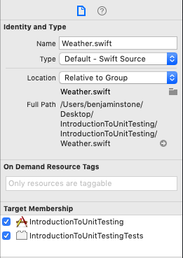

## Introduction to Unit Testing

## Objectives

- Understand why unit testing is used
- Write unit tests for an Xcode project
- Use AAA to write tests
- Use TDD to write new features

## Readings

- [XCTest](https://developer.apple.com/documentation/xctest)  
- [Writing Test Classes and Methods](https://developer.apple.com/library/archive/documentation/DeveloperTools/Conceptual/testing_with_xcode/chapters/04-writing_tests.html)

# 1. Introduction

Testing is an important concept in programming.  Some companies have codebases that are over a million lines of code.  It would be impossible to test every feature manually, or to look at every line of code before adding a new feature.  Tests allow you to clearly define what certain methods should be doing.  If anyone goes to make changes to the codebase in the future, they can run the tests for the whole codebase to make sure that they aren't going to break anything.

Here, we'll build a simple application that will load some weather objects into a Table View.  We will also add unit tests to make sure that our model will work correctly, and protect it so that people will know if new changes break it.

# 2. Environment Configuration

Create a new Xcode project.  Check the box marked "Include Unit Tests".

Go to the URL [here](https://samples.openweathermap.org/data/2.5/find?lat=40&lon=-100&cnt=10&appid=b6907d289e10d714a6e88b30761fae22) and save the JSON to your computer.  Then drag it into your Xcode project named `testWeather.json`.  We will use this JSON to test our model.


# 3. Building the Model

We want to have our model be able to tell us the temperature, wind speed and direction, and a description.  We can decode the JSON into the model below:

```swift
import Foundation

struct Weather: Codable {
    let name: String
    let mainInformation: MainWeatherInformation
    let windInformation: WindInformation
    let weatherDescriptions: [WeatherDescription]

    static func getAllWeathers(from JSONData: Data) -> [Weather] {
        do {
            let allWeathers = try JSONDecoder().decode([Weather].self, from: JSONData)
            return allWeathers
        }
        catch {
            return []
        }
    }

    private enum CodingKeys: String, CodingKey {
        case mainInformation = "main"
        case windInformation = "wind"
        case weatherDescription = "weather"
    }
}

struct MainWeatherInformation: Codable {
    let temperatureInKelvin: Double

    private enum CodingKeys: String, CodingKey {
        case temperatureInKelvin = "temp"
    }
}

struct WindInformation: Codable {
    let speed: Double
    let deg: Int
}

struct WeatherDescription: Codable {
    let description: String
}
```

But did we build our model correctly?  Previously, in order to know we've had to build our our entire UI.  As applications get larger, those pieces of work might be separate, and you wouldn't want to have to wait for someone else to build the UI before you know if your model works.  We will use `Unit Testing` to see if our model works.

# 4 Unit Testing our Model

Unit tests are comprised of 3 parts:

1. Arrange
1. Act
1. Assert

This is called the AAA testing framework.  First you do any setup that you need.  Then, you call whatever function you want to be testing.  Finally you make an `assertion` which tests whether or not what you expect is true.  We'll apply that to our model above.  First, we'll arrange by loading the JSON from the bundle.  Then, we'll act by calling the `getAllWeathers(from:)` method with our JSONData.  Finally, we'll assert that there are three weather structs in the array that we've generated.

In order to make our Weather struct visible to the unit tests, we'll need to add it to the correct `Target`.  A project can have multiple targets which is a way of dividing your code.  By using multiple testing targets, you can make it so that you don't need to build your entire project to run tests for one specific part.  In large companies, it can take over ten minutes to build a project, so this separation is important.



```swift
func testLoadWeather() {
    // Arrange
    let weatherData = getTestWeatherJSONData()

    // Act
    var allWeathers = [Weather]()

    do {
        allWeathers = try Weather.getAllWeathers(from: weatherData)
    } catch {
        print(error)
    }

    // Assert
    XCTAssertTrue(allWeathers.count == 3, "Was expecting 3 weather structs, but received \(allWeathers.count)")
}

private func getTestWeatherJSONData() -> Data {
    guard let pathToData = Bundle.main.path(forResource: "testWeather", ofType: "json") else {
        fatalError("testWeather.json file not found")
    }
    let internalUrl = URL(fileURLWithPath: pathToData)
    do {
        let data = try Data(contentsOf: internalUrl)
        return data
    }
    catch {
        fatalError("An error occurred: \(error)")
    }
}
```

To run our unit tests, either click on the diamond next to `testLoadWeather` or click and hold the play button on the top left to change it into the wrench testing icon.  When we run our test now, we see the following log to the console:

>Test Suite 'All tests' started at 2019-08-27 14:14:05.541
>Test Suite 'IntroductionToUnitTestingTests.xctest' started at 2019-08-27 14:14:05.542
>Test Suite 'WeatherUnitTests' started at 2019-08-27 14:14:05.542
>Test Case '-[IntroductionToUnitTestingTests.WeatherUnitTests testLoadWeather]' started.
>typeMismatch(Swift.Array<Any>, Swift.DecodingError.Context(codingPath: [], debugDescription: "Expected to decode Array<Any> but found a dictionary instead.", underlyingError: nil))
>/Users/benjaminstone/Desktop/IntroductionToUnitTesting/IntroductionToUnitTestingTests/WeatherUnitTests.swift:28: error: -[IntroductionToUnitTestingTests.WeatherUnitTests >testLoadWeather] : XCTAssertTrue failed - Was expecting 3 weather structs, but received 0
> Test Case '-[IntroductionToUnitTestingTests.WeatherUnitTests testLoadWeather]' failed (0.083 seconds).
> Test Suite 'WeatherUnitTests' failed at 2019-08-27 14:14:05.626.
>	 Executed 1 test, with 1 failure (0 unexpected) in 0.083 (0.084) seconds
> Test Suite 'IntroductionToUnitTestingTests.xctest' failed at 2019-08-27 14:14:05.628.
>	 Executed 1 test, with 1 failure (0 unexpected) in 0.083 (0.086) seconds
> Test Suite 'All tests' failed at 2019-08-27 14:14:05.631.
>  Executed 1 test, with 1 failure (0 unexpected) in 0.083 (0.090) seconds

We can see two useful things from this log:

1. Our test failed our array had 0 items instead of 3
2. Our `getAllWeathers(from:)` threw an error message about a type mismatch.  It saw a dictionary instead of an array.

We can use this information to fix our model.  It looks like there's an additional object at the top level of the JSON that contains the array of weather structs.  We'll add the following wrapper object:

```swift
struct WeatherWrapper: Codable {
    let list: [Weather]
}
```

We also have to change our static method to decode into the wrapper:

```swift
static func getAllWeathers(from JSONData: Data) throws -> [Weather] {
    do {
        let allWeathers = try JSONDecoder().decode(WeatherWrapper.self, from: JSONData)
        return allWeathers.list
    }
    catch {
        throw error
    }
}
```


Now when we rerun our tests, we see the following message:

```
Test Suite 'All tests' started at 2019-08-27 14:20:59.709
Test Suite 'IntroductionToUnitTestingTests.xctest' started at 2019-08-27 14:20:59.711
Test Suite 'WeatherUnitTests' started at 2019-08-27 14:20:59.711
Test Case '-[IntroductionToUnitTestingTests.WeatherUnitTests testLoadWeather]' started.
Test Case '-[IntroductionToUnitTestingTests.WeatherUnitTests testLoadWeather]' passed (0.010 seconds).
Test Suite 'WeatherUnitTests' passed at 2019-08-27 14:20:59.722.
	 Executed 1 test, with 0 failures (0 unexpected) in 0.010 (0.011) seconds
Test Suite 'IntroductionToUnitTestingTests.xctest' passed at 2019-08-27 14:20:59.722.
	 Executed 1 test, with 0 failures (0 unexpected) in 0.010 (0.012) seconds
Test Suite 'All tests' passed at 2019-08-27 14:20:59.723.
	 Executed 1 test, with 0 failures (0 unexpected) in 0.010 (0.014) seconds
```

This means all of our tests passed!  It's always a good thing to double check though.  Change the assertion to expect the array has 2 elements:

```swift
XCTAssertTrue(allWeathers.count == 2, "Was expecting 2 weather structs, but received \(allWeathers.count)")
```

We then see the following error messages:

```
/Users/benjaminstone/Desktop/IntroductionToUnitTesting/IntroductionToUnitTestingTests/WeatherUnitTests.swift:28: error: -[IntroductionToUnitTestingTests.WeatherUnitTests testLoadWeather] : XCTAssertTrue failed - Was expecting 2 weather structs, but received 3
```

It's always best practice to make your test fail so you can make sure that you are actually testing the right thing.  Change your assertion back to what it was before and verify that it still passes:

```swift
XCTAssertTrue(allWeathers.count == 3, "Was expecting 3 weather structs, but received \(allWeathers.count)")
```

# 5. Expanding our model with Test Driven Development

Test Driven Development is a framework that says you should write code by first writing the tests, then changing your code so that it passes the tests.  This forces you to have a clear idea of exactly what code you will be writing, and ensures that it will do what you want.  Let's use TDD (Test Driven Development) to build out our model.  Let's add a property that returns the temperature in Fahrenheit

### Return the temperature in Fahrenheit

The temperature object in our model is in Kelvin.  The conversion from Kelvin to Fahrenheit is as follows:

```
fahrenheitTemperature = kelvinTemperature * 1.8 - 459.67
```

First we'll write a new method:  Note that the function must have the string "test" at the beginning:

```swift
func testGetFarenheitTemperature() {
    // Arrange

    // Act

    // Assert
}
```

Now let's add in the structure for how we'll test it:

```swift
func testGetFarenheitTemperature() {
    // Arrange
    let testWeather = Weather(name: "TestWeather",
                              mainInformation: MainWeatherInformation(temperatureInKelvin: 300),
                              windInformation: WindInformation(speed: 0.0, deg: 0),
                              weatherDescriptions: [])
    // Act
    let expectedFarenheitTemp = 80.33
    let actualFarenheitTemp = testWeather.farenheitTemperature

    // Assert
    XCTAssertEqual(expectedFarenheitTemp, actualFarenheitTemp, "Error: expected \(expectedFarenheitTemp), but received \(actualFarenheitTemp)")
}
```

We are creating a new test weather directly, and only populating it with the information that is relevant for our specific unit test.  We haven't actually added a farenheitTemperature property, so our code doesn't compile right now.  That's okay!  Let's go back to our `Weather` struct and add that property:


```swift
struct Weather: Codable {
    let name: String
    let mainInformation: MainWeatherInformation
    let windInformation: WindInformation
    let weatherDescriptions: [WeatherDescription]

    var farenheitTemperature: Double {
        return mainInformation.temperatureInKelvin * 1.8 - 459.67
    }

    static func getAllWeathers(from JSONData: Data) throws -> [Weather] {
        do {
            let allWeathers = try JSONDecoder().decode(WeatherWrapper.self, from: JSONData)
            return allWeathers.list
        }
        catch {
            throw error
        }
    }

    private enum CodingKeys: String, CodingKey {
        case name
        case mainInformation = "main"
        case windInformation = "wind"
        case weatherDescriptions = "weather"
    }
}
```

Now, our code can build.  When we run our tests, we get the following message:

```
Test Suite 'All tests' started at 2019-08-27 15:05:19.106
Test Suite 'IntroductionToUnitTestingTests.xctest' started at 2019-08-27 15:05:19.109
Test Suite 'WeatherUnitTests' started at 2019-08-27 15:05:19.110
Test Case '-[IntroductionToUnitTestingTests.WeatherUnitTests testGetFarenheitTemperature]' started.
/Users/benjaminstone/Desktop/IntroductionToUnitTesting/IntroductionToUnitTestingTests/WeatherUnitTests.swift:42: error: -[IntroductionToUnitTestingTests.WeatherUnitTests testGetFarenheitTemperature] : XCTAssertEqual failed: ("80.33") is not equal to ("80.32999999999998") - Error: expected 80.33, but received 80.32999999999998
Test Case '-[IntroductionToUnitTestingTests.WeatherUnitTests testGetFarenheitTemperature]' failed (0.024 seconds).
Test Case '-[IntroductionToUnitTestingTests.WeatherUnitTests testLoadWeather]' started.
Test Case '-[IntroductionToUnitTestingTests.WeatherUnitTests testLoadWeather]' passed (0.012 seconds).
Test Suite 'WeatherUnitTests' failed at 2019-08-27 15:05:19.458.
	 Executed 2 tests, with 1 failure (0 unexpected) in 0.037 (0.348) seconds
Test Suite 'IntroductionToUnitTestingTests.xctest' failed at 2019-08-27 15:05:19.458.
	 Executed 2 tests, with 1 failure (0 unexpected) in 0.037 (0.349) seconds
Test Suite 'All tests' failed at 2019-08-27 15:05:19.459.
	 Executed 2 tests, with 1 failure (0 unexpected) in 0.037 (0.353) seconds
```

What's going on?  Looks like we've got a [floating point error](https://stackoverflow.com/questions/588004/is-floating-point-math-broken).  We can fix this by adding comparing the [rounded values](https://stackoverflow.com/questions/27338573/rounding-a-double-value-to-x-number-of-decimal-places-in-swift) instead:


```swift
func testGetFarenheitTemperature() {
    // Arrange
    let testWeather = Weather(name: "TestWeather",
                              mainInformation: MainWeatherInformation(temperatureInKelvin: 300),
                              windInformation: WindInformation(speed: 0.0, deg: 0),
                              weatherDescriptions: [])
    // Act
    let expectedFarenheitTemp = Double(round(100 * 80.33) / 100)
    let actualFarenheitTemp = Double(round(100 * testWeather.farenheitTemperature) / 100)

    // Assert
    XCTAssertEqual(expectedFarenheitTemp, actualFarenheitTemp, "Error: expected \(expectedFarenheitTemp), but received \(actualFarenheitTemp)")
}
```

Now our test is passing!  We've used TDD to add a new piece of functionality to our application.  With our model built, we can now build our UI with the knowledge that we don't need to worry if we'll parse the JSON correctly.


# 6. Building our UI

Now that our model is built and tested, we can load our data into a Table View.  Let's start by building a small wrapper around our `Weather` object to get the data for us:

```swift
import Foundation

struct WeatherFetchingService {
    static func getAllWeather() throws -> [Weather] {
        let weatherJSONData = getTestWeatherJSONData()
        return try Weather.getAllWeathers(from: weatherJSONData)
    }

    static func getTestWeatherJSONData() -> Data {
        guard let pathToData = Bundle.main.path(forResource: "testWeather", ofType: "json") else {
            fatalError("testWeather.json file not found")
        }
        let internalUrl = URL(fileURLWithPath: pathToData)
        do {
            let data = try Data(contentsOf: internalUrl)
            return data
        }
        catch {
            fatalError("An error occurred: \(error)")
        }
    }
}
```

You can also go back to test file and remove the copied method `getTestWeatherJSONData()`.

Now, let's build our VC:

```swift
import UIKit

class WeatherViewController: UIViewController {

    // MARK: - IBOutlets

    @IBOutlet var weatherTableView: UITableView!

    // MARK: - Private properties

    private var allWeather = [Weather]() {
        didSet {
            weatherTableView.reloadData()
        }
    }

    // MARK: - Lifecycle Overrides

    override func viewDidLoad() {
        super.viewDidLoad()
        configureTableView()
        loadAllWeather()
    }

    // MARK: - Private methods

    private func configureTableView() {
        weatherTableView.delegate = self
        weatherTableView.dataSource = self
    }

    private func loadAllWeather() {
        do {
            allWeather = try WeatherFetchingService.getAllWeather()
        } catch {
            let alertVC = UIAlertController(title: "Error", message: "Unable to get weather: \(error)", preferredStyle: .alert)
            alertVC.addAction(UIAlertAction(title: "Ok", style: .default, handler: nil))
            present(alertVC, animated: true, completion: nil)
        }
    }
}

extension WeatherViewController: UITableViewDelegate {}

extension WeatherViewController: UITableViewDataSource {
    func tableView(_ tableView: UITableView, numberOfRowsInSection section: Int) -> Int {
        return allWeather.count
    }
    func tableView(_ tableView: UITableView, cellForRowAt indexPath: IndexPath) -> UITableViewCell {
        let cell = tableView.dequeueReusableCell(withIdentifier: "weatherCell", for: indexPath)
        let weather = allWeather[indexPath.row]
        cell.textLabel?.text = weather.name
        let displayTemp = String(format: "%.f", weather.farenheitTemperature)
        cell.detailTextLabel?.text = "Current temperature: \(displayTemp)ºF"
        return cell
    }
}
```
