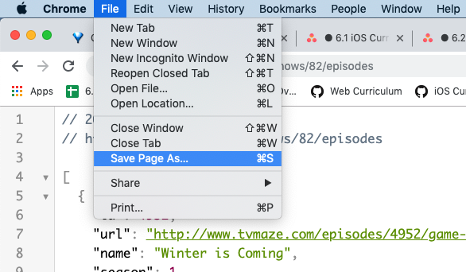
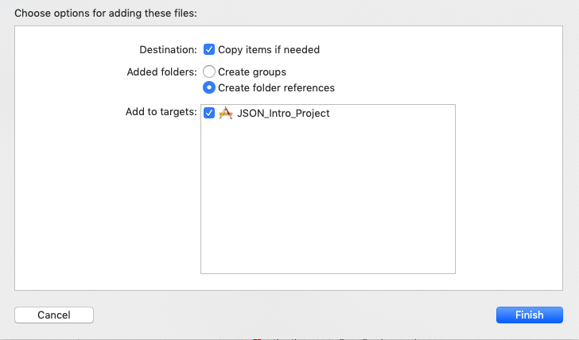

# Parsing JSON

### Project Links

- [Starting Project](https://github.com/lynksdomain/JsonParsing)


### Resources

1. [Postman](https://www.getpostman.com/)
2. [What is JSON? - SquareSpace](https://developers.squarespace.com/what-is-json/)
3. [Apple Docs - JSON](https://developer.apple.com/swift/blog/?id=37)
4. [Apple Docs - Bundle](https://developer.apple.com/documentation/foundation/bundle)
5. [Apple Docs - JSONSerialization](https://developer.apple.com/documentation/foundation/jsonserialization)
6. [Apple Docs - JSONDecoder](https://developer.apple.com/documentation/foundation/jsondecoder)

### Objectives

1. Create a custom class to model the JSON object
1. Create additional wrapper classes to model the nesting in JSON
1. Convert a .json file to `Data` using `Bundle.main`
1. Use `JSONDecoder` to create an array of your custom objects


## 1. JSON Introduction

In projects we've made so far, the data you were working with was entirely static, and given to you as a static property inside of a struct.  You would use something like `GOTEpisode.allEpisodes` to get the information that you wanted.  This works great, but only if someone already went and build Swift objects to describe each episode:

<details>
<summary>GOT JSON example</summary>

```swift
class GOTEpisode {
    var airdate: String
    var id: Int
    var name: String
    var number: Int
    var season: Int
    var runtime: Int
    var summary: String
    var mediumImageID: String
    var originalImageID: String
    init(airdate: String, id: Int, name: String, number: Int, season: Int, runtime: Int, summary: String, mediumImageID: String, originalImageID: String) {
        self.airdate = airdate
        self.id = id
        self.name = name
        self.number = number
        self.season = season
        self.runtime = runtime
        self.summary = summary
        self.mediumImageID = mediumImageID
        self.originalImageID = originalImageID
    }
    static let allEpisodes = [
        GOTEpisode(airdate: "2011-04-17", id: 4952, name: "Winter is Coming", number: 1, season: 1, runtime: 60, summary: "Lord Eddard Stark, ruler of the North, is summoned to court by his old friend, King Robert Baratheon, to serve as the King's Hand. Eddard reluctantly agrees after learning of a possible threat to the King's life. Eddard's bastard son Jon Snow must make a painful decision about his own future, while in the distant east Viserys Targaryen plots to reclaim his father's throne, usurped by Robert, by selling his sister in marriage.", mediumImageID: "2668", originalImageID: "2668"),
        GOTEpisode(airdate: "2011-04-24", id: 4953, name: "The Kingsroad", number: 2, season: 1, runtime: 60, summary: "An incident on the Kingsroad threatens Eddard and Robert's friendship. Jon and Tyrion travel to the Wall, where they discover that the reality of the Night's Watch may not match the heroic image of it.", mediumImageID: "2669", originalImageID: "2669"),
        GOTEpisode(airdate: "2011-05-01", id: 4954, name: "Lord Snow", number: 3, season: 1, runtime: 60, summary: "Jon Snow attempts to find his place amongst the Night's Watch. Eddard and his daughters arrive at King's Landing.", mediumImageID: "2671", originalImageID: "2671"),
        GOTEpisode(airdate: "2011-05-08", id: 4955, name: "Cripples, Bastards, and Broken Things", number: 4, season: 1, runtime: 60, summary: "Tyrion stops at Winterfell on his way home and gets a frosty reception from Robb Stark. Eddard's investigation into the death of his predecessor gets underway.", mediumImageID: "2673", originalImageID: "2673"),
        GOTEpisode(airdate: "2011-05-15", id: 4956, name: "The Wolf and the Lion", number: 5, season: 1, runtime: 60, summary: "Catelyn's actions on the road have repercussions for Eddard. Tyrion enjoys the dubious hospitality of the Eyrie.", mediumImageID: "2674", originalImageID: "2674"),
        GOTEpisode(airdate: "2011-05-22", id: 4957, name: "A Golden Crown", number: 6, season: 1, runtime: 60, summary: "Viserys is increasingly frustrated by the lack of progress towards gaining his crown.", mediumImageID: "2676", originalImageID: "2676"),
        GOTEpisode(airdate: "2011-05-29", id: 4958, name: "You Win or You Die", number: 7, season: 1, runtime: 60, summary: "Eddard's investigations in King's Landing reach a climax and a dark secret is revealed.", mediumImageID: "2677", originalImageID: "2677"),
        GOTEpisode(airdate: "2011-06-05", id: 4959, name: "The Pointy End", number: 8, season: 1, runtime: 60, summary: "Tyrion joins his father's army with unexpected allies. Events in King's Landing take a turn for the worse as Arya's lessons are put to the test.", mediumImageID: "2678", originalImageID: "2678"),
        GOTEpisode(airdate: "2011-06-12", id: 4960, name: "Baelor", number: 9, season: 1, runtime: 60, summary: "Catelyn must negotiate with the irascible Lord Walder Frey.", mediumImageID: "2679", originalImageID: "2679"),
        GOTEpisode(airdate: "2011-06-19", id: 4961, name: "Fire and Blood", number: 10, season: 1, runtime: 60, summary: "Daenerys must realize her destiny. Jaime finds himself in an unfamiliar predicament.", mediumImageID: "2681", originalImageID: "2681"),
        GOTEpisode(airdate: "2012-04-01", id: 4962, name: "The North Remembers", number: 1, season: 2, runtime: 60, summary: "War grips the continent of Westeros. As Tyrion Lannister tries to take his strong-willed nephew in hand in King's Landing, Stannis Baratheon launches his own campaign to take the Iron Throne with the help of a mysterious priestess. In the east, Daenerys must lead her retinue through a desolate wasteland whilst beyond the Wall the Night's Watch seeks the aid of a wildling.", mediumImageID: "3174", originalImageID: "3174"),
        GOTEpisode(airdate: "2012-04-08", id: 4963, name: "The Night Lands", number: 2, season: 2, runtime: 60, summary: "Stannis uses Ser Davos to seek out new allies for his war with the Lannisters. On the road north, Arya confides in Gendry. Robb Stark sends Theon Greyjoy to win an alliance with his father and the fierce warriors of the Iron Islands. Cersei and Tyrion clash on how to rule in King's Landing.", mediumImageID: "3175", originalImageID: "3175"),
        GOTEpisode(airdate: "2012-04-15", id: 4964, name: "What is Dead May Never Die", number: 3, season: 2, runtime: 60, summary: "Catelyn Stark treats with King Renly in the hope of winning an alliance. Tyrion undertakes a complex plan in King's Landing to expose an enemy. At Winterfell, Bran's dreams continue to trouble him.", mediumImageID: "3176", originalImageID: "3176"),
        GOTEpisode(airdate: "2012-04-22", id: 4965, name: "Garden of Bones", number: 4, season: 2, runtime: 60, summary: "Tyrion attempts to restrain Joffrey's cruelty. Catelyn attempts to broker a peace between Stannis and Renly. Daenerys and her followers arrive at the great city of Qarth and hope to find refuge there. Arya and Gendry arrive at Harrenhal, a great castle now under Lannister occupation.", mediumImageID: "3177", originalImageID: "3177"),
        GOTEpisode(airdate: "2012-04-29", id: 4966, name: "The Ghost of Harrenhal", number: 5, season: 2, runtime: 60, summary: "Confusion rages in the Stormlands in the wake of a devastating reversal. Catelyn must flee with a new ally, whilst Littlefinger sees an opportunity in the chaos. Theon seeks to prove himself to his father in battle. Arya receives a promise from the enigmatic Jaqen H'ghar. The Night's Watch arrives at the Fist of the First Men. Daenerys Targaryen receives a marriage proposal.", mediumImageID: "3178", originalImageID: "3178"),
        GOTEpisode(airdate: "2012-05-06", id: 4967, name: "The Old Gods and the New", number: 6, season: 2, runtime: 60, summary: "Arya has a surprise visitor; Dany vows to take what is hers; Joffrey meets his subjects; Qhorin gives Jon a chance to prove himself.", mediumImageID: "3180", originalImageID: "3180"),
        GOTEpisode(airdate: "2012-05-13", id: 4968, name: "A Man Without Honor", number: 7, season: 2, runtime: 60, summary: "Jaime meets a relative; Theon hunts; Dany receives an invitation.", mediumImageID: "3192", originalImageID: "3192"),
        GOTEpisode(airdate: "2012-05-20", id: 4969, name: "The Prince of Winterfell", number: 8, season: 2, runtime: 60, summary: "Theon holds the fort; Arya calls in her debt with Jaqen; Robb is betrayed; Stannis and Davos approach their destination.", mediumImageID: "3194", originalImageID: "3194"),
        GOTEpisode(airdate: "2012-05-27", id: 4970, name: "Blackwater", number: 9, season: 2, runtime: 60, summary: "A massive battle rages for control of King's Landing and the Iron Throne.", mediumImageID: "3196", originalImageID: "3196"),
        GOTEpisode(airdate: "2012-06-03", id: 4971, name: "Valar Morghulis", number: 10, season: 2, runtime: 60, summary: "Tyrion awakens to a changed situation. King Joffrey doles out rewards to his subjects. As Theon stirs his men to action, Luwin offers some final advice. Brienne silences Jaime; Arya receives a gift from Jaqen; Dany goes to a strange place; Jon proves himself to Qhorin.", mediumImageID: "3197", originalImageID: "3197"),
        GOTEpisode(airdate: "2013-03-31", id: 4972, name: "Valar Dohaeris", number: 1, season: 3, runtime: 60, summary: "Jon is brought before Mance Rayder, the King Beyond the Wall, while the Night's Watch survivors retreat south. In King's Landing, Tyrion asks for his reward. Littlefinger offers Sansa a way out. Cersei hosts a dinner for the royal family. Daenerys sails into Slaver's Bay.", mediumImageID: "2628", originalImageID: "2628"),
        GOTEpisode(airdate: "2013-04-07", id: 4973, name: "Dark Wings, Dark Words", number: 2, season: 3, runtime: 60, summary: "Sansa (Sophie Turner) says too much. Shae (Sibel Kekilli) asks Tyrion (Peter Dinklage) for a favor. Jaime (Nikolaj Coster-Waldau) finds a way to pass the time. Arya (Maisie Williams) runs into the Brotherhood Without Banners.", mediumImageID: "2618", originalImageID: "2618"),
        GOTEpisode(airdate: "2013-04-14", id: 4974, name: "Walk of Punishment", number: 3, season: 3, runtime: 60, summary: "Tyrion shoulders new responsibilities. Jon (Kit Harington) is taken to the Fist of the First Men. Daenerys (Emilia Clarke) meets with the slavers. Jaime strikes a deal with his captors.", mediumImageID: "2616", originalImageID: "2616"),
        GOTEpisode(airdate: "2013-04-21", id: 4975, name: "And Now His Watch is Ended", number: 4, season: 3, runtime: 60, summary: "The Night's Watch takes stock. Varys (Conleth Hill) meets his better. Arya is taken to the commander of the Brotherhood. Daenerys exchanges a chain for a Whip.", mediumImageID: "2615", originalImageID: "2615"),
        GOTEpisode(airdate: "2013-04-28", id: 4976, name: "Kissed by Fire", number: 5, season: 3, runtime: 60, summary: "The Hound (Rory McCann) is judged by the gods; Jaime is judged by men. Jon proves himself; Robb (Richard Madden) is betrayed. Tyrion learns the cost of weddings.", mediumImageID: "2614", originalImageID: "2614"),
        GOTEpisode(airdate: "2013-05-05", id: 4977, name: "The Climb", number: 6, season: 3, runtime: 60, summary: "Tywin (Charles Dance) plans strategic unions for the Lannisters. Melisandre (Carice van Houten) visits the Riverlands. Robb (Richard Madden) weighs a compromise to repair his alliance with House Frey. Roose Bolton (Michael McElhatton) decides what to do with Jaime Lannister (Nikolaj Coster-Waldau). Jon (Kit Harington), Ygritte (Rose Leslie) and the Wildlings face a daunting climb.", mediumImageID: "2612", originalImageID: "2612"),
        GOTEpisode(airdate: "2013-05-12", id: 4978, name: "The Bear and the Maiden Fair", number: 7, season: 3, runtime: 60, summary: "Daenerys (Emilia Clarke) exchanges gifts with a slave lord outside Yunkai. As Sansa (Sophie Turner) frets about her prospects, Shae (Sibel Kekilli) chafes at Tyrion's (Peter Dinklage) new situation. Tywin counsels the king, and Melisandre reveals a secret to Gendry (Joe Dempsie). Brienne (Gwendoline Christie) faces a formidable foe in Harrenhal.", mediumImageID: "2611", originalImageID: "2611"),
        GOTEpisode(airdate: "2013-05-19", id: 4979, name: "Second Sons", number: 8, season: 3, runtime: 60, summary: "King's Landing hosts a wedding, and Tyrion and Sansa spend the night together. Daenerys meets the Titan's Bastard. Davos (Liam Cunningham) demands proof from Melisandre. Sam (John Bradley) and Gilly (Hannah Murray) meet an older Gentleman.", mediumImageID: "2599", originalImageID: "2599"),
        GOTEpisode(airdate: "2013-06-02", id: 4980, name: "The Rains of Castamere", number: 9, season: 3, runtime: 60, summary: "Robb (Richard Madden) presents himself to Walder Frey (David Bradley), and Edmure (Tobias Menzies) meets his bride. Jon (Kit Harington) faces his harshest test yet. Bran (Isaac Hempstead Wright) discovers a new gift. Daario (Ed Skrein) and Jorah (Iain Glen) debate how to take Yunkai. House Frey joins with House Tully.", mediumImageID: "2598", originalImageID: "2598"),
        GOTEpisode(airdate: "2013-06-09", id: 4981, name: "Mhysa", number: 10, season: 3, runtime: 60, summary: "Joffrey (Jack Gleeson) challenges Tywin (Charles Dance). Bran tells a ghost story. In Dragonstone, mercy comes from strange quarters. Daenerys (Emilia Clarke) waits to see if she is a conqueror or a liberator.", mediumImageID: "2597", originalImageID: "2597"),
        GOTEpisode(airdate: "2014-04-06", id: 4982, name: "Two Swords", number: 1, season: 4, runtime: 60, summary: "Tyrion (Peter Dinklage) welcomes a guest to King's Landing. At Castle Black, Jon Snow (Kit Harington) finds himself unwelcome. Dany (Emilia Clarke) is pointed to Meereen, the mother of all slave cities. Arya (Maisie Williams) runs into an old friend.", mediumImageID: "2583", originalImageID: "2583"),
        GOTEpisode(airdate: "2014-04-13", id: 4983, name: "The Lion and the Rose", number: 2, season: 4, runtime: 60, summary: "Tyrion lends Jaime (Nikolaj Coster-Waldau) a hand. Joffrey (Jack Gleeson) and Margaery (Natalie Dormer) host a breakfast. At Dragonstone, Stannis (Stephen Dillane) loses patience with Davos (Liam Cunningham). Ramsay (Iwan Rheon) finds a purpose for his pet. North of the Wall, Bran (Isaac Hempstead Wright) sees where they must go.", mediumImageID: "2584", originalImageID: "2584"),
        GOTEpisode(airdate: "2014-04-20", id: 4984, name: "Breaker of Chains", number: 3, season: 4, runtime: 60, summary: "Tyrion ponders his options. Tywin (Charles Dance) extends an olive branch. Sam (John Bradley) realizes Castle Black isn't safe, and Jon proposes a bold plan. The Hound (Rory McCann) teaches Arya the way things are. Dany chooses her Champion.", mediumImageID: "2585", originalImageID: "2585"),
        GOTEpisode(airdate: "2014-04-27", id: 4985, name: "Oathkeeper", number: 4, season: 4, runtime: 60, summary: "Dany balances justice and mercy. Jaime tasks Brienne (Gwendoline Christie) with his honor. Jon secures volunteers while Bran, Jojen (Thomas Brodie-Sangster), Meera (Ellie Kendrick) and Hodor (Kristian Nairn) stumble on shelter.", mediumImageID: "2586", originalImageID: "2586"),
        GOTEpisode(airdate: "2014-05-04", id: 4986, name: "First of His Name", number: 5, season: 4, runtime: 60, summary: "Cersei (Lena Headey) and Tywin (Charles Dance) plot the Crown's next move. Dany (Emilia Clarke) discusses future plans. Jon (Kit Harington) embarks on a new mission.", mediumImageID: "2587", originalImageID: "2587"),
        GOTEpisode(airdate: "2014-05-11", id: 4987, name: "The Laws of Gods and Men", number: 6, season: 4, runtime: 60, summary: "Stannis (Stephen Dillane) and Davos (Liam Cunningham) set sail with a new strategy. Dany meets with supplicants. Tyrion (Peter Dinklage) faces down his father in the throne room.", mediumImageID: "2588", originalImageID: "2588"),
        GOTEpisode(airdate: "2014-05-18", id: 4988, name: "Mockingbird", number: 7, season: 4, runtime: 60, summary: "Tyrion enlists an unlikely ally. Daario (Michiel Huisman) entreats Dany to allow him to do what he does best. Jon's warnings about the Wall's vulnerability fall on deaf ears. Brienne (Gwendoline Christie) follows a new lead on the road with Pod (Daniel Portman).", mediumImageID: "2589", originalImageID: "2589"),
        GOTEpisode(airdate: "2014-06-01", id: 4989, name: "The Mountain and the Viper", number: 8, season: 4, runtime: 60, summary: "Mole's Town receives unexpected visitors. Littlefinger's (Aidan Gillen) motives are questioned. Ramsay (Iwan Rhoen) attempts to prove himself to his father. Tyrion's (Peter Dinklage) fate is decided.", mediumImageID: "2591", originalImageID: "2591"),
        GOTEpisode(airdate: "2014-06-08", id: 4990, name: "The Watchers on the Wall", number: 9, season: 4, runtime: 60, summary: "Jon Snow (Kit Harington) and the rest of the Night's Watch face the biggest challenge to the Wall yet.", mediumImageID: "2593", originalImageID: "2593"),
        GOTEpisode(airdate: "2014-06-15", id: 4991, name: "The Children", number: 10, season: 4, runtime: 60, summary: "An unexpected arrival north of the Wall changes circumstances. Dany (Emilia Clarke) is forced to face harsh realities. Bran (Isaac Hempstead Wright) learns more of his destiny. Tyrion sees the truth of his Situation.", mediumImageID: "2594", originalImageID: "2594"),
        GOTEpisode(airdate: "2015-04-12", id: 116522, name: "The Wars to Come", number: 1, season: 5, runtime: 60, summary: "In the Season 5 premiere, Varys discusses a conspiracy with Tyrion; Daenerys' rule faces a new threat; Jon finds himself between two kings; and Cersei and Jaime try to move on from Tywin's demise.", mediumImageID: "25988", originalImageID: "25988"),
        GOTEpisode(airdate: "2015-04-19", id: 144328, name: "The House of Black and White", number: 2, season: 5, runtime: 60, summary: "Arya arrives in Braavos; Brienne and Podrick find danger while traveling; Cersei worries about Myrcella in Dorne when Ellaria Sand seeks revenge for Oberyn's death; Jon is tempted by Stannis.", mediumImageID: "25989", originalImageID: "25989"),
        GOTEpisode(airdate: "2015-04-26", id: 144329, name: "High Sparrow", number: 3, season: 5, runtime: 60, summary: "Cersei meets the High Sparrow after learning of a clergyman's embarrassing tale. Meanwhile, Davos talks to Jon about the future of Winterfell, where Ramsay Snow has just learned the identity of his future bride; Arya grows impatient doing menial tasks in the House of Black and White; and Tyrion searches for more comfortable surroundings on a long trip with Varys.", mediumImageID: "25990", originalImageID: "25990"),
        GOTEpisode(airdate: "2015-05-03", id: 144330, name: "Sons of the Harpy", number: 4, season: 5, runtime: 60, summary: "Margaery seeks prudent counsel. Jaime Struggles in foreign lands. Dany answers the Harpy's call.", mediumImageID: "26444", originalImageID: "26444"),
        GOTEpisode(airdate: "2015-05-10", id: 151777, name: "Kill the Boy", number: 5, season: 5, runtime: 60, summary: "Dany makes a difficult decision in Meereen. Jon recruits the help of an unexpected ally. Brienne searches for Sansa. Theon remains under Ramsay's control.", mediumImageID: "26819", originalImageID: "26819"),
        GOTEpisode(airdate: "2015-05-17", id: 152766, name: "Unbowed, Unbent, Unbroken", number: 6, season: 5, runtime: 60, summary: "Arya trains. Jorah and Tyrion run into slavers. Trystane and Myrcella make plans. Jaime and Bronn reach their destination. The Sand Snakes attack.", mediumImageID: "27259", originalImageID: "27259"),
        GOTEpisode(airdate: "2015-05-24", id: 153327, name: "The Gift", number: 7, season: 5, runtime: 60, summary: "Jon prepares for conflict. Sansa tries to talk to Theon. Brienne waits for a sign. Stannis remains stubborn. Jaime attempts to reconnect with family.<br><br>", mediumImageID: "27535", originalImageID: "27535"),
        GOTEpisode(airdate: "2015-05-31", id: 155299, name: "Hardhome", number: 8, season: 5, runtime: 60, summary: "Arya makes progress in her training. Sansa confronts an old friend. Cersei struggles. Jon travels.<br><br>", mediumImageID: "28151", originalImageID: "28151"),
        GOTEpisode(airdate: "2015-06-07", id: 160040, name: "The Dance of Dragons", number: 9, season: 5, runtime: 60, summary: "Stannis confronts a troubling decision. Jon returns to The Wall. Mace visits the Iron Bank. Arya encounters someone from her past. Dany reluctantly oversees a traditional celebration of athleticism.", mediumImageID: "29160", originalImageID: "29160"),
        GOTEpisode(airdate: "2015-06-14", id: 162186, name: "Mother's Mercy", number: 10, season: 5, runtime: 60, summary: "Cersei seeks forgiveness; Jon faces a new challenge; Arya plots to cross a name off her list; Tyrion sees a familiar face; and Daenerys finds herself surrounded by strangers.", mediumImageID: "30012", originalImageID: "30012"),
        GOTEpisode(airdate: "2016-04-24", id: 560813, name: "The Red Woman", number: 1, season: 6, runtime: 60, summary: "Jon Snow is dead. Daenerys meets a strong man. Cersei sees her daughter again.", mediumImageID: "142371", originalImageID: "142371"),
        GOTEpisode(airdate: "2016-05-01", id: 664672, name: "Home", number: 2, season: 6, runtime: 60, summary: "Bran trains with the Three-Eyed Raven. In King's Landing, Jaime advises Tommen. Tyrion demands good news, but has to make his own. At Castle Black, the Night's Watch stands behind Thorne. Ramsay Bolton proposes a plan, and Balon Greyjoy entertains other proposals.", mediumImageID: "142372", originalImageID: "142372"),
        GOTEpisode(airdate: "2016-05-08", id: 664673, name: "Oathbreaker", number: 3, season: 6, runtime: 60, summary: "Daenerys meets her future. Bran meets the past. Tommen confronts the High Sparrow. Arya trains to be No One. Varys finds an answer. Ramsay gets a gift.", mediumImageID: "142370", originalImageID: "142370"),
        GOTEpisode(airdate: "2016-05-15", id: 664674, name: "Book of the Stranger", number: 4, season: 6, runtime: 60, summary: "Tyrion strikes a deal. Jorah and Daario undertake a difficult task. Jaime and Cersei try to improve their situation.", mediumImageID: "142273", originalImageID: "142273"),
        GOTEpisode(airdate: "2016-05-22", id: 664675, name: "The Door", number: 5, season: 6, runtime: 60, summary: "Tyrion seeks a strange ally. Bran learns a great deal. Brienne goes on a mission. Arya is given a chance to prove herself.", mediumImageID: "150273", originalImageID: "150273"),
        GOTEpisode(airdate: "2016-05-29", id: 664676, name: "Blood of My Blood", number: 6, season: 6, runtime: 60, summary: "An old foe comes back into the picture. Gilly meets Sam's family. Arya faces a difficult choice. Jaime faces off against the High Sparrow.", mediumImageID: "150274", originalImageID: "150274"),
        GOTEpisode(airdate: "2016-06-05", id: 717449, name: "The Broken Man", number: 7, season: 6, runtime: 60, summary: "The High Sparrow eyes another target. Jaime confronts a hero. Arya makes a plan. The North is reminded.", mediumImageID: "150275", originalImageID: "150275"),
        GOTEpisode(airdate: "2016-06-12", id: 729573, name: "No One", number: 8, season: 6, runtime: 60, summary: "Jaime encounters a hero; the High Sparrow fixates on another prey; Arya hatches a new plan; Yara and Theon plot their next move; Olenna and Cersei discuss their families' futures.While Jaime weighs his options, Cersei answers a request. Tyrion's plans bear fruit. Arya faces a new test.", mediumImageID: "153044", originalImageID: "153044"),
        GOTEpisode(airdate: "2016-06-19", id: 729574, name: "Battle of the Bastards", number: 9, season: 6, runtime: 60, summary: "Ramsay surprises his audience. Jon retaliates. Dany is true to her word.", mediumImageID: "155042", originalImageID: "155042"),
        GOTEpisode(airdate: "2016-06-26", id: 729575, name: "The Winds of Winter", number: 10, season: 6, runtime: 69, summary: "Alliances are made, the High Sparrow is holding trials at King's Landing, Daenerys is sailing for the Seven Kingdoms and a new King of the North is crowned.", mediumImageID: "157920", originalImageID: "157920"),
        GOTEpisode(airdate: "2017-07-16", id: 937256, name: "Dragonstone", number: 1, season: 7, runtime: 60, summary: "Jon organizes the defense of the North. Cersei tries to even the odds. Daenerys comes home.", mediumImageID: "302038", originalImageID: "302038"),
        GOTEpisode(airdate: "2017-07-23", id: 1221410, name: "Stormborn", number: 2, season: 7, runtime: 60, summary: "Daenerys receives an unexpected visitor. Jon faces a revolt. Tyrion plans the conquest of Westeros.", mediumImageID: "302047", originalImageID: "302047"),
        GOTEpisode(airdate: "2017-07-30", id: 1221411, name: "The Queen's Justice", number: 3, season: 7, runtime: 60, summary: "Daenerys holds court. Cersei returns a gift. Jaime learns from his mistakes.", mediumImageID: "306938", originalImageID: "306938"),
        GOTEpisode(airdate: "2017-08-06", id: 1221412, name: "The Spoils of War", number: 4, season: 7, runtime: 60, summary: "Arya gets to the final destination. Daenerys takes it upon herself to strike back.", mediumImageID: "307677", originalImageID: "307677"),
        GOTEpisode(airdate: "2017-08-13", id: 1221413, name: "Eastwatch", number: 5, season: 7, runtime: 60, summary: "Daenerys demands loyalty from the surviving Lannister soldiers; Jon heeds Bran's warning about White Walkers on the move; Cersei vows to vanquish anyone or anything that stands in her way.", mediumImageID: "310839", originalImageID: "310839"),
        GOTEpisode(airdate: "2017-08-20", id: 1221414, name: "Beyond the Wall", number: 6, season: 7, runtime: 60, summary: "Jon's mission continues north of the wall, but the odds against his ragged band of misfits may be greater than he imagined.", mediumImageID: "312651", originalImageID: "312651"),
        GOTEpisode(airdate: "2017-08-27", id: 1221415, name: "The Dragon and the Wolf", number: 7, season: 7, runtime: 60, summary: "Cersei sits on the Iron Throne; Daenerys sails across the Narrow Sea; Jon Snow is King in the North, and winter is finally here.", mediumImageID: "314502", originalImageID: "314502")
    ]
}
```
</details>

Someone had to build all of the objects above, which is a very manual process.  Also, this information is static.  The above JSON only goes up until season 7.  To get the season 8 episodes, you would have to manually add in the additional classes, then push an update to anyone who installed your app.  This would be a very slow way to get new information to users.  Instead, we want to work towards getting this information from online, where a new list can be loaded in each time the user opens the app.


Information on the internet is rarely formatted as Swift objects.  One of the most common ways that information can be transmitting it in the form of Javascript Object Notation, which we commonly refer to as JSON.  A Javascript Object is similar to a *Dictionary* in Swift.  It has a series of key/value pairs where the keys are of type `String` and the values are of type `Any`.  Let's look at an example of what the JSON looks like for our GOT example:

<details>
<summary>JSON Example</summary>


[game of thrones JSON](http://api.tvmaze.com/shows/82/episodes)

</details>

This unit, we will see how to call this api directly and get data from it.  For now, we will have a JSON file stored locally in our Xcode project.

Open a new XCode project.  Visit the link above, and save the page



Then, drag the json file into your project:



Alternatively, you could make an empty `.json` file and paste the JSON in yourself.

Now that our JSON is inside our project, let's figure out how we can build our application to display it without having each object made for us.


# 2. Using Codable to build a model

We need to build a model that can store each GOT episode.  To do so, we'll use a Swift protocol named `Codable`.  `Codable` is a typealias that combines the two protocols `Decodable` and `Encodable`.  To conform to these protocols, we need to have the following method and initializer implemented:

- `init(from decoder: Decoder)`
- `func encode(to encoder: Encoder)`

Fortunately, if the only types that our struct uses already conform to `Codable`, then it will implement the initializer and method for us!  But what types conform to Codable?  Pretty much all of the Swift objects we've worked with so far:

- `String`
- `Int`
- `Double`
- `Data`
- `URL`
- Any collection made up from the above (e.g `[Data]` or `[String: Int]`)

With that in mind, let's build our GOT episode model:

```swift
struct GOTEpisode: Codable {
  let name: String
  let runtime: Int
  let summary: String
}
```

The names and types that we choose for the properties are very important!  They must exactly match the structure of the JSON.

We conform to `Codable` because all of the properties are of a type that conform to `Codable`.

Now that we have our model, let's built in a way to turn JSON data into an array of `GOTEpisode`s:

```swift
struct GOTEpisode: Codable {
    let name: String
    let runtime: Int
    let summary: String
    static func getEpisodes(from data: Data) -> [GOTEpisode] {
        //Implementation here
    }
}
```

`JSON` is read as a new Swift type `Data`.  `Data` is a the raw bytes of information.  To do anything useful with Data, we're going to need to **decode** it into a more useful form.  Remember that one of the initializers we get with `Codable` is `init(from decoder: Decoder)`.  Here, we will use Swift's built in `JSONDecoder` to decode our data.  `JSONDecoder` is ["An object that decodes instances of a data type from JSON objects"](https://developer.apple.com/documentation/foundation/jsondecoder).  We will make an instance of `JSONDecoder` and use its `decode` method.  `decode` takes in two arguments: the *type* you are decoding into and the data you are decoding.  

```swift
struct GOTEpisode: Codable {
    let name: String
    let runtime: Int
    let summary: String
    static func getEpisodes(from data: Data) -> [GOTEpisode] {
        let episodes = JSONDecoder().decode([GOTEpisode].self, from: data)
        return episodes
    }
}
```

Note that the object we are building is of type `[GOTEpisode]`.  `.self` is a way to refer to that type.  We know that this is the type of the JSON, because when we look at the JSON, it opens with `[` indicating an array, then `{` for the start of the first object.

The code above doesn't quite compile though.  We get the following error message:

> Call can throw, but it is not marked with 'try' and the error is not handled

Let's see why that is.

# 3. Do, Try, and Catch

Some things that we do have a higher chance for things to go wrong.  Swift has two ways to handle things happening in an unexpected way:

1. Optionals
1. Try catch statements

These are two separate approaches that solve the same problem: what happens if something unexpected occurs?

```swift
let myNumber = Int("This is not a number")
```

The optionals approach (above) has `myNumber` as an object of type `Int?`

The other approach is to *throw* an error if something unexpected happens.  If a function throws an error, you need to eventually *catch* the error and handle it.  Functions indicate that they might throw an error with the `throws` keyword in their signature.  To tell the compiler that we know the function might throw an error, we use the `try` keyword.  We also need to wrap any calls that throw errors in a `do` block.

```swift
struct GOTEpisode: Codable {
    let name: String
    let runtime: Int
    let summary: String
    static func getEpisodes(from data: Data) -> [GOTEpisode] {
        do {
            let episodes = try JSONDecoder().decode([GOTEpisode].self, from: data)
            return episodes
        } catch {

        }
    }
}
```

Now we just need to decide what to do inside the `catch` block.  If we don't know what we want to do with the error, we can defer the decision, and rethrow the error.  To do that, we'll want to build an enum to be more descriptive about the error.

```swift
enum JSONError: Error {
    case decodingError(Error)
}

struct GOTEpisode: Codable {
    let name: String
    let runtime: Int
    let summary: String
    static func getEpisodes(from data: Data) throws -> [GOTEpisode] {
        do {
            let episodes = try JSONDecoder().decode([GOTEpisode].self, from: data)
            return episodes
        } catch {
            throw JSONError.decodingError(error)
        }
    }
}
```

# 4. Reading JSON from the bundle.

Start off by setting up your Storyboard to have a View Controller with a Table View inside of it.  Then configure your View Controller:

```swift
import UIKit

class EpisodesViewController: UIViewController {

    // MARK: - IBOutlets

    @IBOutlet var episodesTableView: UITableView!

    // MARK: - Internal Properties

    var episodes = [GOTEpisode]() {
        didSet {
            episodesTableView.reloadData()
        }
    }

    // MARK: - Lifecycle Methods

    override func viewDidLoad() {
        super.viewDidLoad()
        configureTableView()
        loadData()
    }

    // MARK: - Private Methods

    private func configureTableView() {
        episodesTableView.delegate = self
        episodesTableView.dataSource = self
    }

    private func loadData() {
        // TODO: Load JSON Data
    }
}

extension EpisodesViewController: UITableViewDelegate {}

extension EpisodesViewController: UITableViewDataSource {

    func tableView(_ tableView: UITableView, numberOfRowsInSection section: Int) -> Int {
        return episodes.count
    }

    func tableView(_ tableView: UITableView, cellForRowAt indexPath: IndexPath) -> UITableViewCell {
        let cell = tableView.dequeueReusableCell(withIdentifier: "episodeCell", for: indexPath)
        let episode = episodes[indexPath.row]
        cell.textLabel?.text = episode.name
        cell.detailTextLabel?.text = "Runtime: \(episode.runtime)"
        return cell
    }
}
```

Now, we can complete the `loadData()` implementation:

```swift
private func loadData() {
    guard let pathToData = Bundle.main.path(forResource: "episodes", ofType: "json") else {
        fatalError("episodes.json file not found")
    }
    let internalUrl = URL(fileURLWithPath: pathToData)
    do {
        let data = try Data(contentsOf: internalUrl)
        let episodesFromJSON = try GOTEpisode.getEpisodes(from: data)
        episodes = episodesFromJSON
    }
    catch {
        fatalError("An error occurred: \(error)")
    }
}
```


# 5. Handling nested objects

Sometimes, the JSON that we want to model contains nested objects.  Here's the first object in the JSON:

```js
{
    "id": 4952,
    "url": "http://www.tvmaze.com/episodes/4952/game-of-thrones-1x01-winter-is-coming",
    "name": "Winter is Coming",
    "season": 1,
    "number": 1,
    "airdate": "2011-04-17",
    "airtime": "21:00",
    "airstamp": "2011-04-18T01:00:00+00:00",
    "runtime": 60,
    "image": {
      "medium": "http://static.tvmaze.com/uploads/images/medium_landscape/1/2668.jpg",
      "original": "http://static.tvmaze.com/uploads/images/original_untouched/1/2668.jpg"
    },
    "summary": "<p>Lord Eddard Stark, ruler of the North, is summoned to court by his old friend, King Robert Baratheon, to serve as the King's Hand. Eddard reluctantly agrees after learning of a possible threat to the King's life. Eddard's bastard son Jon Snow must make a painful decision about his own future, while in the distant east Viserys Targaryen plots to reclaim his father's throne, usurped by Robert, by selling his sister in marriage.</p>",
    "_links": {
      "self": {
        "href": "http://api.tvmaze.com/episodes/4952"
      }
  }
}
```

Let's say that we want to include the image links inside of our model.  We will need to update our model to match the nesting that we see in the JSON:

```swift
import Foundation

enum JSONError: Error {
    case decodingError(Error)
}

struct GOTEpisode: Codable {
    let name: String
    let runtime: Int
    let summary: String
    let image: ImageWrapper

    static func getEpisodes(from data: Data) throws -> [GOTEpisode] {
        do {
            let episodes = try JSONDecoder().decode([GOTEpisode].self, from: data)
            return episodes
        } catch {
            throw JSONError.decodingError(error)
        }
    }
}

struct ImageWrapper: Codable {
    let medium: String
    let original: String
}
```

And update your Table View to see the image URL:

```swift
func tableView(_ tableView: UITableView, cellForRowAt indexPath: IndexPath) -> UITableViewCell {
    let cell = tableView.dequeueReusableCell(withIdentifier: "episodeCell", for: indexPath)
    let episode = episodes[indexPath.row]
    cell.textLabel?.text = episode.name
    cell.detailTextLabel?.text = "Image URL: \(episode.image.medium)"
    return cell
}
```

# 6. Using CodingKeys

So far, all the names we chose had to be exactly the same as the names from the original JSON.  We can customize these by conforming to the `CodingKey` protocol.

```swift
import Foundation

enum JSONError: Error {
    case decodingError(Error)
}

struct GOTEpisode: Codable {

    // MARK: - Internal Properties

    let name: String
    let runtime: Int
    let summary: String
    let imageLinks: ImageWrapper

    // MARK: - Private Types

    private enum CodingKeys: String, CodingKey {
        case name
        case runtime
        case summary
        case imageLinks = "image"
    }

    // MARK: - Static Methods

    static func getEpisodes(from data: Data) throws -> [GOTEpisode] {
        do {
            let episodes = try JSONDecoder().decode([GOTEpisode].self, from: data)
            return episodes
        } catch {
            throw JSONError.decodingError(error)
        }
    }
}

struct ImageWrapper: Codable {
    let medium: String
    let original: String
}
```
