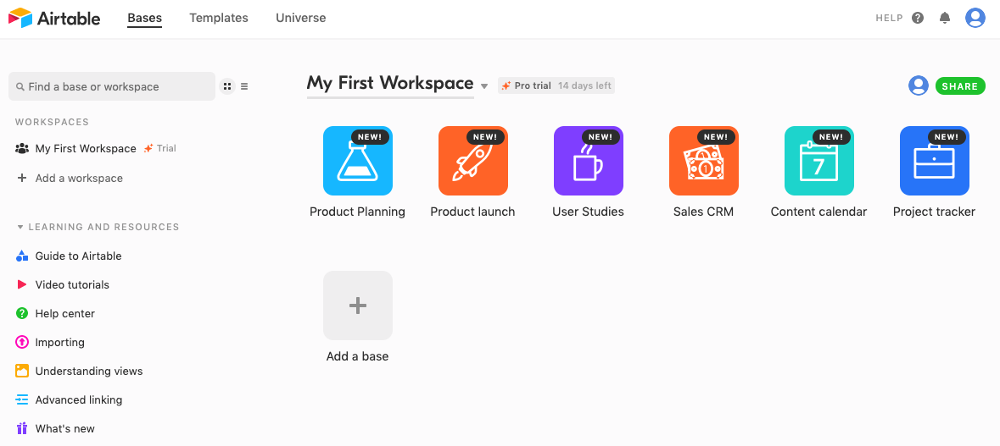
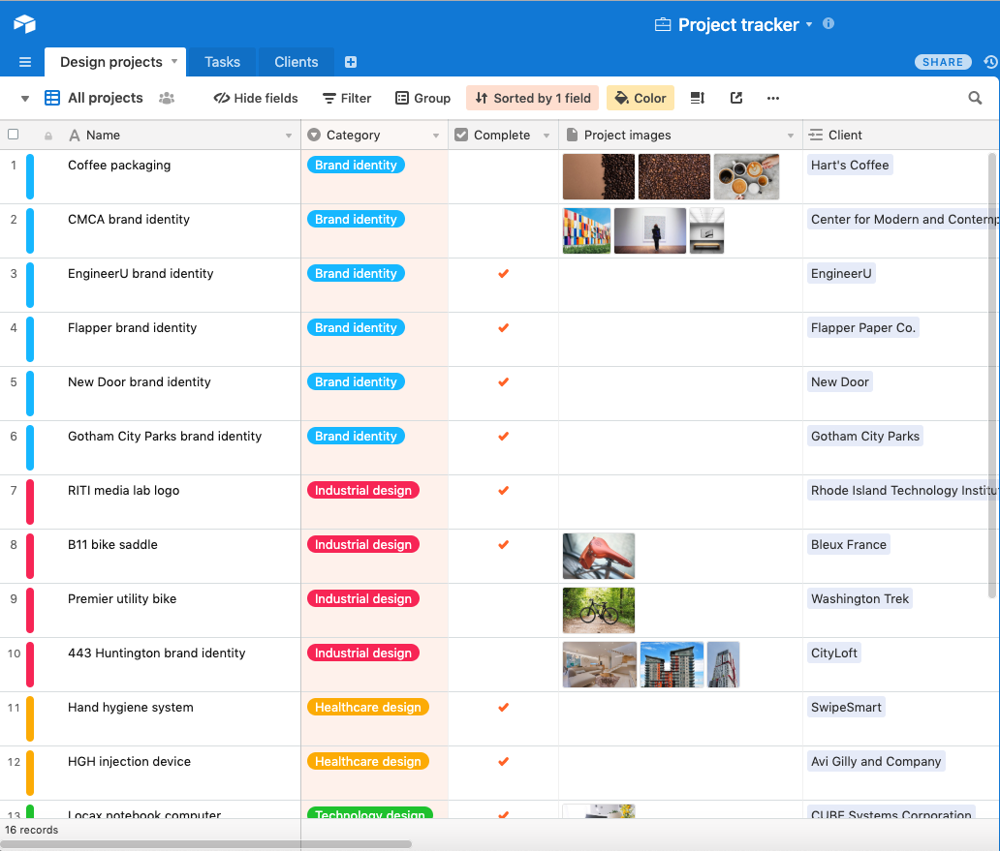
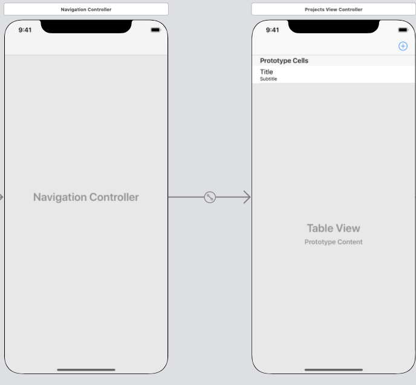

# POST Requests

# Objectives

1. Create a POST request
2. Upload JSON Data

# Resources

1. [POST - Wikipedia](https://en.wikipedia.org/wiki/POST_(HTTP))
2. [Airtable](https://airtable.com/)
3. [gitignore](https://coursework.vschool.io/create-a-gitignore/)

## Completed Project Link

https://github.com/joinpursuit/Pursuit-Core-iOS-Post-Requests-with-Airtable

# 1. POST Requests

Every request that we have made in previous classes has been a GET request.  A GET request is used to access information that is available at a particular API.  With some APIs, we might want to do more than just access information, we might want to POST or write information.

<details>
<summary>When might we want to make a POST request?</summary>

- Submit a comment on Reddit
- Add a Tweet to your favorites
- Like a friends picture on Facebook

</details>

POST requests allow us to add information to an existing profile.  Just as every API has different specifications for how to GET information, each API has a different URL path for a POST request and different expectations for what the data should look like.  

All APIs that have POST requests need some form of authentication.

<details>
<summary>Why?</summary>
Without authorization, anyone would be able to write information to your account.  For example, anyone could post a status to your Facebook account.
</details>

Many popular APIs use OAuth 2.0 as their form of authentication.  Some APIs use Basic Auth.  Today, we will look at an API that uses an API Key.

# 2. URLRequest

So far we have worked with URLs.  This is sufficient for a GET request with additional information.  When we access an API and want to POST information to it, we'll need to add the data we want to post to the message we send to the API.


```swift
var request = URLRequest(url: url)
request.httpMethod = "POST"
request.httpBody = body
request.addValue("application/json", forHTTPHeaderField: "Content-Type")
```

# 3. Airtable

Airtable is a website that is kind of a combination between a spreadsheet and a database.  It has rows and columns, but they can store additional information.  Let's build and app that can both show the data stored on one of these spreadsheets, and is also able to add new information.

Go to [Airtable](https://airtable.com/login) and sign in with your Gmail account.  Skip through all of the questions on the "Tell us a bit about yourself" screen.

On the next menu that appears, select the "Project tracker" sample Base.



This will load a spreadsheet with a bunch of pre-populated information inside.  Our app will be able to read this information, as well as add additional rows.



# 4. Build the Airtable Models

Let's start by building our test, and work backwards using TDD:

Here's the JSON we get back from a GET request via Postman using our API key:


<details>
<summary>JSON</summary>
    
```json
{
    "records": [
        {
            "id": "rec3g0Xxmw2rw3scs",
            "fields": {
                "Client": [
                    "rectEfoe4zYOn8xDM"
                ],
                "Due date": "2020-11-07",
                "Project team": [
                    {
                        "id": "usr6hWARwVNgmt3WW",
                        "email": "katherineduh+collab35@demo.htable.com",
                        "name": "Sam Epps"
                    },
                    {
                        "id": "usrpEyZytbTJ95a2L",
                        "email": "katherineduh+collab37@demo.htable.com",
                        "name": "Skyler Xu"
                    }
                ],
                "Kickoff date": "2020-10-24",
                "Project lead": {
                    "id": "usr3VLCpyqgcI46Sh",
                    "email": "katherineduh+collab10@demo.htable.com",
                    "name": "Gal Samari"
                },
                "Category": "Brand identity",
                "Name": "CMCA brand identity",
                "Project images": [
                    {
                        "id": "attm5HZ4mDsQkfxvz",
                        "url": "https://dl.airtable.com/.attachments/633b1fa6dcf9dcb241212f0f4e3f6cbd/864ac88b/pexels-photo-2261165.jpegautocompresscstinysrgbdpr1w500",
                        "filename": "pexels-photo-2261165.jpeg?auto=compress&cs=tinysrgb&dpr=1&w=500",
                        "size": 22616,
                        "type": "image/jpeg",
                        "thumbnails": {
                            "small": {
                                "url": "https://dl.airtable.com/.attachmentThumbnails/1c2e05b0703493aa2e52dd9018055356/cf985044",
                                "width": 26,
                                "height": 36
                            },
                            "large": {
                                "url": "https://dl.airtable.com/.attachmentThumbnails/edced4962790a93591855336743be859/e48bafa5",
                                "width": 500,
                                "height": 700
                            },
                            "full": {
                                "url": "https://dl.airtable.com/.attachmentThumbnails/66a5299c93a50f472133919c0b726801/b17ab3f3",
                                "width": 3000,
                                "height": 3000
                            }
                        }
                    },
                    {
                        "id": "attzYwaMmw8HBTgqK",
                        "url": "https://dl.airtable.com/.attachments/1e9e22ed12a713305fccf0da8c6e5633/fd2007b0/pexels-photo-220694.jpegautocompresscstinysrgbdpr1w500",
                        "filename": "pexels-photo-220694.jpeg?auto=compress&cs=tinysrgb&dpr=1&w=500",
                        "size": 13675,
                        "type": "image/jpeg",
                        "thumbnails": {
                            "small": {
                                "url": "https://dl.airtable.com/.attachmentThumbnails/1c5386ae2070ebf1211281e423dc2fd2/932c86fa",
                                "width": 54,
                                "height": 36
                            },
                            "large": {
                                "url": "https://dl.airtable.com/.attachmentThumbnails/85dd2257a505276ae275bdcc8b439afb/3a9c70f8",
                                "width": 500,
                                "height": 333
                            },
                            "full": {
                                "url": "https://dl.airtable.com/.attachmentThumbnails/5b68cebcac5344c14354839ecb400b13/4071fa28",
                                "width": 3000,
                                "height": 3000
                            }
                        }
                    },
                    {
                        "id": "atteiDBfduCQopiu6",
                        "url": "https://dl.airtable.com/.attachments/8cf450eb8b46c2b7e2107b29aa6a2c82/21363d9c/pexels-photo-137038.jpegautocompresscstinysrgbdpr1w500",
                        "filename": "pexels-photo-137038.jpeg?auto=compress&cs=tinysrgb&dpr=1&w=500",
                        "size": 55384,
                        "type": "image/jpeg",
                        "thumbnails": {
                            "small": {
                                "url": "https://dl.airtable.com/.attachmentThumbnails/8a27528cd943d361f9a0d9db8b4d8e94/2dea5e10",
                                "width": 36,
                                "height": 36
                            },
                            "large": {
                                "url": "https://dl.airtable.com/.attachmentThumbnails/5396af6157b8f41c38cafec176a30996/2c7c3372",
                                "width": 500,
                                "height": 500
                            },
                            "full": {
                                "url": "https://dl.airtable.com/.attachmentThumbnails/9f1c1312848a132a9f19449c6b0fa168/2e6c1c29",
                                "width": 3000,
                                "height": 3000
                            }
                        }
                    }
                ]
            },
            "createdTime": "2015-02-10T20:57:11.000Z"
        },
        {
            "id": "rec6DyWEAw6ZOWrb4",
            "fields": {
                "Client": [
                    "recHJebvisDtX4MPQ"
                ],
                "Due date": "2020-10-18",
                "Project team": [
                    {
                        "id": "usrpEyZytbTJ95a2L",
                        "email": "katherineduh+collab37@demo.htable.com",
                        "name": "Skyler Xu"
                    }
                ],
                "Kickoff date": "2020-10-04",
                "Notes": "Washington Trek is a nonprofit organization with the mission of promoting bike-riding across America. Each year, it hosts a national competition in its base city of Seattle for bike engineers to build the ultimate bicycle—one that can handle both rigorous terrain and daily road use, while also ensuring comfort and style.",
                "Project lead": {
                    "id": "usr3VLCpyqgcI46Sh",
                    "email": "katherineduh+collab10@demo.htable.com",
                    "name": "Gal Samari"
                },
                "Category": "Industrial design",
                "Name": "Premier utility bike",
                "Project images": [
                    {
                        "id": "attGaAQlHrOs7JRqg",
                        "url": "https://dl.airtable.com/.attachments/4ba2255223dd83ff7da2674336424f17/f90573d8/pexels-photo-100582.jpegautocompresscstinysrgbdpr1w500",
                        "filename": "pexels-photo-100582.jpeg?auto=compress&cs=tinysrgb&dpr=1&w=500",
                        "size": 47191,
                        "type": "image/jpeg",
                        "thumbnails": {
                            "small": {
                                "url": "https://dl.airtable.com/.attachmentThumbnails/d63b03959edf2c354c0edb409fa67922/e9e534cd",
                                "width": 54,
                                "height": 36
                            },
                            "large": {
                                "url": "https://dl.airtable.com/.attachmentThumbnails/97a778a9188e5d0e9133c7c0690f95c9/072997bb",
                                "width": 500,
                                "height": 333
                            },
                            "full": {
                                "url": "https://dl.airtable.com/.attachmentThumbnails/6023f985b6af512d573aae03ba9d452f/cf0c501e",
                                "width": 3000,
                                "height": 3000
                            }
                        }
                    }
                ]
            },
            "createdTime": "2015-02-10T23:20:30.000Z"
        },
        {
            "id": "rec9xiQBTNEG7pdNf",
            "fields": {
                "Client": [
                    "recbGjn7DqOGiIipE"
                ],
                "Due date": "2020-10-04",
                "Project team": [
                    {
                        "id": "usrSdmrY5yGdbcZzg",
                        "email": "katherineduh+collab23@demo.htable.com",
                        "name": "Leslie Walker"
                    },
                    {
                        "id": "usru7j5m2lcNhriKv",
                        "email": "katherineduh+collab7@demo.htable.com",
                        "name": "Cameron Toth"
                    }
                ],
                "Kickoff date": "2020-09-20",
                "Complete": true,
                "Project lead": {
                    "id": "usrArxKAc5yNZQfxl",
                    "email": "katherineduh+collab5@demo.htable.com",
                    "name": "Bailey Mirza"
                },
                "Category": "Technology design",
                "Name": "Convertible 3000 laptop",
                "Project images": [
                    {
                        "id": "attTgB5Fyz8lACBO7",
                        "url": "https://dl.airtable.com/.attachments/b8865bae12c7de5b7ee492b3f41f4ec1/d2d08a39/pexels-photo-748777.jpegautocompresscstinysrgbdpr1w500",
                        "filename": "pexels-photo-748777.jpeg?auto=compress&cs=tinysrgb&dpr=1&w=500",
                        "size": 23603,
                        "type": "image/jpeg",
                        "thumbnails": {
                            "small": {
                                "url": "https://dl.airtable.com/.attachmentThumbnails/b25bce87f45d62b530de0dc9c7270a2e/fd8cbfc6",
                                "width": 55,
                                "height": 36
                            },
                            "large": {
                                "url": "https://dl.airtable.com/.attachmentThumbnails/cc62cac0e31b9afb77bc016f91bdd58f/65987e62",
                                "width": 500,
                                "height": 328
                            },
                            "full": {
                                "url": "https://dl.airtable.com/.attachmentThumbnails/feb5ad68be0f8cf2310b8c6295699d24/d7752211",
                                "width": 3000,
                                "height": 3000
                            }
                        }
                    },
                    {
                        "id": "attXvNQE4KzsjJjAV",
                        "url": "https://dl.airtable.com/.attachments/a91e2fab730954d67a206c6d73161dc3/813d53b8/pexels-photo-2047905.jpegautocompresscstinysrgbdpr1w500",
                        "filename": "pexels-photo-2047905.jpeg?auto=compress&cs=tinysrgb&dpr=1&w=500",
                        "size": 15022,
                        "type": "image/jpeg",
                        "thumbnails": {
                            "small": {
                                "url": "https://dl.airtable.com/.attachmentThumbnails/0b0f3d175162f94684d2f29fd4749075/f9c0730a",
                                "width": 24,
                                "height": 36
                            },
                            "large": {
                                "url": "https://dl.airtable.com/.attachmentThumbnails/5af480f56914034ca652b6d8fc8abe40/82cf2162",
                                "width": 500,
                                "height": 750
                            },
                            "full": {
                                "url": "https://dl.airtable.com/.attachmentThumbnails/39b42b997d2834bc58d11faa300651e0/60aed9c7",
                                "width": 3000,
                                "height": 3000
                            }
                        }
                    }
                ]
            },
            "createdTime": "2015-02-10T23:11:30.000Z"
        },
        {
            "id": "recD0xvq5H5s5r7KO",
            "fields": {
                "Client": [
                    "recRQtsoL3KHqYMu3"
                ],
                "Due date": "2020-10-26",
                "Project team": [
                    {
                        "id": "usr8e9aJ8jHSg29YV",
                        "email": "katherineduh+collab26@demo.htable.com",
                        "name": "Paris Fotiou"
                    }
                ],
                "Kickoff date": "2020-10-12",
                "Complete": true,
                "Project lead": {
                    "id": "usrSdmrY5yGdbcZzg",
                    "email": "katherineduh+collab23@demo.htable.com",
                    "name": "Leslie Walker"
                },
                "Category": "Brand identity",
                "Name": "Flapper brand identity"
            },
            "createdTime": "2015-02-12T02:57:28.000Z"
        },
        {
            "id": "recDpd1jtoVnpXYtI",
            "fields": {
                "Client": [
                    "recrwtbbt8tfBGMYr"
                ],
                "Due date": "2020-10-09",
                "Project team": [
                    {
                        "id": "usru7j5m2lcNhriKv",
                        "email": "katherineduh+collab7@demo.htable.com",
                        "name": "Cameron Toth"
                    },
                    {
                        "id": "usrTv3tPZmP3GYJ9K",
                        "email": "katherineduh+collab4@demo.htable.com",
                        "name": "Ash Quintana"
                    },
                    {
                        "id": "usr6hWARwVNgmt3WW",
                        "email": "katherineduh+collab35@demo.htable.com",
                        "name": "Sam Epps"
                    }
                ],
                "Kickoff date": "2020-09-25",
                "Complete": true,
                "Project lead": {
                    "id": "usrQjmKTBNxfXNmmR",
                    "email": "katherineduh+collab16@demo.htable.com",
                    "name": "Jordan Peretz"
                },
                "Category": "Brand identity",
                "Name": "New Door brand identity"
            },
            "createdTime": "2015-02-12T03:38:06.000Z"
        },
        {
            "id": "recF3yQ5GgUUOjwnx",
            "fields": {
                "Client": [
                    "recbGjn7DqOGiIipE"
                ],
                "Due date": "2020-10-25",
                "Project team": [
                    {
                        "id": "usrTv3tPZmP3GYJ9K",
                        "email": "katherineduh+collab4@demo.htable.com",
                        "name": "Ash Quintana"
                    },
                    {
                        "id": "usrSdmrY5yGdbcZzg",
                        "email": "katherineduh+collab23@demo.htable.com",
                        "name": "Leslie Walker"
                    }
                ],
                "Kickoff date": "2020-10-11",
                "Complete": true,
                "Project lead": {
                    "id": "usrArxKAc5yNZQfxl",
                    "email": "katherineduh+collab5@demo.htable.com",
                    "name": "Bailey Mirza"
                },
                "Category": "Technology design",
                "Name": "CubePad",
                "Project images": [
                    {
                        "id": "att8GzS1suP8jpb9V",
                        "url": "https://dl.airtable.com/.attachments/a60fea29c46df8c0ed9c48870eda7f51/d0992f2c/pexels-photo-221185.jpegautocompresscstinysrgbdpr1w500",
                        "filename": "pexels-photo-221185.jpeg?auto=compress&cs=tinysrgb&dpr=1&w=500",
                        "size": 16321,
                        "type": "image/jpeg",
                        "thumbnails": {
                            "small": {
                                "url": "https://dl.airtable.com/.attachmentThumbnails/e17f93e59698900a1b02e37583846e90/828d762a",
                                "width": 54,
                                "height": 36
                            },
                            "large": {
                                "url": "https://dl.airtable.com/.attachmentThumbnails/022fe8c1f73072dbcb9317af0f07b141/30956a9c",
                                "width": 500,
                                "height": 333
                            },
                            "full": {
                                "url": "https://dl.airtable.com/.attachmentThumbnails/9fa576b1663833ed98aea9d222d7e196/c8dd659b",
                                "width": 3000,
                                "height": 3000
                            }
                        }
                    },
                    {
                        "id": "attLz2Z01mcE40JRM",
                        "url": "https://dl.airtable.com/.attachments/c8043687faa0e148efb9210a03dcc826/29d81e2d/pexels-photo-2363239.jpegautocompresscstinysrgbdpr1w500",
                        "filename": "pexels-photo-2363239.jpeg?auto=compress&cs=tinysrgb&dpr=1&w=500",
                        "size": 23172,
                        "type": "image/jpeg",
                        "thumbnails": {
                            "small": {
                                "url": "https://dl.airtable.com/.attachmentThumbnails/a47f8f55cfa4d7fba6054d6828d8ecee/0bb678a5",
                                "width": 55,
                                "height": 36
                            },
                            "large": {
                                "url": "https://dl.airtable.com/.attachmentThumbnails/6d7276b8daef61b8173df4f7e7031857/554c9703",
                                "width": 500,
                                "height": 325
                            },
                            "full": {
                                "url": "https://dl.airtable.com/.attachmentThumbnails/715ae0eec10a927e844341427d2aaa1a/24f30293",
                                "width": 3000,
                                "height": 3000
                            }
                        }
                    }
                ]
            },
            "createdTime": "2015-02-10T23:10:47.000Z"
        },
        {
            "id": "recPsjO1tkEyBCF7y",
            "fields": {
                "Client": [
                    "recUt9WFkyfiK2ayN"
                ],
                "Due date": "2020-10-30",
                "Tasks": [
                    "rec4V1o57X1xFvUFQ"
                ],
                "Project team": [
                    {
                        "id": "usrSdmrY5yGdbcZzg",
                        "email": "katherineduh+collab23@demo.htable.com",
                        "name": "Leslie Walker"
                    },
                    {
                        "id": "usrQjmKTBNxfXNmmR",
                        "email": "katherineduh+collab16@demo.htable.com",
                        "name": "Jordan Peretz"
                    },
                    {
                        "id": "usr6hWARwVNgmt3WW",
                        "email": "katherineduh+collab35@demo.htable.com",
                        "name": "Sam Epps"
                    }
                ],
                "Kickoff date": "2020-10-16",
                "Project lead": {
                    "id": "usr8e9aJ8jHSg29YV",
                    "email": "katherineduh+collab26@demo.htable.com",
                    "name": "Paris Fotiou"
                },
                "Category": "Brand identity",
                "Name": "Coffee packaging",
                "Project images": [
                    {
                        "id": "att79JnKzAQZoZjHr",
                        "url": "https://dl.airtable.com/.attachments/0e97912b0f6dd01e248b0f6d5edeb945/a2685498/pexels-photo-1251175.jpegautocompresscstinysrgbdpr1w500",
                        "filename": "pexels-photo-1251175.jpeg?auto=compress&cs=tinysrgb&dpr=1&w=500",
                        "size": 28912,
                        "type": "image/jpeg",
                        "thumbnails": {
                            "small": {
                                "url": "https://dl.airtable.com/.attachmentThumbnails/5752aef052b699a7533d7d2492887e12/9de0961e",
                                "width": 49,
                                "height": 36
                            },
                            "large": {
                                "url": "https://dl.airtable.com/.attachmentThumbnails/e11f4f47f964e021033096a0e53f280d/80d1c4ef",
                                "width": 500,
                                "height": 365
                            },
                            "full": {
                                "url": "https://dl.airtable.com/.attachmentThumbnails/f70053b6e710fffc1e8020a4577854f9/c1d6f818",
                                "width": 3000,
                                "height": 3000
                            }
                        }
                    },
                    {
                        "id": "attqgOEisBKdH8Y0a",
                        "url": "https://dl.airtable.com/.attachments/9e83083970f69404691da2cddb80204e/3e9de30e/pexels-photo.jpgautocompresscstinysrgbdpr1w500",
                        "filename": "pexels-photo.jpg?auto=compress&cs=tinysrgb&dpr=1&w=500",
                        "size": 50181,
                        "type": "image/jpeg",
                        "thumbnails": {
                            "small": {
                                "url": "https://dl.airtable.com/.attachmentThumbnails/e3d5257beb2455451ec098f306ab7004/8e119e09",
                                "width": 54,
                                "height": 36
                            },
                            "large": {
                                "url": "https://dl.airtable.com/.attachmentThumbnails/86b30fcfc17f5ad7348b5f0ba8dc7a6c/537dc94c",
                                "width": 500,
                                "height": 333
                            },
                            "full": {
                                "url": "https://dl.airtable.com/.attachmentThumbnails/9753fb1c9814d89d91bd061bd3a2a3e1/de586a53",
                                "width": 3000,
                                "height": 3000
                            }
                        }
                    },
                    {
                        "id": "attEbz7KtJfqQP1uI",
                        "url": "https://dl.airtable.com/.attachments/95d970855a00bc0c7c9f5c950dae4547/3b8b602a/pexels-photo-585750.jpegautocompresscstinysrgbdpr1w500",
                        "filename": "pexels-photo-585750.jpeg?auto=compress&cs=tinysrgb&dpr=1&w=500",
                        "size": 22991,
                        "type": "image/jpeg",
                        "thumbnails": {
                            "small": {
                                "url": "https://dl.airtable.com/.attachmentThumbnails/49a3e548e3ff4503382a3e5c8c73586a/aa310c9b",
                                "width": 54,
                                "height": 36
                            },
                            "large": {
                                "url": "https://dl.airtable.com/.attachmentThumbnails/eacc6d9ab5c115a3ce639f3456798842/30b8e36e",
                                "width": 500,
                                "height": 333
                            },
                            "full": {
                                "url": "https://dl.airtable.com/.attachmentThumbnails/ceb846dff19ba4ff5ff6a913e756e1ad/d1df6f57",
                                "width": 3000,
                                "height": 3000
                            }
                        }
                    }
                ]
            },
            "createdTime": "2015-02-10T20:54:33.000Z"
        },
        {
            "id": "recRifXxB4jTKYCxO",
            "fields": {
                "Client": [
                    "recfMdBLXKt3Cfp6r"
                ],
                "Due date": "2020-10-20",
                "Project team": [
                    {
                        "id": "usrTv3tPZmP3GYJ9K",
                        "email": "katherineduh+collab4@demo.htable.com",
                        "name": "Ash Quintana"
                    },
                    {
                        "id": "usr8e9aJ8jHSg29YV",
                        "email": "katherineduh+collab26@demo.htable.com",
                        "name": "Paris Fotiou"
                    }
                ],
                "Kickoff date": "2020-10-06",
                "Notes": "EngineerU's popularity is only growing. In the first week following its launch in 2015, the website attracted an incredible 300,000 users, which has grown to encompass over 20 million programmers and coders today. EngineerU's user base represents an expansive demographic, with strong gender parity and users from all generations—a remarkable feat in the typically young, male tech industry.\n\n\nEngineerU's new brand identity is inspired by the website's impressively diverse user base, with a simplified visual package that can take on many colors, designs, and forms, but with the website's core design principles and logo remaining consistent. This represents not only the website's wide demographic, but also its many uses, from training to collaboration. ",
                "Complete": true,
                "Project lead": {
                    "id": "usru7j5m2lcNhriKv",
                    "email": "katherineduh+collab7@demo.htable.com",
                    "name": "Cameron Toth"
                },
                "Category": "Brand identity",
                "Name": "EngineerU brand identity"
            },
            "createdTime": "2015-02-10T23:13:58.000Z"
        },
        {
            "id": "recScTxPkfYwBbcfY",
            "fields": {
                "Client": [
                    "recpjMOjOQLT3Km4p"
                ],
                "Due date": "2020-10-25",
                "Project team": [
                    {
                        "id": "usru7j5m2lcNhriKv",
                        "email": "katherineduh+collab7@demo.htable.com",
                        "name": "Cameron Toth"
                    }
                ],
                "Kickoff date": "2020-10-11",
                "Complete": true,
                "Project lead": {
                    "id": "usru7j5m2lcNhriKv",
                    "email": "katherineduh+collab7@demo.htable.com",
                    "name": "Cameron Toth"
                },
                "Category": "Industrial design",
                "Name": "B11 bike saddle",
                "Project images": [
                    {
                        "id": "att54wqtChTeYcLRU",
                        "url": "https://dl.airtable.com/.attachments/b959babeed09c3ebfcd910bedc858178/27eaf874/vintage-brown-bike-bicycle-5882.jpgautocompresscstinysrgbdpr1w500",
                        "filename": "vintage-brown-bike-bicycle-5882.jpg?auto=compress&cs=tinysrgb&dpr=1&w=500",
                        "size": 17765,
                        "type": "image/jpeg",
                        "thumbnails": {
                            "small": {
                                "url": "https://dl.airtable.com/.attachmentThumbnails/3b107adeafaac77ac86c959b39752320/d1fa05b3",
                                "width": 54,
                                "height": 36
                            },
                            "large": {
                                "url": "https://dl.airtable.com/.attachmentThumbnails/61a1aa7d9171a9b30fafcc1155e89867/c08fcb3c",
                                "width": 500,
                                "height": 333
                            },
                            "full": {
                                "url": "https://dl.airtable.com/.attachmentThumbnails/7bc0516ca398ba6d0f3bfa5bf61221a9/d4c46004",
                                "width": 3000,
                                "height": 3000
                            }
                        }
                    }
                ]
            },
            "createdTime": "2015-02-10T23:14:07.000Z"
        },
        {
            "id": "recZ2UzQoJcTTXjws",
            "fields": {
                "Client": [
                    "reclztSlQ9EDmrewc"
                ],
                "Due date": "2020-11-01",
                "Project team": [
                    {
                        "id": "usr6hWARwVNgmt3WW",
                        "email": "katherineduh+collab35@demo.htable.com",
                        "name": "Sam Epps"
                    }
                ],
                "Kickoff date": "2020-10-18",
                "Project lead": {
                    "id": "usrSdmrY5yGdbcZzg",
                    "email": "katherineduh+collab23@demo.htable.com",
                    "name": "Leslie Walker"
                },
                "Category": "Technology design",
                "Name": "Lemon headband"
            },
            "createdTime": "2015-02-10T23:32:28.000Z"
        },
        {
            "id": "recbCffx3vobfga3D",
            "fields": {
                "Client": [
                    "recdBt6kXwgDzMwKM"
                ],
                "Due date": "2020-10-12",
                "Project team": [
                    {
                        "id": "usr8e9aJ8jHSg29YV",
                        "email": "katherineduh+collab26@demo.htable.com",
                        "name": "Paris Fotiou"
                    }
                ],
                "Kickoff date": "2020-09-28",
                "Project lead": {
                    "id": "usr3VLCpyqgcI46Sh",
                    "email": "katherineduh+collab10@demo.htable.com",
                    "name": "Gal Samari"
                },
                "Category": "Industrial design",
                "Name": "443 Huntington brand identity",
                "Project images": [
                    {
                        "id": "att9S0RKrdt2dX0GL",
                        "url": "https://dl.airtable.com/.attachments/8c7dc87340fe47f3496e824f6c9b4ffb/e6060bc9/pexels-photo-430216.jpegautocompresscstinysrgbdpr1w500",
                        "filename": "pexels-photo-430216.jpeg?auto=compress&cs=tinysrgb&dpr=1&w=500",
                        "size": 54852,
                        "type": "image/jpeg",
                        "thumbnails": {
                            "small": {
                                "url": "https://dl.airtable.com/.attachmentThumbnails/98a2bd2e4afbb259a49e9ee6579ab8a3/343829e8",
                                "width": 24,
                                "height": 36
                            },
                            "large": {
                                "url": "https://dl.airtable.com/.attachmentThumbnails/ab7458c0c295042e777df3d8e2d851ea/fa9755e8",
                                "width": 500,
                                "height": 750
                            },
                            "full": {
                                "url": "https://dl.airtable.com/.attachmentThumbnails/811caf020b4dc041a2f4bdc334fcb081/0fa8eae6",
                                "width": 3000,
                                "height": 3000
                            }
                        }
                    },
                    {
                        "id": "attSjD0iGzZV3nCh8",
                        "url": "https://dl.airtable.com/.attachments/47bd066a96e64bdbeccd5d471da02b36/9b09e99d/pexels-photo-439391.jpegautocompresscstinysrgbdpr1w500",
                        "filename": "pexels-photo-439391.jpeg?auto=compress&cs=tinysrgb&dpr=1&w=500",
                        "size": 40527,
                        "type": "image/jpeg",
                        "thumbnails": {
                            "small": {
                                "url": "https://dl.airtable.com/.attachmentThumbnails/64d564ed4a385b1ad97a9d9374145c20/12cb6a92",
                                "width": 48,
                                "height": 36
                            },
                            "large": {
                                "url": "https://dl.airtable.com/.attachmentThumbnails/d6927068c08d8c3acc32718734c42e0d/02fba5c7",
                                "width": 500,
                                "height": 375
                            },
                            "full": {
                                "url": "https://dl.airtable.com/.attachmentThumbnails/06d27dac649d789713c44f6444a05fc0/ab26c72e",
                                "width": 3000,
                                "height": 3000
                            }
                        }
                    },
                    {
                        "id": "attTnVP4fXtWlnguV",
                        "url": "https://dl.airtable.com/.attachments/0088608b2818c4d551615f49f481837d/3a998324/pexels-photo-1571460.jpegautocompresscstinysrgbdpr1w500",
                        "filename": "pexels-photo-1571460.jpeg?auto=compress&cs=tinysrgb&dpr=1&w=500",
                        "size": 23343,
                        "type": "image/jpeg",
                        "thumbnails": {
                            "small": {
                                "url": "https://dl.airtable.com/.attachmentThumbnails/2ab4834fce26947789f4c8993190791d/b459e416",
                                "width": 56,
                                "height": 36
                            },
                            "large": {
                                "url": "https://dl.airtable.com/.attachmentThumbnails/d2e1b96e04f1f2023e5827c312d282a5/bc5c9e0d",
                                "width": 500,
                                "height": 321
                            },
                            "full": {
                                "url": "https://dl.airtable.com/.attachmentThumbnails/aa87575627dc668416437b2b4ba0668b/57c24dae",
                                "width": 3000,
                                "height": 3000
                            }
                        }
                    }
                ]
            },
            "createdTime": "2015-02-12T02:56:01.000Z"
        },
        {
            "id": "reciVwA84OSCRgmI1",
            "fields": {
                "Client": [
                    "recbWdUj3AUxYyEHH"
                ],
                "Due date": "2020-09-29",
                "Project team": [
                    {
                        "id": "usrSdmrY5yGdbcZzg",
                        "email": "katherineduh+collab23@demo.htable.com",
                        "name": "Leslie Walker"
                    },
                    {
                        "id": "usr6hWARwVNgmt3WW",
                        "email": "katherineduh+collab35@demo.htable.com",
                        "name": "Sam Epps"
                    }
                ],
                "Kickoff date": "2020-09-15",
                "Complete": true,
                "Project lead": {
                    "id": "usru7j5m2lcNhriKv",
                    "email": "katherineduh+collab7@demo.htable.com",
                    "name": "Cameron Toth"
                },
                "Category": "Brand identity",
                "Name": "Gotham City Parks brand identity"
            },
            "createdTime": "2015-02-12T03:40:42.000Z"
        },
        {
            "id": "recmmxX3FP1Ycbqkw",
            "fields": {
                "Client": [
                    "recrni0qbe2ucGn7y"
                ],
                "Due date": "2020-10-05",
                "Project team": [
                    {
                        "id": "usrQjmKTBNxfXNmmR",
                        "email": "katherineduh+collab16@demo.htable.com",
                        "name": "Jordan Peretz"
                    }
                ],
                "Kickoff date": "2020-09-21",
                "Notes": "SwipeSmart is a revolutionary technology that promotes sanitation in the healthcare industry by automatically signalling when patients disinfect their hands. A small device that easily clips to a nurse or doctor's scrubs pocket, SwipeSmart makes it easier for medical professionals to ensure safe practices and prevent infection.",
                "Complete": true,
                "Project lead": {
                    "id": "usru7j5m2lcNhriKv",
                    "email": "katherineduh+collab7@demo.htable.com",
                    "name": "Cameron Toth"
                },
                "Category": "Healthcare design",
                "Name": "Hand hygiene system"
            },
            "createdTime": "2015-02-10T20:19:04.000Z"
        },
        {
            "id": "recnCFcLXiqriZ3su",
            "fields": {
                "Client": [
                    "recDtoVUNlzE6w6M5"
                ],
                "Due date": "2020-10-19",
                "Project team": [
                    {
                        "id": "usrSdmrY5yGdbcZzg",
                        "email": "katherineduh+collab23@demo.htable.com",
                        "name": "Leslie Walker"
                    }
                ],
                "Kickoff date": "2020-10-05",
                "Notes": "Healthcare giant Avi Gilly and Company has announced plans to market a human growth hormone (HGH) injection device. There are many reasons why one may seek HGH therapy, from hormone deficiencies to chronic kidney disease. This new design aims to make it quicker, simpler, and less painful for HGH therapy patients to receive their injections.",
                "Complete": true,
                "Project lead": {
                    "id": "usr3VLCpyqgcI46Sh",
                    "email": "katherineduh+collab10@demo.htable.com",
                    "name": "Gal Samari"
                },
                "Category": "Healthcare design",
                "Name": "HGH injection device"
            },
            "createdTime": "2015-02-10T20:19:04.000Z"
        },
        {
            "id": "recuyh11fL9de1HzH",
            "fields": {
                "Client": [
                    "reckoCOhIV53dmmDj"
                ],
                "Due date": "2020-10-31",
                "Project team": [
                    {
                        "id": "usrTv3tPZmP3GYJ9K",
                        "email": "katherineduh+collab4@demo.htable.com",
                        "name": "Ash Quintana"
                    }
                ],
                "Kickoff date": "2020-10-17",
                "Complete": true,
                "Project lead": {
                    "id": "usrSdmrY5yGdbcZzg",
                    "email": "katherineduh+collab23@demo.htable.com",
                    "name": "Leslie Walker"
                },
                "Category": "Industrial design",
                "Name": "RITI media lab logo"
            },
            "createdTime": "2015-02-10T20:59:28.000Z"
        },
        {
            "id": "recv9K4cnpAB0VoMz",
            "fields": {
                "Client": [
                    "recbGjn7DqOGiIipE"
                ],
                "Due date": "2020-10-17",
                "Tasks": [
                    "recIBtCuYwODyDzVt",
                    "recBPVLHTFhWX99Zp"
                ],
                "Project team": [
                    {
                        "id": "usrTv3tPZmP3GYJ9K",
                        "email": "katherineduh+collab4@demo.htable.com",
                        "name": "Ash Quintana"
                    },
                    {
                        "id": "usrQjmKTBNxfXNmmR",
                        "email": "katherineduh+collab16@demo.htable.com",
                        "name": "Jordan Peretz"
                    }
                ],
                "Kickoff date": "2020-10-03",
                "Complete": true,
                "Project lead": {
                    "id": "usrArxKAc5yNZQfxl",
                    "email": "katherineduh+collab5@demo.htable.com",
                    "name": "Bailey Mirza"
                },
                "Category": "Technology design",
                "Name": "Locax notebook computer",
                "Project images": [
                    {
                        "id": "attSu26jSuz8Xl5Qg",
                        "url": "https://dl.airtable.com/.attachments/c2ece3b1d57e489bcd2fdffddab6d006/a58118f9/coffee-desk-laptop-notebook.jpgautocompresscstinysrgbdpr1w500",
                        "filename": "coffee-desk-laptop-notebook.jpg?auto=compress&cs=tinysrgb&dpr=1&w=500",
                        "size": 17787,
                        "type": "image/jpeg",
                        "thumbnails": {
                            "small": {
                                "url": "https://dl.airtable.com/.attachmentThumbnails/d4391863eeb81cd4524434056c792ed3/b8c4a3a2",
                                "width": 54,
                                "height": 36
                            },
                            "large": {
                                "url": "https://dl.airtable.com/.attachmentThumbnails/53cec346c5de8be1d7943c0fdb631868/97bbeeb1",
                                "width": 500,
                                "height": 333
                            },
                            "full": {
                                "url": "https://dl.airtable.com/.attachmentThumbnails/cdf300d3616f9e32f00e4bc6b554c4e7/acca8962",
                                "width": 3000,
                                "height": 3000
                            }
                        }
                    }
                ]
            },
            "createdTime": "2015-02-10T20:19:04.000Z"
        }
    ]
}
```

</details>

Save that JSON into your bundle.  Then, we'll add the test we want to develop towards:

```swift
import XCTest
@testable import PostRequestsWithAirtable

class PostRequestsWithAirtableTests: XCTestCase {

    override func setUp() {}

    override func tearDown() {}

    func testGetProjects() {
        // Arrange
        guard let jsonPath = Bundle.main.path(forResource: "AirtableSampleResponse", ofType: "json"),
            let jsonData = try? Data(contentsOf: URL(fileURLWithPath: jsonPath)) else {
                fatalError("Test JSON data not found")
        }

        // Act
        var projects = [Project]()

        do {
            projects = try Project.getProjects(from: jsonData)
        }
        catch {
            print(error)
        }

        // Assert
        XCTAssertEqual(projects.count, 16, "Was expecting 16 projects, but found \(projects.count)")
    }
}
```

This won't compile yet, because we don't have a `Project` object.  Let's go ahead and build our model to parse the JSON above:

```swift
struct AirtableResponse: Codable {
    let projectWrappers: [ProjectWrapper]

    enum CodingKeys: String, CodingKey {
        case projectWrappers = "records"
    }
}

struct ProjectWrapper: Codable {
    let project: Project

    enum CodingKeys: String, CodingKey {
        case project = "fields"
    }
}
```

```swift
import Foundation

struct Project: Codable {
    static func getProjects(from jsonData: Data) throws -> [Project] {
        let response = try JSONDecoder().decode(AirtableResponse.self, from: jsonData)
        return response.projectWrappers.map { $0.project }
    }

    let dueDate: String
    let name: String

    enum CodingKeys: String, CodingKey {
        case dueDate = "Due date"
        case name = "Name"
    }
}
```

# 5. Build the Projects UI

Create a TableView embedded inside of a Navigation Controller.  Create a prototype cell named "projectCell" with a type of "subtitle".  Add a button at the top.  We'll use that later to segue to our project creation VC.



# 6. Build the Networking Layer for Getting Projects

Now it's time to add handling for fetching projects.  Because we have a secret API key, we want to make sure that we don't expose our whole project to github.  

First, go ahead and create a folder called `Secrets`, then make a file inside called `Secrets.swift`.

At the root level of your directory, create a `.gitignore` file and add the path to the `Secrets` to it.  [More reading](https://coursework.vschool.io/create-a-gitignore/)

Then, add your API key inside your `Secrets.swift` struct:

```swift
struct Secrets {
    static let AirtableAPIKey = "YOUR KEY HERE"
    static let AirtableProject = "YOUR PROJECT ID HERE"
}
```

To find the Project Id, select your project, then click on "Help" -> "API Documentation".


Then click on "Authentication".  On the right hand side you will see the endpoint that you need to hit.


For now, let's use our familiar NetworkHelper.  We'll need to go back and change it later to make `POST` requests:

```swift
import Foundation

enum AppError: Error {
    case unauthenticated
    case invalidJSONResponse
    case couldNotParseJSON(rawError: Error)
    case noInternetConnection
    case badURL
    case badStatusCode
    case noDataReceived
    case notAnImage
    case other(rawError: Error)
}
```

```swift
class NetworkHelper {
    static let manager = NetworkHelper()

    func getData(from url: URL,
                 completionHandler: @escaping ((Result<Data, AppError>) -> Void)) {
        self.urlSession.dataTask(with: url) { (data, response, error) in
            DispatchQueue.main.async {
                guard let data = data else {
                    completionHandler(.failure(.noDataReceived))
                    return
                }
                guard let response = response as? HTTPURLResponse, response.statusCode == 200 else {
                    completionHandler(.failure(.badStatusCode))
                    return
                }

                if let error = error {
                    let error = error as NSError
                    if error.domain == NSURLErrorDomain && error.code == NSURLErrorNotConnectedToInternet {
                        completionHandler(.failure(.noInternetConnection))
                        return
                    } else {
                        completionHandler(.failure(.other(rawError: error)))
                        return
                    }
                }
                completionHandler(.success(data))
            }
            }.resume()
    }

    private init() {}

    private let urlSession = URLSession(configuration: URLSessionConfiguration.default)
}
```

Then we can create our fetching service:

```swift
import Foundation

struct ProjectAPIClient {

    // MARK: - Static Properties

    static let manager = ProjectAPIClient()

    // MARK: - Internal Methods

    func getProjects(completionHandler: @escaping (Result<[Project], AppError>) -> Void) {
        NetworkHelper.manager.getData(from: airtableURL) { result in
            switch result {
            case let .failure(error):
                completionHandler(.failure(error))
                return
            case let .success(data):
                do {
                    let projects = try Project.getProjects(from: data)
                    completionHandler(.success(projects))
                }
                catch {
                    completionHandler(.failure(.couldNotParseJSON(rawError: error)))
                }
            }
        }
    }

    // MARK: - Private Properties and Initializers

    private var airtableURL: URL {
        guard let url = URL(string: "https://api.airtable.com/v0/appIBfoNbzEaA72c2/Design%20projects?typecast=true&&api_key=" + Secrets.AirtableAPIKey) else {
            fatalError("Error: Invalid URL")
        }
        return url
    }

    private init() {}
}
```

# 7. Build the Projects VC

Now we can fill in the rest of our VC:

```swift
import UIKit

class ProjectsViewController: UIViewController {

    // MARK: - IBOutlets

    @IBOutlet var projectsTableView: UITableView!

    // MARK: - Private Properties

    private var projects = [Project]() {
        didSet {
            projectsTableView.reloadData()
        }
    }

    // MARK: - ViewController Lifecycle

    override func viewDidLoad() {
        super.viewDidLoad()
        configureTableView()
    }

    override func viewWillAppear(_ animated: Bool) {
        super.viewWillAppear(animated)
        loadData()
    }

    // MARK: - Private Methods

    private func configureTableView() {
        projectsTableView.delegate = self
        projectsTableView.dataSource = self
    }

    private func loadData() {
        ProjectAPIClient.manager.getProjects { result in
            DispatchQueue.main.async { [weak self] in
                switch result {
                case let .success(projects):
                    self?.projects = projects
                case let .failure(error):
                    self?.displayErrorAlert(with: error)
                }
            }
        }
    }

    private func displayErrorAlert(with error: AppError) {
        let alertVC = UIAlertController(title: "Error Fetching Data", message: "\(error)", preferredStyle: .alert)
        alertVC.addAction(UIAlertAction(title: "OK", style: .cancel, handler: nil))
        present(alertVC, animated: true, completion: nil)
    }
}

extension ProjectsViewController: UITableViewDelegate {}

extension ProjectsViewController: UITableViewDataSource {
    func tableView(_ tableView: UITableView, numberOfRowsInSection section: Int) -> Int {
        return projects.count
    }
    func tableView(_ tableView: UITableView, cellForRowAt indexPath: IndexPath) -> UITableViewCell {
        let project = projects[indexPath.row]
        let cell = tableView.dequeueReusableCell(withIdentifier: "ProjectCell", for: indexPath)
        cell.textLabel?.text = project.name
        cell.detailTextLabel?.text = project.dueDate.description
        return cell
    }
}
```

Great!  We should see the data loaded into a Table View.  Try editing some of the names/due dates in Airtable and see if the data you load changes.

Now, we can add in the functionality to add new Projects to Airtable.


# 8. Build the Create new Project UI

Create a Segue from the button to a new VC that has the following layout:


# 9. Build the Networking Layer for Creating new Projects

Now we'll need to go back and add functionality to create and post new projects.  Update your NetworkHelper:

```swift
import Foundation

enum HTTPMethod: String {
    case get = "GET"
    case post = "POST"
}

class NetworkHelper {

    // MARK: - Static Properties

    static let manager = NetworkHelper()

    // MARK: - Internal Properties

    func performDataTask(withUrl url: URL,
                         andHTTPBody body: Data? = nil,
                         andMethod httpMethod: HTTPMethod,
                         completionHandler: @escaping ((Result<Data, AppError>) -> Void)) {
        var request = URLRequest(url: url)
        request.httpMethod = httpMethod.rawValue
        request.httpBody = body
        request.addValue("application/json", forHTTPHeaderField: "Content-Type")

        urlSession.dataTask(with: request) { (data, response, error) in
            DispatchQueue.main.async {
                guard let data = data else {
                    completionHandler(.failure(.noDataReceived))
                    return
                }

                guard let response = response as? HTTPURLResponse, (200...299) ~= response.statusCode else {
                    completionHandler(.failure(.badStatusCode))
                    return
                }

                if let error = error {
                    let error = error as NSError
                    if error.domain == NSURLErrorDomain && error.code == NSURLErrorNotConnectedToInternet {
                        completionHandler(.failure(.noInternetConnection))
                        return
                    } else {
                        completionHandler(.failure(.other(rawError: error)))
                        return
                    }
                }
                completionHandler(.success(data))
            }
            }.resume()
    }

    // MARK: - Private Properties and Initializers

    private let urlSession = URLSession(configuration: URLSessionConfiguration.default)

    private init() {}
}
```

Then, update your API Client:

```swift
import Foundation

struct ProjectAPIClient {

    // MARK: - Static Properties

    static let manager = ProjectAPIClient()

    // MARK: - Internal Methods

    func getProjects(completionHandler: @escaping (Result<[Project], AppError>) -> Void) {
        NetworkHelper.manager.performDataTask(withUrl: airtableURL, andMethod: .get) { result in
            switch result {
            case let .failure(error):
                completionHandler(.failure(error))
                return
            case let .success(data):
                do {
                    let projects = try Project.getProjects(from: data)
                    completionHandler(.success(projects))
                }
                catch {
                    completionHandler(.failure(.couldNotParseJSON(rawError: error)))
                }
            }
        }
    }

    func post(_ project: Project, completionHandler: @escaping (Result<Data, AppError>) -> Void) {
        let projectWrapper = ProjectWrapper(project: project)
        guard let encodedProjectWrapper = try? JSONEncoder().encode(projectWrapper) else {
            fatalError("Unable to json encode project")
        }
        print(String(data: encodedProjectWrapper, encoding: .utf8)!)
        NetworkHelper.manager.performDataTask(withUrl: airtableURL,
                                              andHTTPBody: encodedProjectWrapper,
                                              andMethod: .post,
                                              completionHandler: { result in
                                                switch result {
                                                case let .success(data):
                                                    completionHandler(.success(data))
                                                case let .failure(error):
                                                    completionHandler(.failure(error))
                                                }
        })
    }

    // MARK: - Private Properties and Initializers

    private var airtableURL: URL {
        guard let url = URL(string: "https://api.airtable.com/v0/appIBfoNbzEaA72c2/Design%20projects?typecast=true&&api_key=" + Secrets.AirtableAPIKey) else {
            fatalError("Error: Invalid URL")
        }
        return url
    }

    private init() {}
}
```

## 10. Build the Create new Project VC

Complete your VC implementation:

```swift
import UIKit

class CreateProjectViewController: UIViewController {

    // MARK: - IBOutlets

    @IBOutlet var nameTextField: UITextField!
    @IBOutlet var categoryTextField: UITextField!
    @IBOutlet var datePicker: UIDatePicker!
    @IBOutlet var postButton: UIButton!
    @IBOutlet var spinner: UIActivityIndicatorView!

    // MARK: - Lifecycle Methods

    override func viewDidLoad() {
        super.viewDidLoad()
        spinner.isHidden = true
    }

    // MARK: - IBActions

    @IBAction func postNewProject(_ sender: UIButton) {
        guard let project = createProjectFromFields() else {
            displayInvalidProjectAlert()
            return
        }
        startPostingAnimation()
        ProjectAPIClient.manager.post(project) { [weak self] result in
            switch result {
            case .success:
                self?.navigationController?.popViewController(animated: true)                
            case let .failure(error):
                print(error)
                self?.displayPostFailureAlert(with: error)
                self?.stopPostingAnimation()
            }
        }
    }

    // MARK: - Private Methods

    private func createProjectFromFields() -> Project? {
        guard let projectName = nameTextField.text else {
                return nil
        }
        return Project(dueDate: formattedAirtableDate(from: datePicker.date),
                       name: projectName)
    }

    private func formattedAirtableDate(from date: Date) -> String {
        return date.description.components(separatedBy: .whitespaces)[0]
    }

    private func startPostingAnimation() {
        postButton.isHidden = true
        spinner.isHidden = false
        spinner.startAnimating()
    }

    private func stopPostingAnimation() {
        postButton.isHidden = false
        spinner.isHidden = true
        spinner.stopAnimating()
    }

    private func displayPostFailureAlert(with error: Error) {
        displayAlert(title: "Error posting new Project", message: error.localizedDescription)
    }

    private func displayInvalidProjectAlert() {
        displayAlert(title: "Invalid Post", message: "Ensure you have completed fields")
    }

    private func displayAlert(title: String, message: String) {
        let alertVC = UIAlertController(title: title, message: message, preferredStyle: .alert)
        alertVC.addAction(UIAlertAction(title: "OK", style: .default, handler: nil))
        present(alertVC, animated: true, completion: nil)
    }
}
```

Make a new Project and check Airtable to see it!
