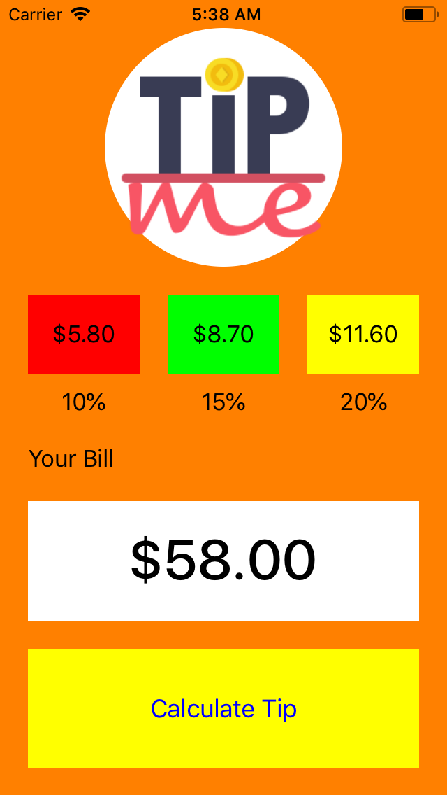

## Demo - MVC, Autolayout

In this Objective-C Demo app we will use MVC principles to build a Tip calculator. We will use programmatic autolayout to size and position the UIView elements in the app. 

## Model 
**Tip.h**
A tip object has a bill and the percent allocated to the bill, i.e 10%, 15% or 20% accordingly. 

```objective-c
@interface Tip: NSObject

typedef NS_ENUM(NSInteger, TipPercent) {
    tenPercent = 10,
    fifteenPercent = 15,
    twentyPercent = 20
};

// we use (assign) attribute for primitive types: int, char, float.....
@property (assign) double bill;
@property (nonatomic) TipPercent tipPercent;
@property (nonatomic, readonly) double totalBill; 

- (instancetype)initWithBill: (double)bill tipPercent: (double)tipPercent;

@end
```

**Tip.m**

```objective-c 
@implementation Tip
- (instancetype)initWithBill:(double)bill tipPercent:(double)tipPercent {
    self = [super init];
    if (self) {
        _bill = bill;
        _tipPercent = tipPercent;
        _totalBill = bill * (tipPercent / 100.0);
    }
    return self;
}
@end
```

## View

Here we will sublcass UIView to create a TipView which will consists of the calculator elements. A UIStackView will be used to arrange the tip percent labels horizontally onscreen. 

**TipView.h**

```objective-c
@interface TipView : UIView

@property (nonatomic) UIImageView *imageView;

@property (nonatomic) UILabel *tenPercentValue;
@property (nonatomic) UILabel *fifteenPercentValue;
@property (nonatomic) UILabel *twentyPercentValue;

@property (nonatomic) UILabel *tenPercentLabel;
@property (nonatomic) UILabel *fifteenPercentLabel;
@property (nonatomic) UILabel *twentyPercentLabel;

@property (nonatomic) UILabel *billLabel;
@property (nonatomic) UITextField *billTextField;

@property (nonatomic) UIButton *calculateTipButton; 

@property (nonatomic) UIStackView *stackView;

- (void)updateTipValuesTenPercent: (double)tenPercent
                   fifteenPercent: (double)fifteenPercent
                    twentyPercent: (double)twentyPercent;

@end
```

**TipView.m**


```objective-c
#import "TipView.h"

#define PADDING 20

@interface TipView ()
// private properties / methods here
@end

@implementation TipView

- (instancetype)initWithFrame:(CGRect)frame {
    self = [super initWithFrame:frame];
    if(self) {
        [self setupViews];
    }
    return self;
}

- (void)setupViews {
    self.backgroundColor = [UIColor orangeColor];
    [self setupImageView];
    [self setupStackView];
    [self setupTenPercentLabel];
    [self setupFifteenPercentLabel];
    [self setupTwentyPercentLabel];
    [self setupBillLabel];
    [self setupBillTextField];
    [self setupCalculateBillButton];
}

- (void)setupImageView {
    // Lazy Initialization
    if (!_imageView)
        _imageView = [[UIImageView alloc] init];
    
    // Add attributes needed for UIView
    self.imageView.contentMode = UIViewContentModeScaleAspectFit;
    [self.imageView setImage:[UIImage imageNamed:@"tip-icon"]];
    self.imageView.backgroundColor = [UIColor whiteColor];
    
    // Add View to hierarchy
    [self addSubview:self.imageView];
    
    // Setup Constraints
    self.imageView.translatesAutoresizingMaskIntoConstraints = NO;
    [NSLayoutConstraint activateConstraints:@[
        [self.imageView.topAnchor constraintEqualToAnchor:self.safeAreaLayoutGuide.topAnchor],
        [self.imageView.centerXAnchor constraintEqualToAnchor:self.centerXAnchor],
        [self.imageView.heightAnchor constraintEqualToAnchor:self.heightAnchor multiplier:0.30],
        [self.imageView.widthAnchor constraintEqualToAnchor:self.imageView.heightAnchor]
    ]];
}

- (void)setupStackView {
    if(!_stackView)
        _stackView = [[UIStackView alloc] init];
    self.stackView.axis = UILayoutConstraintAxisHorizontal;
    self.stackView.spacing = PADDING;
    self.stackView.distribution = UIStackViewDistributionFillEqually;
    
    [self addSubview:self.stackView];

    self.stackView.translatesAutoresizingMaskIntoConstraints = NO;
    [NSLayoutConstraint activateConstraints:@[
        [self.stackView.topAnchor constraintEqualToAnchor:self.imageView.bottomAnchor constant: PADDING],
        [self.stackView.leadingAnchor constraintEqualToAnchor:self.leadingAnchor constant: PADDING],
        [self.stackView.trailingAnchor constraintEqualToAnchor:self.trailingAnchor constant: -PADDING],
        [self.stackView.heightAnchor constraintEqualToAnchor:self.heightAnchor multiplier:0.10]
    ]];
    
    if(!_tenPercentValue)
        _tenPercentValue = [[UILabel alloc] init];
    self.tenPercentValue.text = @"$0.00";
    self.tenPercentValue.textAlignment = NSTextAlignmentCenter;
    self.tenPercentValue.backgroundColor = [UIColor redColor];
    
    if(!_fifteenPercentValue)
        _fifteenPercentValue = [[UILabel alloc] init];
    self.fifteenPercentValue.text = @"$0.00";
    self.fifteenPercentValue.textAlignment = NSTextAlignmentCenter;
    self.fifteenPercentValue.backgroundColor = [UIColor greenColor];
    
    if(!_twentyPercentValue)
        _twentyPercentValue = [[UILabel alloc] init];
    self.twentyPercentValue.text = @"$0.00";
    self.twentyPercentValue.textAlignment = NSTextAlignmentCenter;
    self.twentyPercentValue.backgroundColor = [UIColor yellowColor];
    
    [self.stackView addArrangedSubview:self.tenPercentValue];
    [self.stackView addArrangedSubview:self.fifteenPercentValue];
    [self.stackView addArrangedSubview:self.twentyPercentValue];
}

- (void)setupTenPercentLabel {
    if(!_tenPercentLabel)
        _tenPercentLabel = [[UILabel alloc] init];
    self.tenPercentLabel.text = @"10%";
    self.tenPercentLabel.textAlignment = NSTextAlignmentCenter;
    
    [self addSubview: self.tenPercentLabel];
    
    self.tenPercentLabel.translatesAutoresizingMaskIntoConstraints = NO;
    [NSLayoutConstraint activateConstraints:@[
        [self.tenPercentLabel.topAnchor constraintEqualToAnchor:self.stackView.bottomAnchor constant: PADDING / 2.0],
        [self.tenPercentLabel.centerXAnchor constraintEqualToAnchor:self.tenPercentValue.centerXAnchor]
    ]];
}

- (void)setupFifteenPercentLabel {
    if(!_fifteenPercentLabel)
        _fifteenPercentLabel = [[UILabel alloc] init];
    self.fifteenPercentLabel.text = @"15%";
    self.fifteenPercentLabel.textAlignment = NSTextAlignmentCenter;
    
    [self addSubview: self.fifteenPercentLabel];
    
    self.fifteenPercentLabel.translatesAutoresizingMaskIntoConstraints = NO;
    [NSLayoutConstraint activateConstraints:@[
                                              [self.fifteenPercentLabel.topAnchor constraintEqualToAnchor:self.stackView.bottomAnchor constant: PADDING / 2.0],
                                              [self.fifteenPercentLabel.centerXAnchor constraintEqualToAnchor:self.fifteenPercentValue.centerXAnchor]
                                              ]];
}

- (void)setupTwentyPercentLabel {
    if(!_twentyPercentLabel)
        _twentyPercentLabel = [[UILabel alloc] init];
    
    self.twentyPercentLabel.text = @"20%";
    self.twentyPercentLabel.textAlignment = NSTextAlignmentCenter;
    
    [self addSubview: self.twentyPercentLabel];
    
    self.twentyPercentLabel.translatesAutoresizingMaskIntoConstraints = NO;
    [NSLayoutConstraint activateConstraints:@[
                                              [self.twentyPercentLabel.topAnchor constraintEqualToAnchor:self.stackView.bottomAnchor constant: PADDING / 2.0],
                                              [self.twentyPercentLabel.centerXAnchor constraintEqualToAnchor:self.twentyPercentValue.centerXAnchor]
    ]];
}

- (void)setupBillLabel {
    if(!_billLabel)
        _billLabel = [[UILabel alloc] init];
    
    self.billLabel.text = @"Your Bill";
    self.billLabel.textAlignment = NSTextAlignmentLeft;
    
    [self addSubview: self.billLabel];
    
    self.billLabel.translatesAutoresizingMaskIntoConstraints = NO;
    [NSLayoutConstraint activateConstraints:@[
        [self.billLabel.topAnchor constraintEqualToAnchor: self.tenPercentLabel.bottomAnchor constant: PADDING],
        [self.billLabel.leadingAnchor constraintEqualToAnchor: self.leadingAnchor constant:PADDING]
    ]];
}

- (void)setupBillTextField {
    if(!_billTextField)
        _billTextField = [[UITextField alloc] init];
    
    self.billTextField.text = @"$0.00";
    self.billTextField.textAlignment = NSTextAlignmentCenter;
    self.billTextField.backgroundColor = [UIColor whiteColor];
    self.billTextField.font = [UIFont systemFontOfSize:40 weight:UIFontWeightMedium];
    self.billTextField.keyboardType = UIKeyboardTypeDecimalPad;
    self.billTextField.clearButtonMode = UITextFieldViewModeWhileEditing;
    
    UIToolbar *keyboardToolbar = [[UIToolbar alloc] initWithFrame:CGRectMake(0, 0, UIScreen.mainScreen.bounds.size.width, 49)];
    UIBarButtonItem *cancelButton = [[UIBarButtonItem alloc] initWithTitle:@"Cancel" style:UIBarButtonItemStylePlain target:self action:@selector(cancel)];
    UIBarButtonItem *flexibleSpace = [[UIBarButtonItem alloc] initWithBarButtonSystemItem:UIBarButtonSystemItemFlexibleSpace target:nil action:nil];
    self.billTextField.inputAccessoryView = keyboardToolbar;
    [keyboardToolbar setItems:@[cancelButton, flexibleSpace, /*doneButton*/] animated:YES];
    [self addSubview:self.billTextField];
    
    self.billTextField.translatesAutoresizingMaskIntoConstraints = NO;
    [NSLayoutConstraint activateConstraints:@[
        [self.billTextField.topAnchor constraintEqualToAnchor: self.billLabel.bottomAnchor constant: PADDING],
        [self.billTextField.leadingAnchor constraintEqualToAnchor: self.leadingAnchor constant: PADDING],
        [self.billTextField.trailingAnchor constraintEqualToAnchor: self.trailingAnchor constant: -PADDING],
        [self.billTextField.heightAnchor constraintEqualToAnchor: self.heightAnchor multiplier: 0.15]
    ]];
}

- (void)setupCalculateBillButton {
    if(!_calculateTipButton)
        _calculateTipButton = [[UIButton alloc] init];

    [self.calculateTipButton setTitle:@"Calculate Tip" forState:UIControlStateNormal];
    self.calculateTipButton.backgroundColor = [UIColor yellowColor];
    [self.calculateTipButton setTitleColor:[UIColor blueColor] forState:UIControlStateNormal];
    
    [self addSubview:self.calculateTipButton];
    
    self.calculateTipButton.translatesAutoresizingMaskIntoConstraints = NO;
    [NSLayoutConstraint activateConstraints:@[
        [self.calculateTipButton.topAnchor constraintEqualToAnchor:self.billTextField.bottomAnchor constant:PADDING],
        [self.calculateTipButton.leadingAnchor constraintEqualToAnchor:self.leadingAnchor constant:PADDING],
        [self.calculateTipButton.trailingAnchor constraintEqualToAnchor:self.trailingAnchor constant:-PADDING],
        [self.calculateTipButton.heightAnchor constraintEqualToAnchor:self.heightAnchor multiplier:0.15]
    ]];
}

- (void)layoutSubviews {
    [super layoutSubviews];
    self.imageView.layer.cornerRadius = self.imageView.bounds.size.height / 2.0;
}

- (void)updateTipValuesTenPercent:(double)tenPercent
                   fifteenPercent:(double)fifteenPercent
                    twentyPercent:(double)twentyPercent {
    self.tenPercentValue.text = [NSString stringWithFormat:@"$%1.2f", tenPercent];
    self.fifteenPercentValue.text = [NSString stringWithFormat:@"$%1.2f", fifteenPercent];
    self.twentyPercentValue.text = [NSString stringWithFormat:@"$%1.2f", twentyPercent];
}

- (void)cancel {
    [self.billTextField resignFirstResponder];
}

@end
```

## Controller
The TipController adds the tipView as its subview, calculates the Tip and manages the keyboard. 

> Reminder: In Objective-C sending messages to nil won't crash your app and this may lead to logic errors and take a longer time than needed when debugging. So always ensure that your properties are alloc, init as needed. 

**TipViewController.m**

```objective-c
#import "TipViewController.h"
#import "TipView.h"
#import "Tip.h"

@interface TipViewController ()
// private properties or methods
@property (nonatomic) TipView *tipView;
@end

@implementation TipViewController

- (void)viewDidLoad {
    [super viewDidLoad];
    self.view.backgroundColor = [UIColor yellowColor];
    
    // lazy initialization
    if(!_tipView)
        _tipView = [[TipView alloc] initWithFrame:UIScreen.mainScreen.bounds];
    
    // we can send message to nil without crashes
    [self.view addSubview:self.tipView];
    
    [self registerForKeyboardNotifications];
    
    [self.tipView.calculateTipButton addTarget:self action:@selector(calculateTip) forControlEvents:UIControlEventTouchUpInside];
}

-(void)calculateTip {
    double bill = [self.tipView.billTextField.text doubleValue];
    
    Tip *tenPercentTip = [[Tip alloc] initWithBill:bill tipPercent:tenPercent];
    Tip *fifteenPercentTip = [[Tip alloc] initWithBill:bill tipPercent:fifteenPercent];
    Tip *twentyPercentTip = [[Tip alloc] initWithBill:bill tipPercent:twentyPercent];
    
    [self.tipView updatesTipValues:tenPercentTip.totalBill
                    fifteenPercent:fifteenPercentTip.totalBill
                     twentyPercent:twentyPercentTip.totalBill];
}

#pragma mark Keyboard Handling
- (void)registerForKeyboardNotifications {
    [[NSNotificationCenter defaultCenter] addObserver:self selector:@selector(keyboardWillShow:) name:UIKeyboardWillShowNotification object:nil];
    [[NSNotificationCenter defaultCenter] addObserver:self selector:@selector(keyboardWillHide:) name:UIKeyboardWillHideNotification object:nil];
}

- (void)keyboardWillShow: (NSNotification *)notification {
    NSDictionary *userInfo = [notification userInfo];
    CGSize size = [[userInfo objectForKey:UIKeyboardFrameEndUserInfoKey] CGRectValue].size;
    
    self.tipView.transform = CGAffineTransformMakeTranslation(0, -size.height);
}

- (void)keyboardWillHide: (NSNotification *)notification {
    self.tipView.transform = CGAffineTransformIdentity;
}

@end
```

Above we manage the keyboard through NSNotificationCenter

**AppDelegate.m**

```objective-c
- (BOOL)application:(UIApplication *)application didFinishLaunchingWithOptions:(NSDictionary *)launchOptions {
    // Override point for customization after application launch.
    
    if(!_window) {
        TipViewController *vc = [[TipViewController alloc] init];
        _window = [[UIWindow alloc] initWithFrame:UIScreen.mainScreen.bounds];
        _window.rootViewController = vc;
        [_window makeKeyAndVisible]; 
    }
    
    return YES;
}
```

## Unit Test 

As developers we should always aim to have tests in our programs. Below is a simple set of tests to run against tip percentages base on our bill amount. 

```objective-c
#import <XCTest/XCTest.h>
#import "Tip.h"

@interface TipTests : XCTestCase

@end

@implementation TipTests

- (void)test10PercentTip {
    // setup
    Tip *tip = [[Tip alloc] init];
    tip.bill = 50.00;
    tip.percent = Percent10;
    double tipValue = tip.bill * (tip.percent / 100.0);

    // test
    XCTAssertEqual(tipValue, 5.00);
}

- (void)test15PercentTip {
    // setup
    Tip *tip = [[Tip alloc] init];
    tip.bill = 50.00;
    tip.percent = Percent15;
    double tipValue = tip.bill * (tip.percent / 100.0);
    
    // test
    XCTAssertEqual(tipValue, 7.50);
}

- (void)test20PercentTip {
    // setup
    Tip *tip = [[Tip alloc] init];
    tip.bill = 50.00;
    tip.percent = Percent20;
    double tipValue = tip.bill * (tip.percent / 100.0);
    
    // test
    XCTAssertEqual(tipValue, 10.00);
}

@end
```

<p align="center">

</p>


Below an inputAccessoryView is used as a property on the UITextField to dismiss the keyboard.
<p align="center">

</p>

[Completed Demo Link](https://github.com/C4Q/AC-iOS-ObjC-Autolayout-MVC/tree/master)

