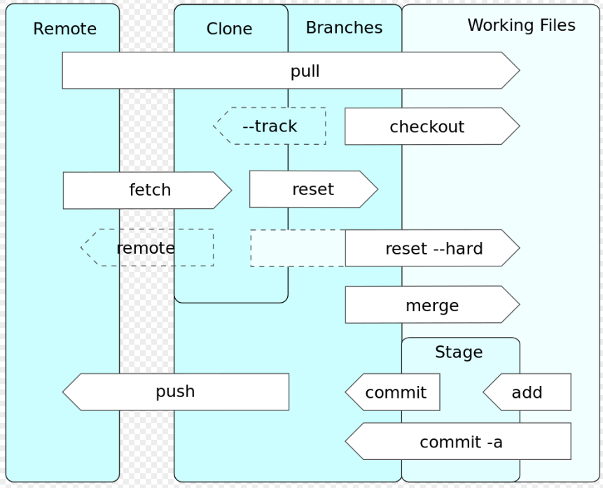
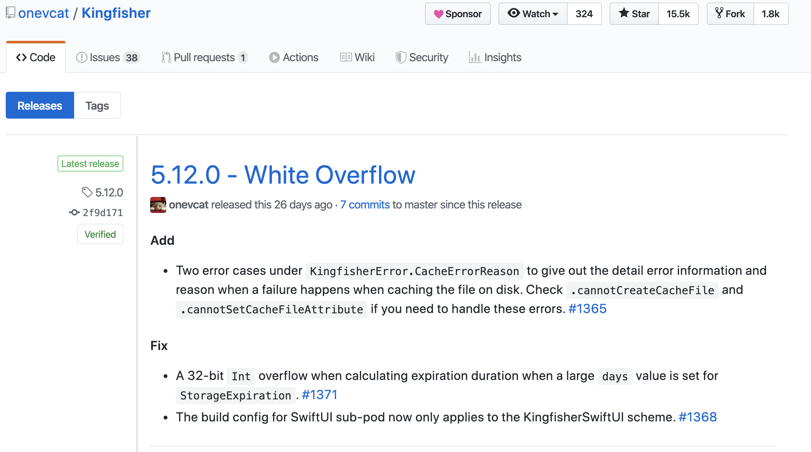

# Git and Version Control

## Resources

 - [Version Control](http://www.catb.org/~esr/writings/version-control/version-control.html)
 - [Git cheatsheet](http://ndpsoftware.com/git-cheatsheet.html)
 - [Try Git](http://try.github.io)
 - [Pro Git ebook](https://git-scm.com/book/en/v2)
 - [Learn Enough Git To Be Dangerous](https://www.learnenough.com/git-tutorial)
 - [Oh Shit, Git!](https://ohshitgit.com/)

## Objectives

- Understand the problem that version control solves
- Use common git commands to navigate through a file
- Use Git Flow to manage a project
- Use different strategies to resolve merge conflicts
- Understand how git flow relates to the software release cycle

# 1. Version Control

## Locking

In the early days of software development, version control was accomplished with *locks*.  All files are read-only, so no one can edit them.  If you want to edit a file, you tell the system what file you want to be editing, and it gives you write access.  It also puts a lock on it that prevents anyone else from requesting edit access for that file.  From [http://www.catb.org/~esr/writings/version-control/version-control.html](http://www.catb.org/~esr/writings/version-control/version-control.html):

"When a locking strategy is working well, workflow looks something like this:

1. Alice locks the file foo.c and begins to modify it.
1. Bob, attempting to modify foo.c, is notified that Alice has a lock on it and he cannot check it out.
1. Bob is blocked and cannot proceed. He wanders off to have a cup of coffee.
1. Alice finishes her changes and commits them, unlocking foo.c.
1. Bob finishes his coffee, returns, and checks out foo.c, locking it.


Unfortunately workflow too often looks more like this:

1. Alice locks the file foo.c and begins to modify it.
1. Bob, attempting to modify foo.c, is notified that Alice has a lock on it and he cannot check it out.
1. Alice gets a reminder that she is late for a meeting and rushes off to it, leaving foo.c locked.
1. Bob, attempting to modify foo.c, is notified that Alice has a lock on it and he cannot check it out.
1. Bob, having been thwarted twice and wasted a significant fraction of his day waiting on the lock, curses feelingly at Alice. He informs the VCS he wants to steal the lock.
1. Alice returns from the meeting to find mail or an instant message informing her that Bob has stolen her lock.
1. Changes in Alice's working copy are now in conflict with Rob's and will have to be merged later. Locking has proven useless.

That, unfortunately, is the least nasty failure case. If the VCS has no facility for stealing locks, change conflict is prevented but Bob may be blocked indefinitely by Alice's forgotten lock. If Alice is not reliably notified that her lock has been stolen, she may continue working on foo.c only to receive a rude surprise when she attempts to commit it.

Most importantly, in these failure cases locking only defers conflicts that must be resolved by merging divergent changes to foo.c after the fact — it does not prevent them. It scales poorly and tends to frustrate all parties."

To solve the problems seen here, developers created a more robust version control system.

## Commit before merge

Instead of only having one person able to edit a file at a time, any number of people can locally make changes to the file and commit them.  This has the advantage of allowing multiple people to work on the same codebase and files simultaneously.  For example, you can create a feature branch and change files that are also being changed in production.  This allows multiple versions of the codebase to exist in different forms, and be merged in at a later point.

# 2. Git

Git is the most widely used version control system.  Competitors include [Mercurial](https://www.mercurial-scm.org/) and [Subversion (SVN)](https://subversion.apache.org/).



Source: https://en.wikipedia.org/wiki/Git#/media/File:Git_operations.svg

## Common Git commands

| command | description |
| --- | --- |
| git pull | pull all new commits from upstream |
| git add -A | stage all changes |
| git add /path/to/file | stage all changes at a given filepath |
| git commit -m 'commit message' | commit all staged changes with a given message |
| git push origin HEAD | push all new commits upstream |
| git checkout -b 'new-branch' | create a new branch |
| git checkout 'existing-branch' | switch over to an existing branch |
| git checkout /path/to/file | permanently delete all unstaged changes at a given filepath |
| git branch | view the current branch |
| git remote add origin 'https://github.com/username/projectName.git' | Link a local project to an project in github |
| git push -u origin master | use the first time pushing changes to a new remote repo to configure tracking |

# 3. Git Flow


In Git Flow, there are two main branches:

- master
- developer

 And three additional supporting kinds of branches:

- Feature branches
- Release branches
- Hotfix branches

When you want to add something to the codebase, branch off of develop.  Make the changes that you want, then merge it back into develop.  This is in effect a short lived feature branch.  If it needs to live longer, other people can collaborate in that feature branch until it is ready to be merged into develop.

To release something, branch off of develop into a release branch, then merge the release branch into master. Only branch off of master in emergency cases like creating hotfixes for serious bugs.

# 4. Resolving merge conflicts

## Causing Merge Conflicts

Some conflicts are unavoidable in the process of development.  When you encounter a merge conflict, there are several tools you can use to resolve the conflict and move forwards.

At the simplest level, git reads the current text of a file line-by-line to look for changes from the previously-committed text. Thus, merge conflicts most often occur when git cannot figure out how lines of code (which are generally just text in a file) from one branch should interact with and be arranged relative to the lines of code in another branch.

Ultimately, a conflict arises because the code you are trying to merge in differs from the code that is already present.  Typically this isn't a problem -- you're trying to add new things after all!  This is only a problem if git can't find a single way to combine the different versions.  In the code snippets below, there is no conflict when merging feature-branch into develop.

#### develop

```swift
struct Foo {
  let bar: Int
}
```

#### feature-branch

```swift
struct Foo {
  let bar: Int
  var barDescription: String { "\(bar) is a great number!" }
}
```

However, in the snippets below, there would be a merge conflict:

#### develop

```swift
struct Foo {
  let bar: Int
  var barDescription: String { "\(bar) is an okay number, I guess" }
}
```

#### feature-branch

```swift
struct Foo {
  let bar: Int
  var barDescription: String { "\(bar) is a great number!" }
}
```

This is because it doesn't know which of the `barDescription` implementations it should pick.  It then gives up and tells you to deal with the conflict and decide what the final version should like like.

## Using `mergetool` to resolve conflicts

The link below goes through an example of using `git mergetool` to resolve merge conflicts.  The core idea is that during a merge, the tool presents both versions and allows you to select which version you want.

https://gist.github.com/karenyyng/f19ff75c60f18b4b8149#concepts-for-resolving-git-conflicts


## Anatomy of a merge conflict

When you do inevitably run into a merge conflict, git tells you where the issue occurred. In the files with conflicts, you will see **git conflict markers**. Look at the code below:

```
<<<<<<< HEAD (1)
Hello (2)
======= (3)
Goodbye (4)
>>>>>>> 77542cq35a11db4580b80ae27e8d65caf5211111 (5)

```


1. `<<<<<<<` is the conflict marker that notes that the code in your local branch begins to divert from and conflict with the other branch at this point.
2. After the first line line, and before the line `=======`, is the code on your branch that cannot be merged given its difference from the second branch.
3. `=======` is the conflict marker that notes that the code from your conflicting local branch is complete, and that the conflicting code from the second branch will be listed below
4. Code from the second branches
5. `>>>>>>>` is the conflict marker that notes the end of the code in the second branch, and thus the end of that particular merge conflict.

Resolving merge conflicts can be tricky; sometimes the code in your branch is meant to replace the code from the prior branch, but at other times some content from both branches will need to remain in the code base. Testing your code is important; you should make sure the code works before declaring the change resolved!

To fully resolve a conflict, all lines with conflict markers must be removed, and then a new commit created.


# 5. Git Releases and Tagging

## Releases

As discussed in the git flow section above, the only time the `master` branch is updated is when there's a releases. But what is a release?

In software development terms, a release is when the program has "shipped." That means the program or an update of the program was provided to the intended users in either a public or private setting. The changes are no longer available only to the developers.

Releases can occur multiple times, which means that each should have a **version**. The most commonly-used convention for versioning is [Semantic Versioning](https://semver.org/), which is the *Major.Minor.Patch* format familiar to most app users. In SemVer, changes in version are noted by incrementing either the Major, Minor, or Patch value according to the following rules:

- Change Major when you make API changes that render previous versions incompatible.
- Change Minor when you add functionality in a backwards-compatible manner.
- Change Patch when you make backwards-compatible bug fixes.

## Using Git Tag to track releases

Git allows you to specify which commits mark the completion of a specific version using the [`git tag`](https://git-scm.com/docs/git-tag) command. After a commit, typing

`git tag 1.1.4`

will create a tag that lines up with the previous commit as the point at which version 1.1.4. Using the command

`git tag 1.1.4 -a "this release rocks"`

will create a tag for the previous commit that includes a brief message.


Github has a section "Releases" specifically for listing git tags and their contents.


This section allows other developers to understand the current working status of a repo, and to see the history of changes. Think of git tags and releases as a higher-level version of commits -- they tell you what a program did and how it functioned at a certain point in time, rather than what a specific change to some code like in a commit.




Note: Git tags must be explicitly pushed to Github (they won't be included when you push a branch).
