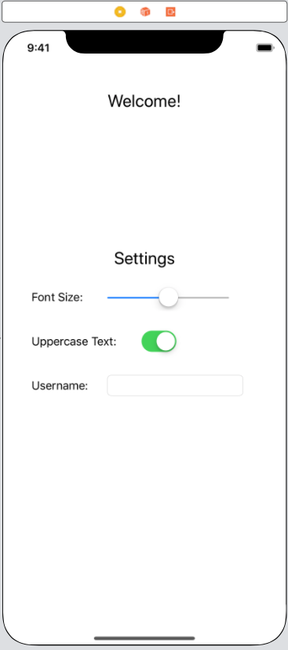

# Introduction to Persistence with UserDefaults


### Readings

1. [Apple Docs on UserDefaults](https://developer.apple.com/documentation/foundation/userdefaults/)
2. [An Introduction to NSUserDefaults](http://www.codingexplorer.com/nsuserdefaults-a-swift-introduction/)
3. [StackOverflow Post on UserDefault limits](https://stackoverflow.com/questions/35961005/how-much-data-can-i-store-in-nsuserdefaults)
4. [More Examples on UserDefaults](https://www.hackingwithswift.com/read/12/2/reading-and-writing-basics-userdefaults)
5. [Op: Don't Store Sensitive Data in UserDefaults](https://www.andyibanez.com/nsuserdefaults-not-for-sensitive-data/)
6. [How to save user settings using UserDefaults](https://www.hackingwithswift.com/example-code/system/how-to-save-user-settings-using-userdefaults)   

---
### Objectives

1. Become familiar with using `UserDefaults` to store data
2. Understand that `UserDefaults` is a light-weight, persistent storage option for small amounts of data that relate to how your app should be configured, based on the user's selection/choices.
3. Build a Singleton wrapper around UserDefaults and use it store data

---

### [Project Link](https://github.com/joinpursuit/Pursuit-Core-iOS-UserDefaults-Intro)

# 1. Persistence Introduction

Every app we've built so far can display information to the user.  Some of them were able to use POST requests to store information up on a server that someone else is hosting.  But what if there's information that we want to save locally?  For example, a grocery list track of your items even if you close and re-open the app.  While we could store that information up in a server, we also might want it to work without an internet connection.

Additionally, many apps allow you to save settings like dark mode, layout or sorting.  A user might only want to use your app in "night mode" because it's easier for them to read. It wouldn't be a great experience for them, however, if they had to switch the app into "night mode" every time they opened the app.  We want a solution that allows us to store these kinds of properties and have them persist in between launches of the app.

# 2. UserDefaults Introduction

UserDefaults is one way for us to save this information.  When you download an app onto your phone, it comes with a set of files.  For example, any images that you put inside your `Assets` directory will be downloaded.  One of the files that is downloaded is a special file called `{appbundlename}.plist` (where appbundlename) is your app bundle.  A `.plist` file is a property list that is a way to store keys and values, sometimes called a key-value store.  It's essentially a dictionary.  Just like a dictionary, we can store values at a given key, then look them up later.

There are restrictions on the kind of things that we can have as the values inside our property list. The values we store must be an instance of (or for collections, a combination of instances of) `NSData`, `NSString`, `NSNumber`, `NSDate`, `NSArray`, or `NSDictionary`. If you want to store any other type of object, you should typically archive it to create an instance of `NSData`.

The `NS` prefix before the familiar types means that the system was originally built for Objective-C.  By default, there is bridging built in between `String` and `NSString` and the compiler is able to convert one into the other.  Sometimes this may cause errors, so it's something to watch out for.

UserDefaults is a good way to store small amounts of information.  It is NOT to store large complicated objects that take up a lot of memory.  This is because the app will load all the stored information on launch, and having too much information stored there will make it take longer to launch your app.

# 3. Using UserDefaults to persist information

So how do we actually use `UserDefaults` to store and retrieve data?  Let's build a simple app that can store some information from a settings screen.

Put together the UI for the following View Controller:



Let's build an app where the text size, uppercase preference and username are all persisted to User Defaults and will load again even if the app is closed and re-opened.


Let's start by building an app that updates the image in real time as the fields are updated:

```swift
import UIKit

class ViewController: UIViewController {

    // MARK: - IBOutlets

    @IBOutlet var welcomeMessageLabel: UILabel!
    @IBOutlet var usernameTextField: UITextField!

    @IBOutlet var allLabels: [UILabel]!

    // MARK: - Private Properties

    var fontSize: Double = 10 {
        didSet {
            allLabels.forEach { $0.font = $0.font.withSize(CGFloat(fontSize)) }
        }
    }

    var uppercaseText = false {
        didSet {
            switch uppercaseText {
            case true:
                allLabels.forEach { $0.text = $0.text?.uppercased() }
            case false:
                allLabels.forEach { $0.text = $0.text?.lowercased() }
            }
        }
    }

    var username = "" {
        didSet {
            welcomeMessageLabel.text = "Welcome " + username + "!"
        }
    }

    // MARK: - Lifecycle Methods

    override func viewDidLoad() {
        super.viewDidLoad()
        usernameTextField.delegate = self
    }

    // MARK: - IBActions

    @IBAction func updateFontSize(_ sender: UISlider) {
        fontSize = Double(sender.value)
    }

    @IBAction func updateUppercaseText(_ sender: UISwitch) {
        uppercaseText = sender.isOn
    }
}

extension ViewController: UITextFieldDelegate {
    func textField(_ textField: UITextField, shouldChangeCharactersIn range: NSRange, replacementString string: String) -> Bool {
        // https://stackoverflow.com/questions/25621496/how-shouldchangecharactersinrange-works-in-swift
        if let text = textField.text,
            let textRange = Range(range, in: text) {
            let updatedText = text.replacingCharacters(in: textRange, with: string)
            username = updatedText
        }
        return true
    }
}
```

Now let's persist each of the three fields to user defaults each time that it's updated:


It all begins with the `standard` singleton:

```swift
let defaults = UserDefaults.standard
```

In order to store data, we can call the `set(_:forKey:)` function on `defaults`:

Let's build our VC to store this information every time one of those fields is updated:

```swift
var fontSize: Double = 10 {
    didSet {
        allLabels.forEach { $0.font = $0.font.withSize(CGFloat(fontSize)) }
        UserDefaults.standard.set(fontSize, forKey: "fontSize")
    }
}

var uppercaseText = false {
    didSet {
        switch uppercaseText {
        case true:
            allLabels.forEach { $0.text = $0.text?.uppercased() }
        case false:
            allLabels.forEach { $0.text = $0.text?.lowercased() }
        }
        UserDefaults.standard.set(uppercaseText, forKey: "uppercaseText")
    }
}

var username = "" {
    didSet {
        welcomeMessageLabel.text = "Welcome " + username + "!"
        UserDefaults.standard.set(username, forKey: "username")
    }
}
```

However, when we close and re-open our app, we can none of the settings we saved persists on the screen.  But it is stored in UserDefaults!  We can then access those values in our `viewDidLoad` and ensure that the start screen looks just like it did when the app was closed.

```swift
// MARK: - Lifecycle Methods

override func viewDidLoad() {
    super.viewDidLoad()
    usernameTextField.delegate = self
    setInitialValuesFromUserDefaults()
}

// MARK: - Private Methods

private func setInitialValuesFromUserDefaults() {
    if let storedUsername = UserDefaults.standard.value(forKey: "username") as? String {
        username = storedUsername
    }
    if let storedFontSize = UserDefaults.standard.value(forKey: "fontSize") as? Double {
        fontSize = storedFontSize
    }
    if let storedUppercaseText = UserDefaults.standard.value(forKey: "uppercaseText") as? Bool {
        uppercaseText = storedUppercaseText
    }
}
```

Now close and re-open the app.  The settings we made before should be persisted. Great!  Just one more bug: the initial position of the controls is still set from Storyboard.  Let's add some handling to update those controls.  First, add the following three outlets:

```swift
@IBOutlet var fontSizeSlider: UISlider!
@IBOutlet var uppercaseTextSwitch: UISwitch!
```

Then, update them when we set the initial values:

```swift
private func setInitialValuesFromUserDefaults() {
    if let storedUsername = UserDefaults.standard.value(forKey: "username") as? String {
        usernameTextField.text = storedUsername
        username = storedUsername
    }
    if let storedFontSize = UserDefaults.standard.value(forKey: "fontSize") as? Double {
        fontSizeSlider.value = Float(storedFontSize)
        fontSize = storedFontSize
    }
    if let storedUppercaseText = UserDefaults.standard.value(forKey: "uppercaseText") as? Bool {
        uppercaseTextSwitch.isOn = storedUppercaseText
        uppercaseText = storedUppercaseText
    }
}
```

Now our app is able to persist information between launches.

# 4. Building a wrapper for UserDefaults to organize our code

As a last step, let's clean up our implementation.  You'll notice that we are relying on hardcoded strings in two separate places.  For example, to store the fontSize, we call:

```swift
UserDefaults.standard.set(fontSize, forKey: "fontSize")
```

To access the stored value, we call:

```swift
if let storedFontSize = UserDefaults.standard.value(forKey: "fontSize") as? Double {}
```

If we misspell the key, we won't get any data back.  To resolve this, let's build a wrapper that will do this work for us and prevent us from duplicating our fetching code.  First, let's make our skeleton that has all the functionality that we'll need:

```swift
class UserDefaultsWrapper {

    // MARK: - Static Properties

    static let manager = UserDefaultsWrapper()

    // MARK: - Internal Methods

    func store(fontSize: Double) {

    }

    func store(username: String) {

    }

    func store(shouldUppercaseText: Bool) {

    }

    func getFontSize() -> Double? {

    }

    func getUsername() -> String? {

    }

    func getShouldUppercaseText() -> Bool? {

    }

    // MARK: - Private inits and properties

    private init() {}

    private let usernameKey = "username"
    private let shouldUppercaseTextKey = "uppercaseText"
    private let fontSizeKey = "fontSize"
}
```

Note that we have 3 methods with the same name, but different signatures.  This is called overloading.

Now, let's complete our implementation:

```swift
import Foundation

class UserDefaultsWrapper {

    // MARK: - Static Properties

    static let manager = UserDefaultsWrapper()

    // MARK: - Internal Methods

    func store(fontSize: Double) {
        UserDefaults.standard.set(fontSize, forKey: fontSizeKey)
    }

    func store(username: String) {
        UserDefaults.standard.set(username, forKey: usernameKey)
    }

    func store(shouldUppercaseText: Bool) {
        UserDefaults.standard.set(shouldUppercaseText, forKey: shouldUppercaseTextKey)
    }

    func getFontSize() -> Double? {
        return UserDefaults.standard.value(forKey: fontSizeKey) as? Double
    }

    func getUsername() -> String? {
        return UserDefaults.standard.value(forKey: usernameKey) as? String
    }

    func getShouldUppercaseText() -> Bool? {
        return UserDefaults.standard.value(forKey: shouldUppercaseTextKey) as? Bool
    }

    // MARK: - Private inits and properties

    private init() {}

    private let usernameKey = "username"
    private let shouldUppercaseTextKey = "uppercaseText"
    private let fontSizeKey = "fontSize"
}
```

Now, we can return to our VC and refactor to use our new wrapper:

```swift
import UIKit

class ViewController: UIViewController {

    // MARK: - IBOutlets

    @IBOutlet var welcomeMessageLabel: UILabel!
    @IBOutlet var usernameTextField: UITextField!
    @IBOutlet var fontSizeSlider: UISlider!
    @IBOutlet var uppercaseTextSwitch: UISwitch!

    @IBOutlet var allLabels: [UILabel]!

    // MARK: - Private Properties

    var fontSize: Double = 10 {
        didSet {
            allLabels.forEach { $0.font = $0.font.withSize(CGFloat(fontSize)) }
            UserDefaultsWrapper.manager.store(fontSize: fontSize)
        }
    }

    var uppercaseText = false {
        didSet {
            switch uppercaseText {
            case true:
                allLabels.forEach { $0.text = $0.text?.uppercased() }
            case false:
                allLabels.forEach { $0.text = $0.text?.lowercased() }
            }
            UserDefaultsWrapper.manager.store(shouldUppercaseText: uppercaseText)
        }
    }

    var username = "" {
        didSet {
            welcomeMessageLabel.text = "Welcome " + username + "!"
            UserDefaultsWrapper.manager.store(username: username)
        }
    }

    // MARK: - Lifecycle Methods

    override func viewDidLoad() {
        super.viewDidLoad()
        usernameTextField.delegate = self
        setInitialValuesFromUserDefaults()
    }

    // MARK: - Private Methods

    private func setInitialValuesFromUserDefaults() {
        if let storedUsername = UserDefaultsWrapper.manager.getUsername() {
            usernameTextField.text = storedUsername
            username = storedUsername
        }
        if let storedFontSize = UserDefaultsWrapper.manager.getFontSize() {
            fontSizeSlider.value = Float(storedFontSize)
            fontSize = storedFontSize
        }
        if let storedUppercaseText = UserDefaultsWrapper.manager.getShouldUppercaseText() {
            uppercaseTextSwitch.isOn = storedUppercaseText
            uppercaseText = storedUppercaseText
        }
    }

    // MARK: - IBActions

    @IBAction func updateFontSize(_ sender: UISlider) {
        fontSize = Double(sender.value)
    }

    @IBAction func updateUppercaseText(_ sender: UISwitch) {
        uppercaseText = sender.isOn
    }
}

extension ViewController: UITextFieldDelegate {
    func textField(_ textField: UITextField, shouldChangeCharactersIn range: NSRange, replacementString string: String) -> Bool {
        // https://stackoverflow.com/questions/25621496/how-shouldchangecharactersinrange-works-in-swift
        if let text = textField.text,
            let textRange = Range(range, in: text) {
            let updatedText = text.replacingCharacters(in: textRange, with: string)
            username = updatedText
        }
        return true
    }
}
```
