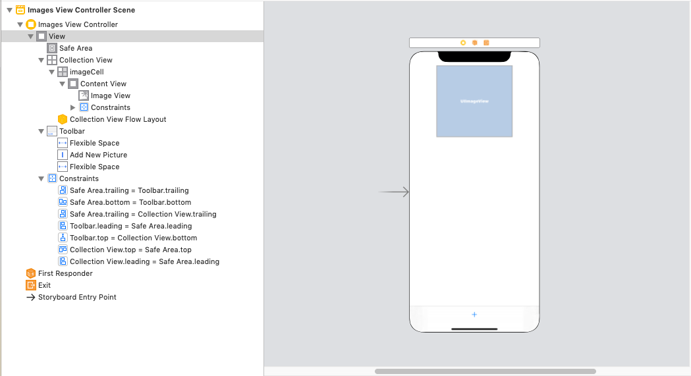

## UIImagePickerController

## Goals

- Understand how UIImagePickerController is used to select images
- Understand what user permissions are necessary for camera access
- Build an app that prompts the user for images and loads them into a Collection View

## Resources

- [Hacking with Swift](https://www.hackingwithswift.com/example-code/uikit/how-to-take-a-photo-using-the-camera-and-uiimagepickercontroller)
- [NSHipster](https://nshipster.com/image-resizing/)
- [The Swift Dev](https://theswiftdev.com/2019/01/30/picking-images-with-uiimagepickercontroller-in-swift-5/)

## Vocabulary

- AVFoundation
- UIImagePickerController
- AVCaptureDevice
- AVCaptureDevice.authorizationStatus
- AVCaptureDevice.requestAccess
- UIImagePickerControllerDelegate
- UINavigationControllerDelegate
- UIImagePickerController.InfoKey


## [Project Link](https://github.com/joinpursuit/Pursuit-Core-UIImagePickerController-Introduction)

# 1. Selecting Images

When building an app, you often want to be able to access photos from users.  When you use Instagram or Pinterest, you are asked to take photos or select photos from your library and upload them through the app.  Today, we'll look at one tool that allows us to access these photos called `UIImagePickerController`.  We will build an app that lets you take pictures from the camera or photo library and put them in a Collection View.

# 2. Building the UI

## Storyboard

Start by putting your Storyboard file together.  We want to load all pictures into a CollectionView as seen below:



## ImageCollectionViewCell

Create a new class `ImageCollectionViewCell` that subclasses from `UICollectionViewCell`.  Change your `UICollectionViewCell` in storyboard to be an instance of your new class, then drag its `UIImageView` into your new class and create and outlet.  Then change its reuse ID to be "imageCell"

```swift
import UIKit

class ImageCollectionViewCell: UICollectionViewCell {
    @IBOutlet var imageView: UIImageView!
}
```

# 3. Building the VC

Now we can build out our View Controller.  Let's start by putting together logic that will load all images from a stored `images` property into the Collection View:

```swift
import UIKit

class ImagesViewController: UIViewController {

    // MARK: - IBOutlets

    @IBOutlet var imagesCollectionView: UICollectionView!

    // MARK: - Internal Properties

    var images = [UIImage]() {
        didSet {
            imagesCollectionView.reloadData()
        }
    }

    // MARK: - Lifecycle Methods

    override func viewDidLoad() {
        super.viewDidLoad()
        imagesCollectionView.delegate = self
        imagesCollectionView.dataSource = self
    }


    // MARK: - IBActions

    @IBAction func addNewPhoto(_ sender: Any) {
        // Get photo using UIImagePickerController
    }
}

// MARK: - UICollectionViewDelegateFlowLayout

extension ImagesViewController: UICollectionViewDelegateFlowLayout {}

// MARK: - UICollectionViewDataSource

extension ImagesViewController: UICollectionViewDataSource {
    func collectionView(_ collectionView: UICollectionView, numberOfItemsInSection section: Int) -> Int {
        return images.count
    }

    func collectionView(_ collectionView: UICollectionView, cellForItemAt indexPath: IndexPath) -> UICollectionViewCell {
        guard let cell = collectionView.dequeueReusableCell(withReuseIdentifier: "imageCell", for: indexPath) as? ImageCollectionViewCell else {
            fatalError("Was expecting an ImageCollectionViewCell, but found a different type")
        }
        let image = images[indexPath.row]
        cell.imageView.image = image
        return cell
    }
}
```

Now we can fill out our implementation for `addNewPhoto` and present a `UIImagePickerController`

# 4. Adding the UIImagePickerController logic

Getting the UI for selecting an image is quite easy.  We can just add the following to our method:

```swift
@IBAction func addNewPhoto(_ sender: Any) {
    let imagePickerVC = UIImagePickerController()
    present(imagePickerVC, animated: true)
}
```

For free, this will give us access to their photos and allow the user to select something.  However, selecting a photo currently doesn't do anything.  As we saw above, we'll need to tap into the delegate methods to specify what should happen when the user selects a photo:

```swift
// MARK: - IBActions

@IBAction func addNewPhoto(_ sender: Any) {
    let imagePickerVC = UIImagePickerController()
    imagePickerVC.delegate = self
    present(imagePickerVC, animated: true)
}
```

```swift
// MARK: - UIImagePickerControllerDelegate

extension ImagesViewController: UIImagePickerControllerDelegate, UINavigationControllerDelegate {
    func imagePickerController(_ picker: UIImagePickerController, didFinishPickingMediaWithInfo info: [UIImagePickerController.InfoKey : Any]) {
        guard let image = info[UIImagePickerController.InfoKey.originalImage] as? UIImage else {
            return
        }
        images.append(image)
        dismiss(animated: true, completion: nil)
    }
}
```

Great!  But the default images are super large.  Let's add a quick helper function to scale them down:

```swift
// MARK: - Private methods

// https://nshipster.com/image-resizing/
func resized(image: UIImage, for size: CGSize) -> UIImage {
    let renderer = UIGraphicsImageRenderer(size: size)
    return renderer.image { (context) in
        image.draw(in: CGRect(origin: .zero, size: size))
    }
}
```

```swift
// MARK: - UICollectionViewDataSource

extension ImagesViewController: UICollectionViewDataSource {
    func collectionView(_ collectionView: UICollectionView, numberOfItemsInSection section: Int) -> Int {
        return images.count
    }

    func collectionView(_ collectionView: UICollectionView, cellForItemAt indexPath: IndexPath) -> UICollectionViewCell {
        guard let cell = collectionView.dequeueReusableCell(withReuseIdentifier: "imageCell", for: indexPath) as? ImageCollectionViewCell else {
            fatalError("Was expecting an ImageCollectionViewCell, but found a different type")
        }
        let image = images[indexPath.row]
        cell.imageView.image = resized(image: image, for: CGSize(width: 400, height: 400))
        return cell
    }
}
```
# 5. Camera Access

Let's now add functionality to have the user take a picture themselves.  First, let's add a new button:


Then, hook it up to an IBOutlet that will present a `UIImagePickerController` with a camera interface:

```swift
@IBAction func addNewPhotoFromCamera(_ sender: Any) {
    let imagePickerVC = UIImagePickerController()
    imagePickerVC.delegate = self
    imagePickerVC.sourceType = .camera
    imagePickerVC.allowsEditing = true
    present(imagePickerVC, animated: true)
}
```

Now press the button.  You'll crash with the message:

```
Source type 1 not available
```

This is because your simulator doesn't have a camera.  To test this one, you'll need to connect to an iPhone.  Connect an iPhone, set up signing, then launch the app and press the camera button.  You will crash again, this time with the following message:

```
This app has crashed because it attempted to access privacy-sensitive data without a usage description.  The app's Info.plist must contain an NSCameraUsageDescription key with a string value explaining to the user how the app uses this data.
```

### Permissions

Some information that user's have require special permissions to access.  In order to get the information, you need to have a message that explains why you need it, and the user needs to accept the permissions.  The following services all require permissions:

- Location data
- Access to the camera
- Calendar
- Contacts

To add the String, go to your `Info.plist` file and add a new row.  Set your key to "Privacy - Camera Usage Description" and the value to "This app wants to use your camera to take a picture and store it on the main screen" or whatever message you like.

Once the user accepts the permission, they can use the camera to take pictures and pressing "Use Photo" will store the photo inside our Collection View.
