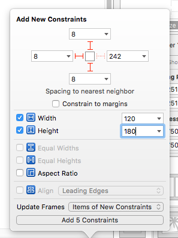
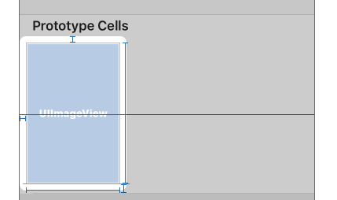
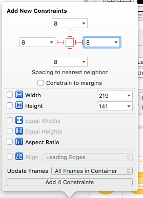
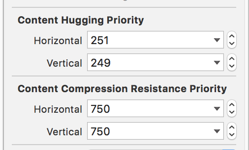
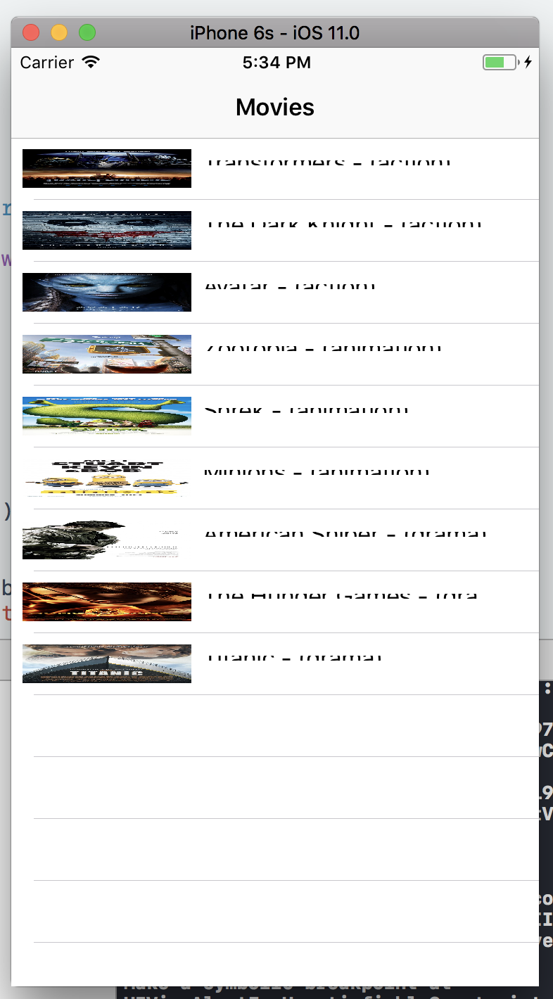

# Table Views Day 2: Custom TableViewCells

### [Project Repo](https://github.com/C4Q/AC-iOS-TableViewCustomCells)

### Readings (in Recommended Order)
1. [A Beginner's Guide to AutoLayout w/ Xcode 8 - Appcoda](http://www.appcoda.com/auto-layout-guide/)
2. [Understanding AutoLayout - Apple](https://developer.apple.com/library/content/documentation/UserExperience/Conceptual/AutolayoutPG/index.html#//apple_ref/doc/uid/TP40010853-CH7-SW1)
  1. [Anatomy of a Constraint](https://developer.apple.com/library/content/documentation/UserExperience/Conceptual/AutolayoutPG/AnatomyofaConstraint.html#//apple_ref/doc/uid/TP40010853-CH9-SW1)
  2. [Working With Constraints in IB](https://developer.apple.com/library/content/documentation/UserExperience/Conceptual/AutolayoutPG/WorkingwithConstraintsinInterfaceBuidler.html#//apple_ref/doc/uid/TP40010853-CH10-SW1)
  3. [Simple Constraints](https://developer.apple.com/library/content/documentation/UserExperience/Conceptual/AutolayoutPG/WorkingwithSimpleConstraints.html#//apple_ref/doc/uid/TP40010853-CH12-SW1)
  4. [Working with Self-Sizing Table View Cells](https://developer.apple.com/library/content/documentation/UserExperience/Conceptual/AutolayoutPG/WorkingwithSelf-SizingTableViewCells.html#//apple_ref/doc/uid/TP40010853-CH25-SW1)
3. [Array.sorted() - Apple Docs](https://developer.apple.com/documentation/swift/array/2905744-sorted)

### Further Readings (Optional)
3. [Designing for iOS - Design+Code](https://designcode.io/iosdesign-guidelines)
4. [Extensions - Apple](https://developer.apple.com/library/content/documentation/Swift/Conceptual/Swift_Programming_Language/Extensions.html)
5. [Custom Fonts in Swift - GrokSwift](https://grokswift.com/custom-fonts/)

---
### Vocabulary

1. **Autolayout** - Auto Layout dynamically calculates the size and position of all the views in your view hierarchy, based on constraints placed on those views. Because elements are laid out relative to other elements, resizing is dynamic and a UI looks consistant regardless of screen size. ([Apple](https://developer.apple.com/library/content/documentation/UserExperience/Conceptual/AutolayoutPG/index.html))
2. **Content Hugging**: How much content does not want to grow. ([Apple](https://developer.apple.com/library/content/documentation/UserExperience/Conceptual/AutolayoutPG/WorkingwithConstraintsinInterfaceBuidler.html#//apple_ref/doc/uid/TP40010853-CH10-SW2))
3. **Compression Resistance**: How much content does not want to shrink. ([Apple](https://developer.apple.com/library/content/documentation/UserExperience/Conceptual/AutolayoutPG/WorkingwithConstraintsinInterfaceBuidler.html#//apple_ref/doc/uid/TP40010853-CH10-SW2))

---
# 0. Objectives
1. Create customized, self-sizing `UITableViewCell` using IB **(Interface Builder)**
2. Understanding *"minimally satisfying constraints"* in AutoLayout
3. Learning basics of iOS Design
5. (Extra) Modifying a projects `.plist` to use custom fonts


# 1. Review:

Create an app to display the data below:

<details>
<summary>Movie class</summary>

```swift
class Movie {
    var name: String
    var year: Int
    var genre: String
    var cast: [String]
    var locations: [String]
    var posterImageName: String
    public var description: String
    init(name: String, year: Int, genre: String, cast: [String], locations: [String], posterImageName: String, description: String) {
        self.name = name
        self.year = year
        self.genre = genre
        self.cast = cast
        self.locations = locations
        self.posterImageName = posterImageName
        self.description = description
    }
}
```
</details>

<details>
<summary>Movie Data</summary>

```swift
struct MovieData {
    static let movies: [Movie] = [
        Movie(name: "Minions",
              year: 2015,
              genre: "animation",
              cast: ["Sandra Bullock", "Jon Hamm", "Michael Keaton"],
              locations: ["New York", "Los Angeles"],
              posterImageName: "minions_small",
              description: "Evolving from single-celled yellow organisms at the dawn of time, Minions live to serve, but find themselves working for a continual series of unsuccessful masters, from T. Rex to Napoleon. Without a master to grovel for, the Minions fall into a deep depression. But one minion, Kevin, has a plan."),
        Movie(name: "Shrek",
              year: 2001,
              genre: "animation",
              cast: ["Mike Myers", "Eddie Murphy", "Cameron Diaz"],
              locations: ["Fairyland", "Los Angeles"],
              posterImageName: "shrek_small",
              description: "Once upon a time, in a far away swamp, there lived an ogre named Shrek whose precious solitude is suddenly shattered by an invasion of annoying fairy tale characters. They were all banished from their kingdom by the evil Lord Farquaad. Determined to save their home -- not to mention his -- Shrek cuts a deal with Farquaad and sets out to rescue Princess Fiona to be Farquaad\"s bride. Rescuing the Princess may be small compared to her deep, dark secret."),
        Movie(name: "Zootopia",
              year: 2016,
              genre: "animation",
              cast: ["Ginnifer Goodwin", "Jason Bateman", "Idris Elba"],
              locations: ["New York", "Toronto"],
              posterImageName: "zootopia_small",
              description: "From the largest elephant to the smallest shrew, the city of Zootopia is a mammal metropolis where various animals live and thrive. When Judy Hopps becomes the first rabbit to join the police force, she quickly learns how tough it is to enforce the law."),
        Movie(name: "Avatar",
              year: 2009,
              genre: "action",
              cast: ["Sam Worthington", "Zoe Saldana", "Sigourney Weaver"],
              locations: ["Space", "Los Angeles"],
              posterImageName: "avatar_small",
              description: "On the lush alien world of Pandora live the Na\"vi, beings who appear primitive but are highly evolved. Because the planet\"s environment is poisonous, human/Na\"vi hybrids, called Avatars, must link to human minds to allow for free movement on Pandora. Jake Sully, a paralyzed former Marine, becomes mobile again through one such Avatar and falls in love with a Na\"vi woman. As a bond with her grows, he is drawn into a battle for the survival of her world."),
        Movie(name: "The Dark Knight",
              year: 2008,
              genre: "action",
              cast: ["Christian Bale", "Heath Ledger", "Aaron Eckhart"],
              locations: ["Gotham", "Justice League of America"],
              posterImageName: "dark_knight_small",
              description: "With the help of allies Lt. Jim Gordon and DA Harvey Dent, Batman has been able to keep a tight lid on crime in Gotham City. But when a vile young criminal calling himself the Joker suddenly throws the town into chaos, the caped Crusader begins to tread a fine line between heroism and vigilantism."),
        Movie(name: "Transformers",
              year: 2007,
              genre: "action",
              cast: ["Shia LaBeouf", "Megan Fox", "Josh Duhamel"],
              locations: ["Tokyo", "Sapporo"],
              posterImageName: "transformers_small",
              description: "The fate of humanity is at stake when two races of robots, the good Autobots and the villainous Decepticons, bring their war to Earth. The robots have the ability to change into different mechanical objects as they seek the key to ultimate power. Only a human youth, Sam Witwicky can save the world from total destruction."),
        Movie(name: "Titanic",
              year: 1997,
              genre: "drama",
              cast: ["Leonardo DiCaprio", "Kate Winslet", "Billy Zane"],
              locations: ["Liverpool", "Belfast", "New York", "Arctic"],
              posterImageName: "titanic_small",
              description: "The ill-fated maiden voyage of the R.M.S. Titanic; the pride and joy of the White Star Line and, at the time, the largest moving object ever built. She was the most luxurious liner of her era -- the \"ship of dreams\" -- which ultimately carried over 1,500 people to their death in the ice cold waters of the North Atlantic in the early hours of April 15, 1912."),
        Movie(name: "The Hunger Games",
              year: 2012,
              genre: "drama",
              cast: ["Jennifer Lawrence", "Josh Hutcherson", "Liam Hemsworth"],
              locations: ["New York", "Wisconsin"],
              posterImageName: "hunger_games_small",
              description: "Katniss Everdeen voluntarily takes her younger sister\"s place in the Hunger Games, a televised competition in which two teenagers from each of the twelve Districts of Panem are chosen at random to fight to the death."),
        Movie(name: "American Sniper",
              year: 2014,
              genre: "drama",
              cast: ["Bradley Cooper", "Sienna Miller", "Kyle Gallner"],
              locations: ["Los Angeles", "Detroit", "Morocco"],
              posterImageName: "american_sniper_small",
              description: "Navy S.E.A.L. sniper Chris Kyle\"s pinpoint accuracy saves countless lives on the battlefield and turns him into a legend. Back home to his wife and kids after four tours of duty, however, Chris finds that it is the war he can\"t leave behind.")
    ]
}
```
</details>


- Each row should have a main text of the title, and the detail text should be the genre of the movie.
- Next, we want the movies to be listed alphabetically by genre


# 2. Customizing `UITableviewCell` in Storyboard

1. Create a new `UITableViewCell` subclass by going to File > New > File... and selecting `Cocoa Touch Class`
  - Have this subclass from `UITableViewCell` and name the new class `MovieTableViewCell`
  - *If you'd like to be thorough: before saving, create a new Folder called "Views" to create the file in. Then right-click the `MovieTableViewCell.swift` file and select "New Group from Selection" and name the new group "Views"*
2. Go into storyboard, select the protoype cell, switch "Style" to "Custom" (note that the prototype cell in the storyboard changes) and switch its class type to `MovieTableViewCell` in the "Identity Inspector" in the Utilities pane.
  - 
3. Open the *Utilities Area* and select the *Attributes Inspector*
4. Switch to the *Size Inspector* in the *Utilities Area* and give the `MovieTableViewCell` a custom row height of 200pt to give us a little room to work with (note: this will only be 200pts in the storyboard, and at runtime, our autolayout guides will expand/shrink as needed)
  - 
5. From the *Object Library*, drag over a `UIImageView` into the `contentView` of the cell
  - 
6. Align the `UIImageView` to the left side of the cell, such that the alignment lines show up on the top, left, and bottom sides of the imageview.
  - 
7. Select the imageView, click on the *Align* button, and select "Vertically in Container" and switch "Update Frames" to "All Frames in Container"
  - This will ensure that the imageView will be aligned vertically in the content view (sets imageView.centerY `NSLayoutAttribute` to contentView.centerY)
  - Changing the "Update Frames" option makes sure that the storyboard updates the UI to match these changes. If you don't do this, you could have the proper constraints in place, but Xcode will warn you that the constraints you've applied don't match what's being seen in storyboard.
  - 
8. Next, with the imageView still selected, click on the *Pin* button and add the following:
  - 8pt margin to top, left and bottom
  - Width of 120, Height of 180
  - 
9. Its possible that the storyboard hasn't updated its views to match the constraints you've set, so you may need to click on *Resolve Autolayout Issues* and select "Update Frames".
  - When selecting this, Xcode will look at the constraints you've set and try to update the storyboard elements to match their constraints. If you've done everything right up until this point, you should no longer see any warnings or errors in storyboard
  - *Some Advice: Using the storyboard can be quite frustrationg at times. I would highly recommend that if you make an error somewhere along the line, to just select the problematic view, click on "Clear Constraints" and just start over. It's very difficult, especially when starting out, to resolve layout issues when you have many existing (and potentially) conflicting constraints in place. Once you've become a little experienced with it, you can try to resolve them on your own. But for now, you may find that just clearing the constraints is ultimately faster.*
  - 
10. Now, add a `UILabel` to the right of the `UIImageView` with the following constraints:
  - 
  - 8pts from top, left, right
  - 17pt font
  - Left aligned
  - Name it: Movie Title Label
11. Add a second UILabel below the first:
  - 
  - 8pts from the top, left, right and bottom
  - Number of lines = 0
  - Justified alignment
  - Named: Movie Summary Label
  - 12pt font, Gray color (any)
12. You may now notice an error about `verticalHuggingPriority` and `verticalCompressionResistence`... let's take a look at these two properties for a moment


#### Content Hugging/Compression Resistance ([CHCR](https://developer.apple.com/library/content/documentation/UserExperience/Conceptual/AutolayoutPG/WorkingwithConstraintsinInterfaceBuidler.html#//apple_ref/doc/uid/TP40010853-CH10-SW2))
These aren't the easiest concepts to understand, and I think in large part is due to their naming. But thanks to one very perfectly succinct [StackOverflow answer](http://stackoverflow.com/a/16281229/3833368), it's a bit easier:

- **Content Hugging**: How much content does not want to grow
- **Compression Resistance**: How much content does not want to shrink

Meaning:
- The higher the **Content Hugging** value, the more it will try to keep its size you set in IB. Think of it as how tightly the edges of a view are hugging what's inside the view (like how the edges of a `UILabel` are hugging the text inside of it).
- The higher the **Compression Resistance** value, the more it will try to expand the bounds you set in IB.

*Note:* These values are set *relative* to the views that surround it. Meaning, these properties will only matter in cases where constraints do not define an exact width/height for a view, and rather, expect a view to expand/contract based on the sizes of the views around it.

#### Exercise: Fixing the CHCR Errors

In our case, we want the movie title `UILabel` to keep a consistent size, both in width and height. The movie summary `UILabel`, however, should expand **vertically** as much as needed to accomodate all of the movie's text, but stay pinned to the left, top and right. So conceptually, the *content hugging* of the movie title label's width and height should be high, but the *content compression resistance* of the movie summary label should be low (to let it grow) vertically. With this in mind, let's update our views...

<br>
<details><summary>Hint 1</summary>
<br><br>
You really only need to change one of the labels's content hugging for the errors to resolve
<br><br>
</details>
<br>

<details><summary>Answer</summary>
<br><br>
Make the <code>vertical content hugging</code> priority of the <code>movieSummaryLabel</code> any value less than the
<code>movieTitleLabel</code>'s  <code>vertical content hugging</code>

<br><br>
</details>
<br>

---
# 3. Linking Storyboard Elements to a custom `UITableViewCell`
With our prototype cell's constraints completed, now its necessary to link it up so our project uses the new prototype.

However is most comfortable (typing and/or ctrl+dragging), add three `IBOutlet`s to `MovieTableViewCell` and make sure they are linked to your prototype cell. Name the elements `movieTitleLabel`, `movieSummaryLabel`, and `moviePosterImageView`

```swift
    @IBOutlet weak var movieTitleLabel: UILabel!
    @IBOutlet weak var movieSummaryLabel: UILabel!
    @IBOutlet weak var moviePosterImageView: UIImageView!
```


With the addition of this `UIImageView`, it's a good time to add in the images that we plan on using for our app.  Drag the images from the folder in this repo named `assetsForProject` into your project.  Make sure to keep the names the same, because each movie in `Data.swift` has a property, `posterImageName` corresponding to the name of the image bundled with the project. Go ahead and take a look at both `Data.swift` and `Assets.xcassets` to verify you have set up your project correctly.


Next, we'll need to update our code in our `MovieTableViewController`'s `cellForRow` function:

```swift
func tableView(_ tableView: UITableView, cellForRowAt indexPath: IndexPath) -> UITableViewCell {
	//1
   let cell = tableView.dequeueReusableCell(withIdentifier: "Movie Cell", for: indexPath)
    let movie = movies[indexPath.row]
    if let movieCell = cell as? MovieTableViewCell {
        movieCell.movieTitleLabel.text = movie.name
        movieCell.movieSummaryLabel.text = movie.description
        movieCell.imageView?.image = UIImage(named: movie.posterImageName)
    }
    return cell
}
```

1. This part is the same: we still want to `dequeue` a cell based on a `cellIdentifier`, and we still want to get the movie at a particular index to display
2. We need to do a conditional bind to check if the `cell` that's dequeued with our given identifier is of a specific type, `MovieTableViewCell`. By default, `dequeueReusableCell(withIdentifier:for:)` returns `UITableViewCell`. So we must ensure that the `cell` can in fact be cast into `MovieTableViewCell`.
3. Because we've defined and set up the UI elements of the `MovieTableViewCell`, we know which values of the `Movie` should be given to each element.
4. At this point, we've set up the `cell` and just have to return it.

Great! Now let's run and see our new cell in action (note: this may work  on your machine.  It can be tempermental).


<br>


Oh, something's wrong... remember before I mentioned that there are a few critial things you need to do in order to get self-sizing cells with autolayout? Well, constraining everything relative the the `contentView` is one, but there are two more:

1. You need to set the `tableView.rowHeight` property to `UITableViewAutomaticDimension`
2. You need to set the `tableView.estimatedRowHeight` property to any value (but as close to actual size as possible)

So add the following to `viewDidLoad`, just before we parse our `Movie` data objects

```swift
  self.tableView.rowHeight = UITableViewAutomaticDimension
  self.tableView.estimatedRowHeight = 200.0
```
And now re-run the project. Much better right?


---

# 4. Exercises

Depending on the iPhone model your simulation is running on, you probably notice a problem with the summary text: it's being cut off! While it's true that our summary text label will expand as needed for text, there are two constraints that are holding the cell at a specific height. See if you can figure out which two those are.


<br>
<details><summary>Hint 1</summary>
<br><br>
The height of the cell is determined by a single, unbroken chain of constraints that describe the vertical relationships of the views.
<br><br>
</details>

<br>
<details><summary>Hint 2</summary>
<br><br>
Think about what is giving our cell it's height (it's not those two tableview properties we just set, FYI)*
<br><br>
</details>
<br>

<details><summary>Hint 3</summary>
<br><br>
Anything with a pre-set height or width, can prevent autoresizing like this.
<br><br>
</details>
<br>


#### Styling of Cells

We're going to practice creating new custom cells, but we'll start simple. Your task is to

1. Create a new prototype cell in storyboard
2. Create a new `UITableViewCell` subclass called `MovieRightAlignedTableViewCell`
3. Make the new cell exactly like `MovieTableViewCell`, except that the image is now right-aligned
4. You table should display movies in alternating cell types (meaning, left-aligned, right-aligned, left-aligned,.. etc.)

Your finished product should look something like this:


---

### 5. (Extra) Adding Custom Fonts

To add your own set of fonts for an app, you'll need:

1. The actual font files (can be different file types, such as `.otf` and `.ttf`)
2. To add the font files to your *application bundle*
2. To add the `Fonts provided by application` key to your `.plist`
  3. To add the names of the fonts (manually) to this plist as well


Following the above steps, you can test to make sure your app sees the font by add the following line to your `AppDelegate` didFinishLaunching function:

`print(UIFont.familyNames)`

You should see `Roboto` among the fonts listed in the console log. Then if you wanted to see the styles you can use, use this line (after making sure `Roboto` exists):

`print(UIFont.fontNames(forFamilyName: "Roboto"))`

You will see `["Roboto-Light", "Roboto-Black", "Roboto-Bold", "Roboto-Regular"]` if all has been done properly.

Once you've validated your fonts, change your `NSFontAttribute` value from before, and update your storyboard's prototype `MovieTableViewCell` (use Roboto-Regular, 17pt for the title text and Roboto-Light, 12pt for the summary text)


